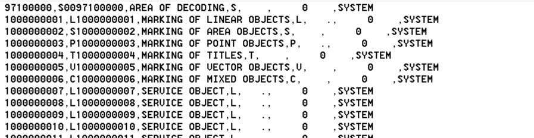

.. sectionauthor::  <grigorenko.j@gmail.com>

Convert RSC to CSV
==========================

Convert Panorama RSC file to CSV table for analysis purposes. 

Input: RSC file

Output: CSV file 

   Output CSV

Launch instrument: https://toolbox.nextgis.com/operation/rsc2csv

**Try it out using our sample:**

Download `input dataset <https://nextgis.com/data/toolbox/rsc2csv/rsc2csv_inputs.zip>`_ to test the instrument. Step-by-step instructions included.

Get the `output <https://nextgis.com/data/toolbox/rsc2csv/rsc2csv_outputs.zip>`_ to additionally check the results.
