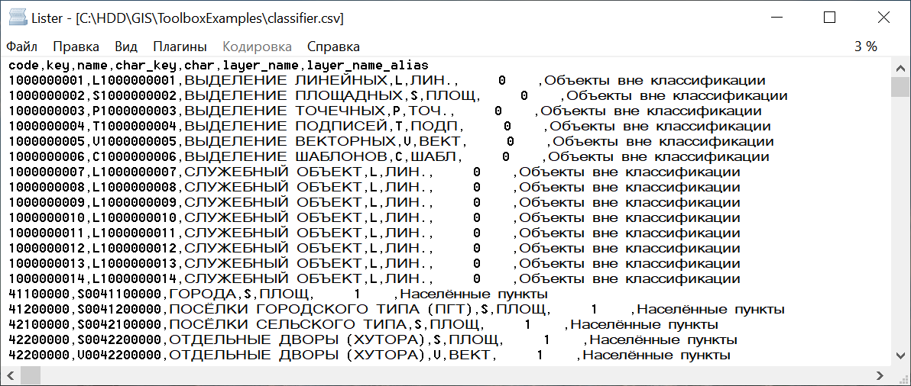

Конвертация RSC в CSV 
==========================

Конвертация файла классификатора RSC из ГИС Панорама в CSV для анализа. Он используется для сравнения списка условных знаков в Панораме с другими программами.

**На входе:** RSC-файл

**На выходе:** CSV со списком знаков. 

   Полученный файл CSV

Запуск инструмента: https://toolbox.nextgis.com/t/rsc2csv

**Попробуйте инструмент в действии**

1. Нажмите кнопку **Демо** над формой инструмента. Поля будут автоматически заполнены демонстрационными значениями.
2. Нажмите кнопку **Запустить**.

