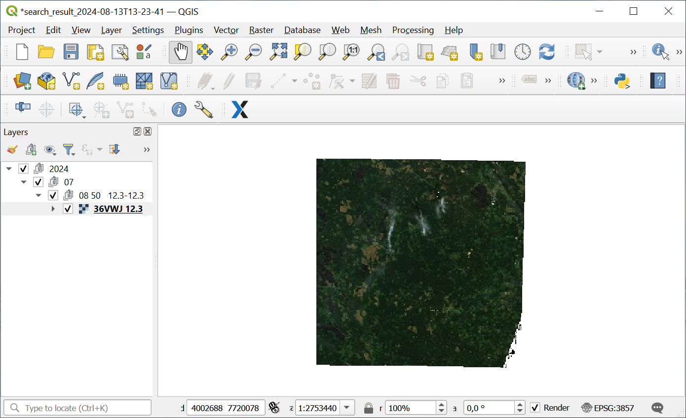

.. sectionauthor:: Юлия Григоренко <grigorenko.j@gmail.com>

Sentinel-2 scenes to GPKG 
============================

Search and save Sentinel-2 scene previews to GPKG.

To run a search, enter following parameters:

* **S2 tile index(es)** - Simple or list e.g. "36VWJ" or "36VWJ,36VXJ" - limit 50 id. You can check the ID of the scene you need on our `Web Map <https://demo.nextgis.com/resource/7697/display?panel=layers>`_ or  :download:`download the scene division file <files/sentinel_2_index.gpkg>`.
* **Year(s)** - Simple,list or range e.g. "2016,2020,2021-2024"
* **Month(s)** - Simple,list or range e.g. "1,5,9-12"
* **Max cloud** - Max cloud coverage in %, int or float e.g. 10 or 10.5
* **Custom order name** - optional, you can enter a name for the Toolbox task to make it easier to tell them apart without comparing all the parameters.

There is also option to **No preview**. If ticked, the resulting GeoPackage will contain only vector footprint itendifiers.

Input:

* Search parameters.

Output:

* GPKG file

If previews are included, to view the result in QGIS select Project ‣ Open From ‣ GeoPackage.

Project also includes a layer with geometries of selected S2 tiles and a search_result layer containing scene IDs, attributes and borders of satellite images from dataspace catalog.

By default, tile layer and the earliest preview are visible. Select the layers you want to display.

   Search result with layer visibility enabled

Launch instrument: https://toolbox.nextgis.com/operation/s2_search

**Try it out using our sample:**

Download `input dataset <https://nextgis.com/data/toolbox/s2_search/s2_search_inputs.zip>`_ to test the instrument. Step-by-step instructions included.

Get the `output <https://nextgis.com/data/toolbox/s2_search/s2_search_outputs.zip>`_ to additionally check the results.
