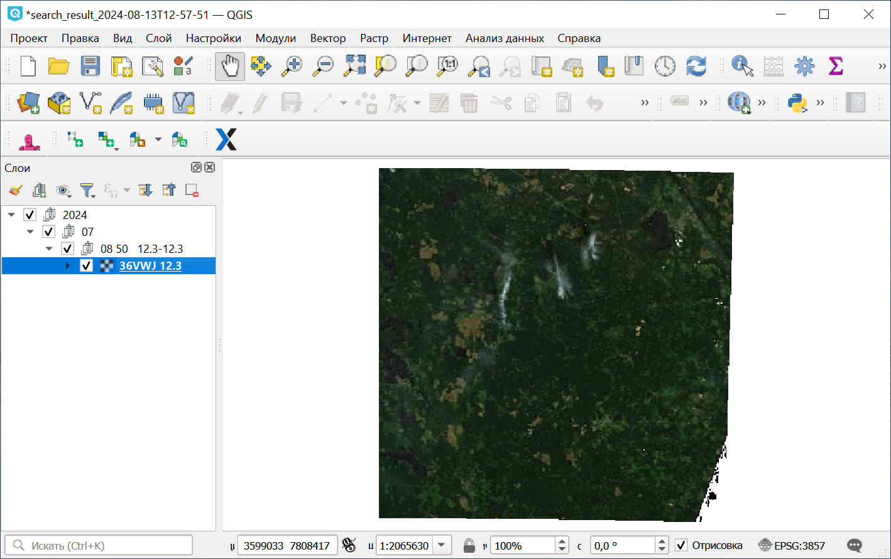

Cцены Sentinel-2 в GPKG
========================

Поиск и импорт превью сцен Sentinel-2 в GPKG.

На входе:

* Индекс(ы) тайлов - Один или несколько идентификаторов тайлов S2, например "36VWJ" или "36VWJ,36VXJ" - максимально 50 id. Индекс нужного тайла вы можете посмотреть на `веб-карте <https://demo.nextgis.ru/resource/8889/display?panel=layers>`_ или :download:`скачать файл разграфки <files/sentinel_2_index.gpkg>`;
* Год(ы) - Год съемки - один, список или диапазон, например "2016,2020,2021-2024";
* Месяц(ы) - Месяц съемки - один, список или диапазон, например "1,5,9-12";
* Максимальная облачность - задается в %, например 10 или 10.5;
* Название запуска - при желании можно задать название для задачи в Toolbox, это позволит легче ориентироваться в запущенных задачах, не сравнивая каждый раз все параметры.

Также доступна опция **Не загружать превью**. Если поставить эту галочку, то будет произведена выгрузка только итендификаторов сцен и их области покрытия.

На выходе: 

* Файл GPKG.

Если вы загружаете превью, то чтобы открыть результат в NextGIS QGIS или обычном QGIS, выберите Проект ‣ Открыть из ‣ GeoPackage.

Помимо превью, в файле содержатся также геометрии заданных тайлов и слой search_result, который содержит ID сцен, атрибуты и границы съемки из каталога dataspace.

По умолчанию включена видимость для слоя тайлов и первого по дате превью.

   Результат поиска в NextGIS QGIS с включенной видимостью слоев

Запуск инструмента: https://toolbox.nextgis.com/t/s2_search

**Попробуйте инструмент в действии**

1. Нажмите кнопку **Демо** над формой инструмента. Поля будут автоматически заполнены демонстрационными значениями.
2. Нажмите кнопку **Запустить**.

.. seealso::

   * `Подготовка и скачивание данных Sentinel-2 <https://toolbox.nextgis.com/t/download_and_prepare_l8_s2?from-related-tools=1>`_
   * `Поиск снимков Sentinel через Copernicus <https://toolbox.nextgis.com/t/imagesearch?from-related-tools=1>`_
   * `Нормализованный разностный индекс <https://toolbox.nextgis.com/t/ndi?from-related-tools=1>`_
   * `Кластеризация изображений <https://toolbox.nextgis.com/t/image_clustering?from-related-tools=1>`_