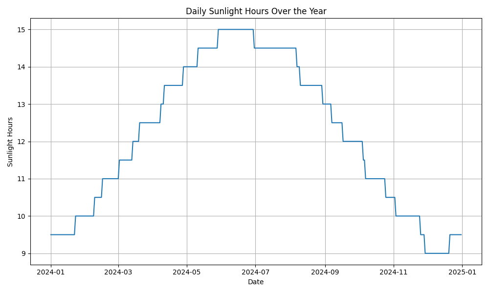

Sunlight hours prediction
=========================

Predict the number of daily sunlight hours for a specific latitude and longitude.

Inputs:

* Latitude of the location (WGS84, decimal degrees);
* Longitude of the location (WGS84, decimal degrees);
* Period for which to calculate sunlight hours. Fill in one of the fields:

  * Year, or
  * Date.

Outputs:

If a date is selected:

* Text output: number of sunlight hours for the selected date.

If a year is selected:

* Text output: predicted average number of sunlight hours per day;
* CSV table with sunlight hours for every date of the year;
* PNG diagram of sunlight hours for the selected period.

Launch the tool: https://toolbox.nextgis.com/t/solar_hours

Example:

   Example output

**Try the tool in action**

1. Click on the **Demo** button above the tool form. The fields are filled in with demo values.
2. Click on the **Run** button.

.. admonition:: Related tools

  * `Table to vector file <https://toolbox.nextgis.com/t/predict_overpass?from-related-tools=1>`_