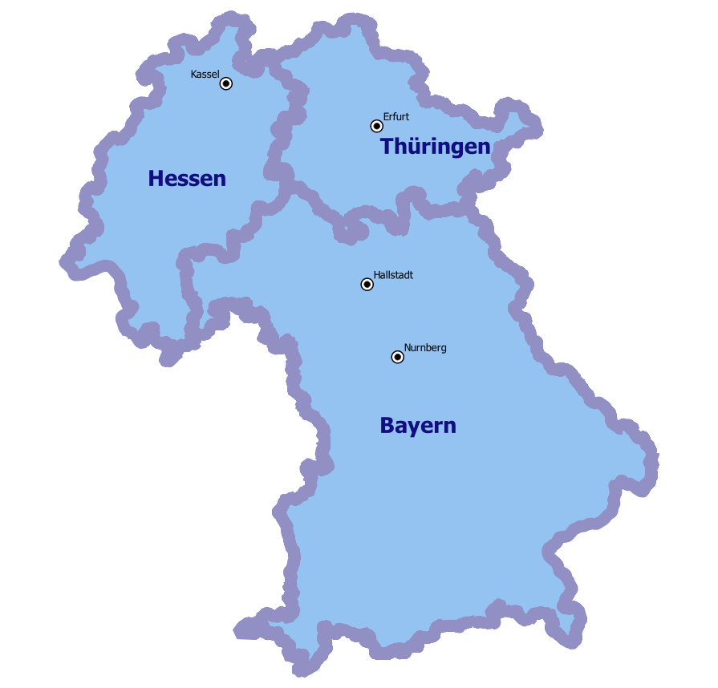
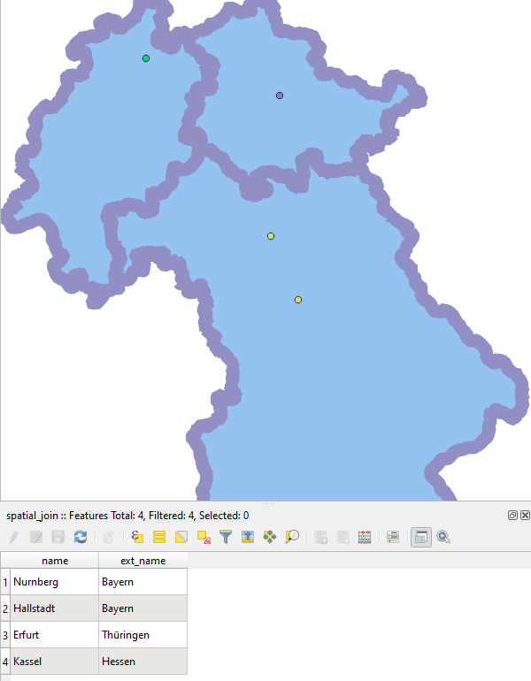

Spatial Join (Join by location)
===============================

Insert into layer 1 attribute from intersects feature in layer 2

Inputs:

* Vector layer 1
* Polygon layer 2
* Name of attibute in layer 2

Outputs:

* ZIP with Shapefile layer 1 with added attribute 
* QML style file

   
   Example of source data: cities and regions
   

   
   Example output: cities with added region name
   

Launch the tool: https://toolbox.nextgis.com/t/spatial_join

**Try the tool in action**

1. Click on the **Demo** button above the tool form. The fields are filled in with demo values.
2. Click on the **Run** button.

.. admonition:: Related tools

  * `Merge vector layers <https://toolbox.nextgis.com/t/ogrmerge?from-related-tools=1>`_
  * `Join layer and table by field <https://toolbox.nextgis.com/t/join_by_field?from-related-tools=1>`_