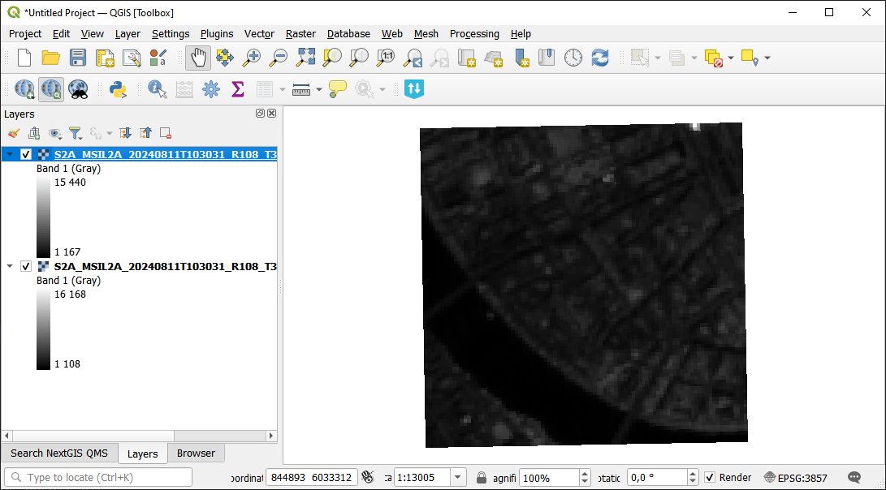
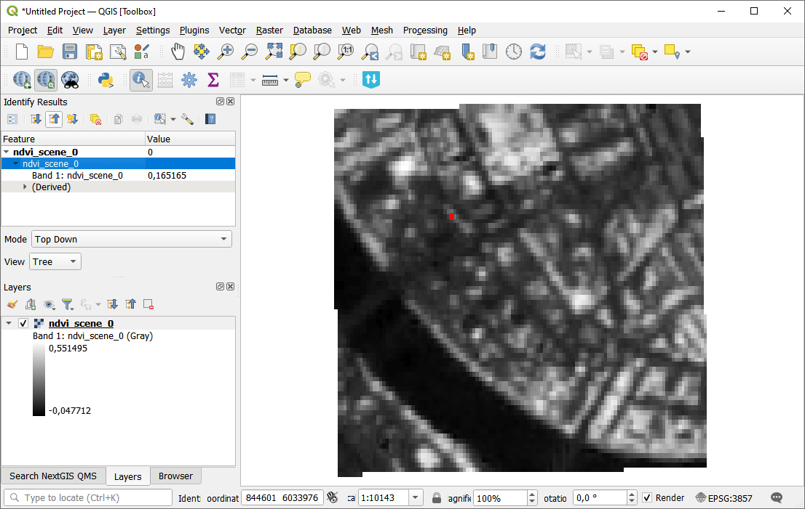

Compute spectral index
==========================

Compute normalized difference spectral indices (NDVI, NDWI, NBR) from Sentinel-2 or Landsat time series. Produces temporal aggregates (mean, max, min, stddev, range) aligned to the terrain analysis grid.

Inputs:

* Satellite Imagery Package - ZIP file from `Search & download Planetary Computer <https://toolbox.nextgis.com/t/planetary_search>`_ containing Sentinel-2 or Landsat band GeoTIFFs and manifest.json with time_series;
* Spectral Index. Type of normalized difference index to compute:

  - NDVI (Vegetation) (NDVI);
  - NDWI (Water) (NDWI);
  - NBR (Burn Ratio) (NBR);

* Generate series - tick to generate series rasters (max, min, std etc.) if multiple inputs are provided.

Outputs:

* ZIP archive with spectral index aggregates, statistics, and manifest;
* Human-readable summary of the spectral index results;
* JSON manifest string describing all outputs.

Launch the tool: https://toolbox.nextgis.com/t/spectral_indices

Example:

   Example input

   Example output

**Try the tool in action**

1. Click on the **Demo** button above the tool form. The fields are filled in with demo values.
2. Click on the **Run** button.

.. admonition:: Related tools

  * `Normalized difference index <https://toolbox.nextgis.com/t/ndi?from-related-tools=1>`_
  * `Raster calculator (GDAL) <https://toolbox.nextgis.com/t/raster_calculator?from-related-tools=1>`_
  * `Raster calculator (GRASS) <https://toolbox.nextgis.com/t/r_mapcalc?from-related-tools=1>`_