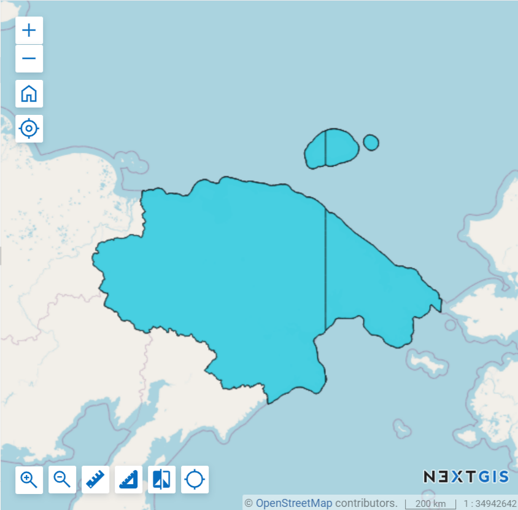

Разрезать геометрии по 180 меридиану 
=====================================

Инструмент разрезает геометрии объектов векторного слоя по 180 меридиану.

Данная операция может понадобится для корректного отображения подобных объектов в различном программном обеспечении и на веб-картах.

   Данные, разрезанные по 180 меридиану, на веб-карте

На входе:

* Векторный слой в поддерживаемом GDAL формате, например, GeoPackage, GeoJSON, MapInfo TAB, ESRI Shapefile (последние два - в ZIP-архиве).

На выходе:

* Векторный слой в формате GeoPackage.

Чтобы затем слой правильно отобразился на веб-карте, нужно включить адаптер "Тайлы". Посмотрите, как это работает, в нашем видео:

.. raw:: html

   <iframe width="560" height="315" src="https://rutube.ru/play/embed/8c7d98d7332b1483d731eb70645ca3f2/" frameBorder="0" allow="clipboard-write; autoplay" webkitAllowFullScreen mozallowfullscreen allowFullScreen></iframe>

Посмотреть видео на `youtube <https://youtu.be/w3viKZQyReg>`_, `rutube <https://rutube.ru/video/8c7d98d7332b1483d731eb70645ca3f2/>`_.

Запуск инструмента: https://toolbox.nextgis.com/t/split180

**Попробуйте инструмент в действии, скачав наш пример:**

`Набор исходных данных <https://nextgis.ru/data/toolbox/split180/split180_inputs_ru.zip>`_ для проверки работы инструмента. Внутри архива пошаговая инструкция.

`Пример результата <https://nextgis.ru/data/toolbox/split180/split180_outputs_ru.zip>`_ работы инструмента.

.. seealso::

   * `Разделить сложные полигоны <https://toolbox.nextgis.com/t/splitcomplex?from-related-tools=1>`_
   * `Разбить на равные части <https://toolbox.nextgis.com/t/split_to_equal?from-related-tools=1>`_
