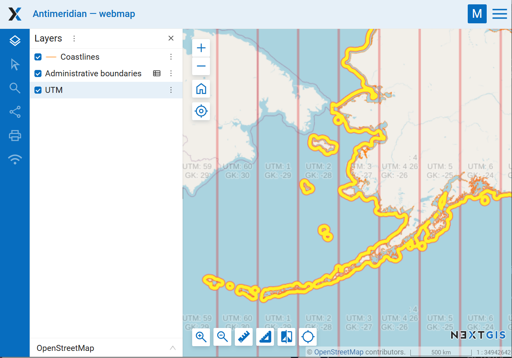

Split data by 180 degrees 
=====================================

Split vector layer feature geometries at antimeridian (180th meridian) for correct visualization on online maps.

   Data split by the antimeridian on a Web Map

Inputs:

* Vector layer in a GDAL-supported format, e.g. GeoPackage, GeoJSON, MapInfo TAB, ESRI Shapefile (the latter two should be in ZIP archive).

Outputs:

* Vector layer in GeoPackage.

To make sure the layer is correctly displayed on the Web Map, set the adapter to "Tiles". See how it works in our video:

.. raw:: html

   <>

<>

Launch tool: 
