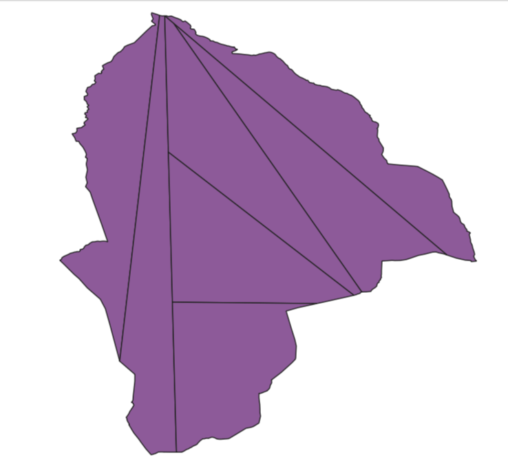

Разбить на равные части
=======================

Разбивает полигональный слой на равные части. 

.. note:: Не работает с мультиполигонами. Вы можете предварительно `трансформировать мультигеометрии в простые геометрии <https://toolbox.nextgis.com/t/qgis_multiparttosingleparts>`_.

На входе:

* Исходный файл. Векторный полигональный слой в одном из поддерживаемых GDAL форматов, например, Shapefile в ZIP-архиве, GeoJSON, GeoPackage.
* Количество частей, на которые надо разбить исходный полигон.

На выходе:

* Результирующий слой в формате GeoPackage, упакованный в ZIP-архив.

Запуск инструмента: https://toolbox.nextgis.com/t/split_to_equal

   Пример работы инструмента

**Попробуйте инструмент в действии, скачав наш пример:**

`Набор исходных данных <https://nextgis.ru/data/toolbox/split_to_equal/split_to_equal_inputs_ru.zip>`_ для проверки работы инструмента. Внутри архива пошаговая инструкция.

`Пример результата <https://nextgis.ru/data/toolbox/split_to_equal/split_to_equal_outputs_ru.zip>`_ работы инструмента.

.. seealso::

   * `Сетка в метрах <https://toolbox.nextgis.com/t/grid>`_
   * `Генератор набора квадратов <https://toolbox.nextgis.com/t/quadro>`_