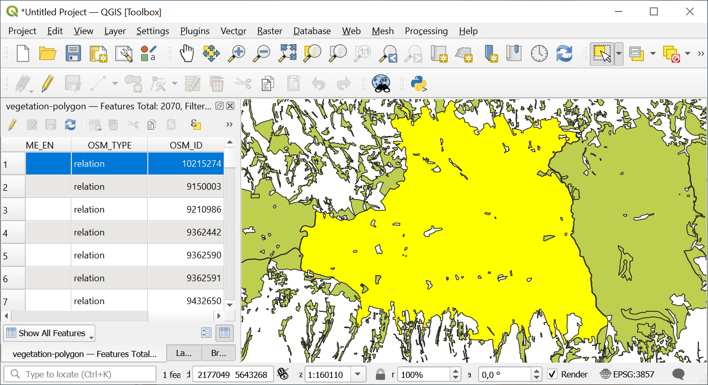
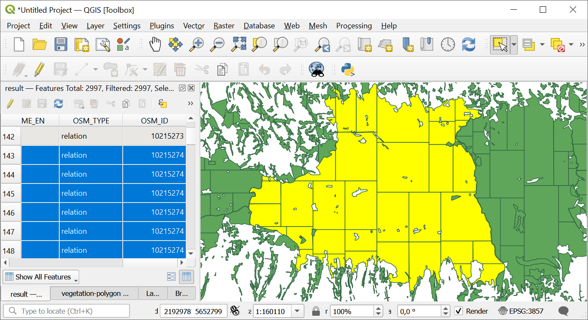

Split Complex Polygons
======================

Splits polygons with too many vertices into smaller parts. Each part is a separate feature that keeps all the attributes of the split polygon.

Inputs:

* Source file - Vector layer in one of the formats supported by GDAL, e.g. GeoJSON, GeoPackage, zipped Shapefile.
* Max count of vertices - Maximum number of vertices allowed in a polygon. Default is 200000.

Outputs:

* GeoPackage file with split polygons.

Launch the tool: https://toolbox.nextgis.com/t/splitcomplex

   Example input

   Example output

**Try the tool in action by downloading our example:**

`Input data set <https://nextgis.ru/data/toolbox/splitcomplex/splitcomplex_inputs.zip>`_ to test the tool. The archive contains step-by-step instructions.

`Result example <https://nextgis.ru/data/toolbox/splitcomplex/splitcomplex_outputs.zip>`_ of the tool run.
