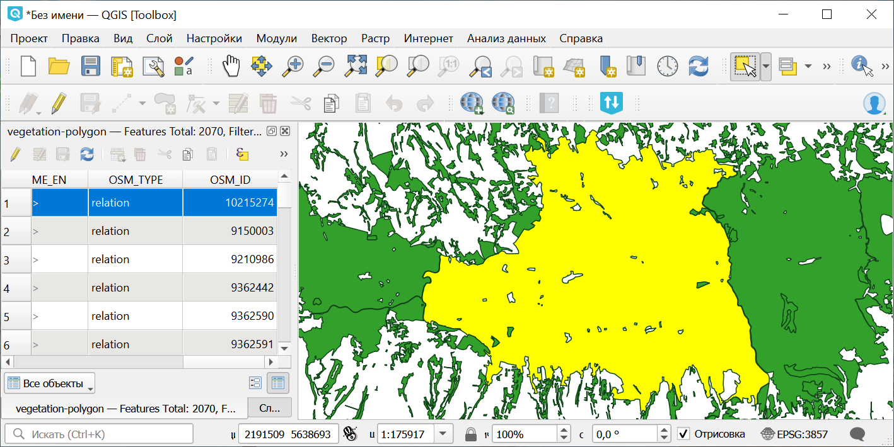
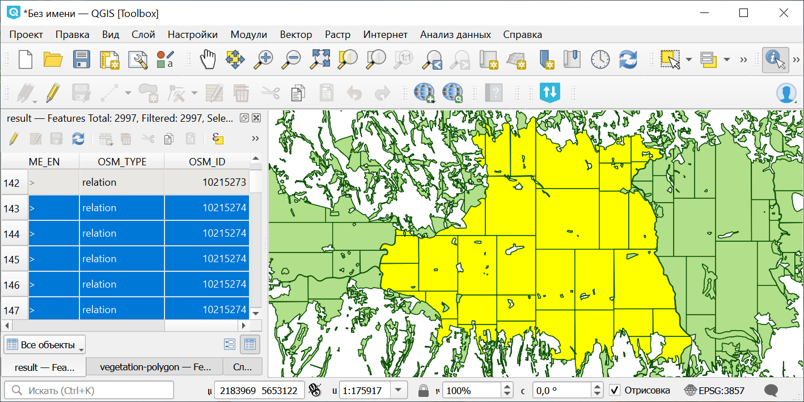

Разделить сложные полигоны
==========================

Разделяет полигоны с большим количеством вершин на более мелкие части. Каждая часть представляет собой отдельный объект, сохраняющий все атрибуты исходного полигона.

На входе:

* Исходный файл - векторный слой в одном из поддерживаемых GDAL форматов, например, GeoPackage, Shapefile в ZIP-архиве, GeoJSON.
* Максимальное число вершин - максимально допустимое число вершин в полигоне. По умолчанию — 200000

На выходе:

* Файл GeoPackage с полигонами, разделёнными при превышении порога по числу вершин.

Запуск инструмента: https://toolbox.nextgis.com/t/splitcomplex

   Пример исходных данных

   Пример результата работы инструмента, полигон разбит на составные части

**Попробуйте инструмент в действии**

1. Нажмите кнопку **Демо** над формой инструмента. Поля будут автоматически заполнены демонстрационными значениями.
2. Нажмите кнопку **Запустить**.

.. seealso::

   * `Базовое упрощение векторных данных <https://toolbox.nextgis.com/t/polysimplifier?from-related-tools=1>`_
   * `Разбить на равные части <https://toolbox.nextgis.com/t/split_to_equal?from-related-tools=1>`_
   * `Продвинутое упрощение векторных данных <https://toolbox.nextgis.com/t/generalization?from-related-tools=1>`_
   * `Разрезать геометрии по 180 меридиану <https://toolbox.nextgis.com/t/split180?from-related-tools=1>`_