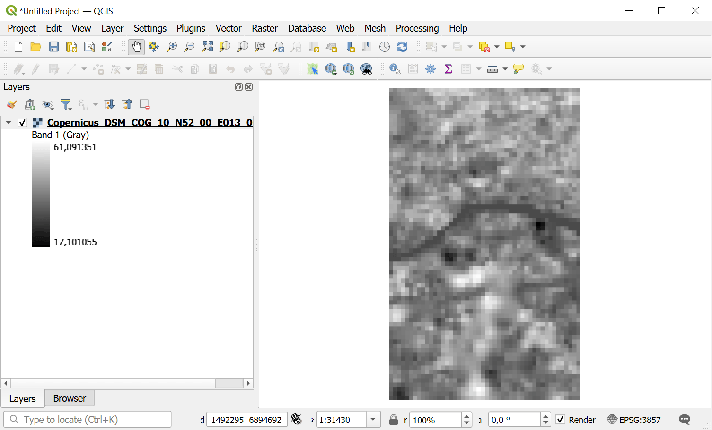
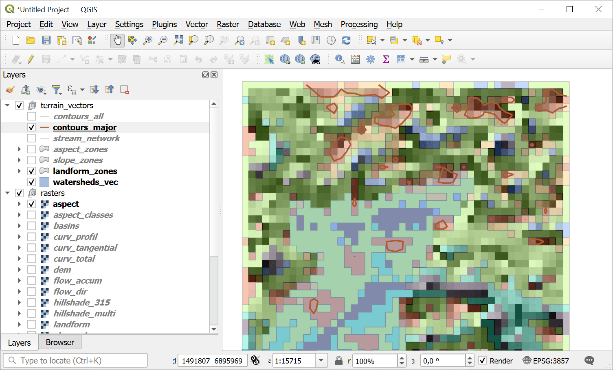

Comprehensive Terrain Analysis
==============================

Complete geomorphological analysis of a DEM: morphometry, hydrology, terrain indices, classifications, and statistics. Produces a ZIP package with rasters, vectors, CSVs, and a JSON manifest.

Inputs:

* DEM Package (ZIP). ZIP file from `Search & download Planetary Computer <https://toolbox.nextgis.com/t/planetary_search?from-related-tools=1>`_ containing a DEM GeoTIFF and manifest.json
* Contour Interval (m). Elevation interval for contour lines in meters (default: 10)
* Major Contour Interval (m). Elevation interval for major contour lines in meters (default: 50)
* Watershed Threshold (cells). Minimum number of cells for watershed delineation (default: 500)
* TPI Small Radius (cells). Neighborhood radius for small-scale TPI in cells (default: 5)
* TPI Large Radius (cells). Neighborhood radius for large-scale TPI in cells (default: 25)

Outputs:

* Terrain Analysis Package (ZIP). ZIP archive with rasters, vectors, statistics, and manifest
* Summary. Human-readable summary of the terrain analysis results
* Manifest JSON. JSON manifest string describing all outputs

Launch the tool: https://toolbox.nextgis.com/t/terrain_analysis

Example:

   Example input

   Example output

The output of this tool can be used in other tools:

* `Flood Susceptibility Analysis <https://toolbox.nextgis.com/t/flood_analysis?from-related-tools=1>`_
* `Erosion Susceptibility Analysis <https://toolbox.nextgis.com/t/erosion_analysis?from-related-tools=1>`_
* `Landslide Susceptibility Analysis <https://toolbox.nextgis.com/t/landslide_analysis?from-related-tools=1>`_
* `Wildfire Susceptibility Analysis (Topographic) <https://toolbox.nextgis.com/t/wildfire_analysis?from-related-tools=1>`_

**Try the tool in action**

1. Click on the **Demo** button above the tool form. The fields are filled in with demo values.
2. Click on the **Run** button.

.. seealso::

  * `Search & download Planetary Computer <https://toolbox.nextgis.com/t/planetary_search?from-related-tools=1>`_
  * `Download Sentinel-2 satellite data <https://toolbox.nextgis.com/t/download_and_prepare_l8_s2?from-related-tools=1>`_
  * `Search and save Sentinel-2 scene previews <https://toolbox.nextgis.com/t/s2_search?from-related-tools=1>`_
  * `Image clustering <https://toolbox.nextgis.com/t/image_clustering?from-related-tools=1>`_
