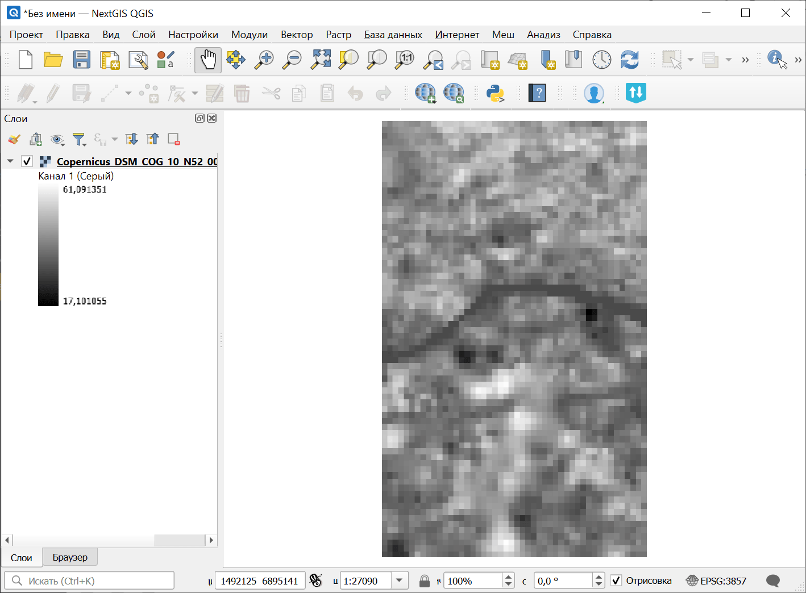
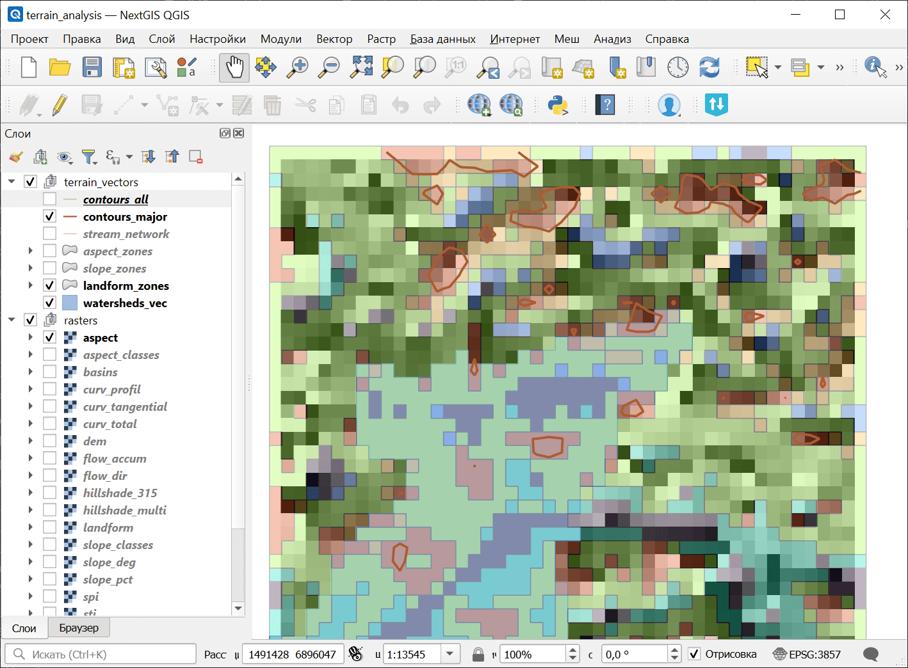

Комплексный анализ рельефа
==========================

Комплексный геоморфологический анализ ЦМР: морфометрия, гидрология, индексы рельефа, классификации и статистика. Создает ZIP-пакет с растрами, векторами, CSV и JSON-манифестом.

На входе:

* Пакет ЦМР (ZIP). ZIP-файл, полученный инструментом `Скачивание данных Planetary Computer <https://toolbox.nextgis.com/t/planetary_search?from-related-tools=1>`_, содержащий ЦМР GeoTIFF и manifest.json
* Шаг горизонталей (м). Интервал высот для горизонталей в метрах (по умолчанию: 10)
* Шаг основных горизонталей (м). Интервал высот для основных горизонталей в метрах (по умолчанию: 50)
* Порог водосбора (ячейки). Минимальное количество ячеек для выделения водосбора (по умолчанию: 500)
* TPI малый радиус (ячейки). Радиус окрестности для мелкомасштабного TPI в ячейках (по умолчанию: 5)
* TPI большой радиус (ячейки). Радиус окрестности для крупномасштабного TPI в ячейках (по умолчанию: 25)

На выходе:

* Пакет анализа рельефа (ZIP). ZIP-архив с растрами, векторами, статистикой и манифестом
* Сводка. Текстовая сводка результатов анализа рельефа
* Манифест JSON. JSON-манифест, описывающий все результаты

Запуск инструмента: https://toolbox.nextgis.com/t/terrain_analysis

Пример работы инструмента:

   Пример исходных данных

   Пример результата работы инструмента

Полученный в результате набор данных можно использовать в следующих инструментах:

* `Анализ подверженности затоплению <https://toolbox.nextgis.com/t/flood_analysis?from-related-tools=1>`_
* `Анализ подверженности оползням <https://toolbox.nextgis.com/t/landslide_analysis?from-related-tools=1>`_
* `Анализ подверженности лесным пожарам (топографический) <https://toolbox.nextgis.com/t/wildfire_analysis?from-related-tools=1>`_
* `Анализ подверженности эрозии <https://toolbox.nextgis.com/t/erosion_analysis?from-related-tools=1>`_

**Попробуйте инструмент в действии:**

1. Нажмите кнопку **Демо** над формой инструмента. Поля будут автоматически заполнены демонстрационными значениями.
2. Нажмите кнопку **Запустить**.

.. seealso::

   * `Скачивание данных Planetary Computer <https://toolbox.nextgis.com/t/planetary_search?from-related-tools=1>`_