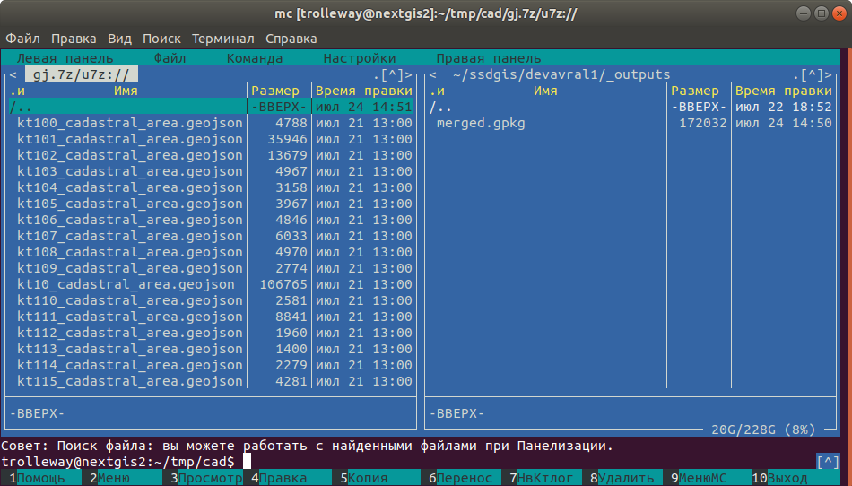
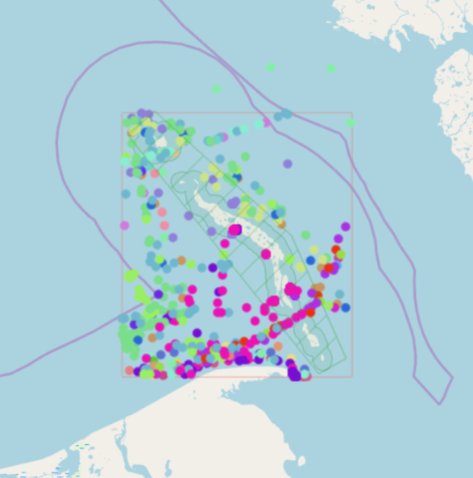

.. sectionauthor:: Maxim Dubinin <maxim.dubinin@nextgis.com>
.. NextGIS Toolbox TOC

.. _toolbox_intro:

Инструменты
===========

.. _toolbox_quadro:

Генератор набора квадратов
--------------------------

Это инструмент cоздает набор сеток квадратов (полигоны) и трансект их обхода для заданной территории.

На входе:

* x0 - Долгота точки привязки
* y0 - Широта точки привязки
* x1 - Долгота опорной точки
* y1 - Широта опорной точки
* size1 - Количество ячеек по первой оси
* size2 - Количество ячеек по второй оси
* side - Сторона генерации ячеек (right,left)
* base_interval - Размер стороны ячейки, метров

Алгоритм расчета: от точки привязки в направлении опорной точки прокладывается линия длиной равной size1*base_interval. От этой линии либо направо или налево от нее откладывается вторая линия длиной size2*base_interval, метров. Две эти линии формируют сетку квадратов.

Результатом работы процесса является набор слоёв:

* rect1 - сеть ячеек размером size1*size2 ячеек, центр первой ячейки - в точке привязки
* rect2 - сеть уменьшенных ячеек размером size1*size2 ячеек (т.е. в 4 раза больше ячеек, каждая крупная ячейка разделена на 4 части)
* line1 - линии обхода в направлении перпендикулярном линии представленной точкой привязки и опорной точкой
* line2 - линии обхода в направлении параллельном линии представленной точкой привязки и опорной точкой
* centers - центры ячеек сетки rect1

Запуск инструмента: https://toolbox.nextgis.com/operation/quadro

Скачать пример результатов: http://nextgis.ru/data/toolbox/quadro/outputs.zip

Посмотреть результаты на интерактивной карте: https://demo.nextgis.com/resource/4582/display?panel=layers

.. figure:: _static/quadro.png
   :align: center
   :width: 16cm
   
   Пример результата работы инструмента 

.. _toolbox_generalization:

Упрощение векторного слоя (генерализация)
-----------------------------------------

Упрощение объектов векторного слоя для уменьшения объема данных.

На входе:

* Векторный слой в формате ESRI Shape, заархивированный (zip)
* import_snap - 
* iterations - 
* method - метод упрощения, один из: 'douglas', 'douglas_reduction', 'lang', 'reduction', 'reumann', 'boyle', 'sliding_averaging', 'distance_weighting', 'chaiken', 'hermite', 'snakes', 'displacement'.
* threshold - порог упрощения (вводится в метрах)
* look_ahead - 
* reduction - 
* slide - 
* angle_thresh - 
* alpha - 
* beta - 

Результатом работы процесса является слой с упрощенными объектами (геометриями).

Запуск инструмента: https://toolbox.nextgis.com/operation/generalization

Скачать пример исходных данных и результата: https://demo.nextgis.com/api/resource/4548/export?zipped=true&format=shp

Посмотреть результат на интерактивной карте: https://demo.nextgis.com/resource/4108/display?panel=info

Подробнее о параметрах запуска: https://grasswiki.osgeo.org/wiki/V.generalize_tutorial

.. _toolbox_dem:

Пакет данных по рельефу
-----------------------
  
Генерация пакета данных по рельефу.

На входе:

* Шаг горизонталей. Целочисленное значение.
* База данных. Выбор из ALOS, GMTED, GEBCO.
* Граница обрезки. Подгрузка заархивированного в zip файла в формате GeoJSON (EPSG:4326).

Результатом работы процесса является набор слоёв:

* Изолинии рельефа с заданным шагом
* Цифровая модель рельефа (разрешение 30 м если территория до 60 гр. с.ш., 250 м если после)
* Свето-теневая отмывка рельефа (разрешение как у ЦМР)

Запуск инструмента: https://toolbox.nextgis.com/operation/dem

Скачать пример результатов: https://demo.nextgis.com/api/resource/4548/export?zipped=true&format=shp

Посмотреть результаты на интерактивной карте: https://demo.nextgis.com/resource/4108/display?panel=info

.. figure:: _static/isolines_sample.png
   :align: center
   :width: 16cm
   
   Пример рендеринга 

.. _toolbox_launch_conditions:

.. _toolbox_split_to_equal:

Разбить на равные части
-----------------------

На входе:

* Слой с полигоном (zip c Shapefile)

Результатом работы процесса является слой:

* Полигоны, с приблизительно одинаковой площадью

Запуск инструмента: https://toolbox.nextgis.com/operation/split_to_equal

Посмотреть результаты на интерактивной карте: https://demo.nextgis.com/resource/4552/display?panel=layers

.. _toolbox_demInPoints:

Извлечение высот
----------------

Извлечение значений высот из ЦМР в точках. Возвращает CSV с координатами и высотами.

Запуск инструмента: https://toolbox.nextgis.com/operation/demInPoints

.. _toolbox_lesis2sqlite:

Лесис в SQLite
--------------

Преобразование базы данных Лесис (ГИС TopoL-L) в формат SQLite для открытия в NextGIS QGIS.

Запуск инструмента: https://toolbox.nextgis.com/operation/lesis2sqlite

Скачать пример исходных данных и результатов расчёта: http://nextgis.ru/data/toolbox/lesis2sqlite/lesis.zip

.. _toolbox_eraser:

Удалить из целевого слоя
-----------------------   

   
Инструмент, позволяющий удалить из целевого слоя области объектов другого слоя.

На входе:

* Векторный слой, из которого нужно удалить области

ZIP-архив с ESRI Shapefile или отдельный файл формата поддерживаемого OGR.

* Векторный слой, содержащий объекты, области которых нужно удалить из исходного

ZIP-архив с ESRI Shapefile или отдельный файл формата поддерживаемого OGR.

Результатом работы инструмента является новый векторный слой.

Исходные векторные слои должны иметь одинаковую систему координат.

Запуск инструмента: https://toolbox.nextgis.com/operation/eraser

Скачать пример исходных данных и результатов расчёта: http://nextgis.ru/data/toolbox/eraser/eraser.zip

Посмотреть исходные данные и результаты расчётов на интерактивной карте: https://demo.nextgis.com/resource/4611/display?panel=info

.. figure:: _static/eraser.png
   :align: center
   :width: 16cm

   Пример результата работы инструмента

.. _toolbox_raster_calculator:

Калькулятор растров
-----------------------

.. figure:: _static/raster_calculator.png
   :align: center
   :width: 16cm
   
   
Инструмент, реализующий растровую арифметику для многоканальных растров или групп одноканальных растров.

На входе:

* Исходные растровые данные.

Исходные растровые данные могут быть представлены в двух видах:

1. многоканальный растр в GDAL-совместимом формате

2. ZIP архив с набором одноканальных GDAL-совместимых растров.

Растры в архиве могут храниться в разных системах координат, иметь разные охваты и размеры ячеек. При расчёте всё будет приведено в единый пространственный домен.

* Выражение.

Стандартное выражение с использованием операторов +, -, \*, /, >, < и т.п. Если исходные данные - ZIP архив, то следует использовать имена исходных файлов в выражении (например band4.tif / band5.tif, если файлы имеют соответствуюшие имена). Расширение является частью имени.
Для мультиканального растра следует использовать номер канала с префиксом & (например &4 / &5). Каналы нумеруются начиная с 1.

Примеры выражений:

Участки леса с температурой меньше 30 градусов:

forest_mask.tif * (land_temperature.tif < 30)

Индекс EVI:

2.5 * (&5 - &4) / (&5 + 6.0*&4 - 7.5*&2 + 1.0)

* Название результирующего растра

Без расширения файла (например ndvi, water). Расширение будет автоматически установлено в .tif

* Разрешение по X

Ширина каждого отдельного пикселя в результирующем растре в метрике системы координат первого растра из набора (напр. 30). Используйте символ - для автоматического подбора ширины пикселя

* Разрешение по Y

Высота каждого отдельного пикселя в результирующем растре в метрике системы координат первого растра из набора (напр. 30). Используйте символ - для автоматического подбора высоты пикселя

* Охват результирующего растра

Формат: xmin, ymin, xmax, ymax. Пример: 1000, 1000, 2500, 2500. Используйте - для автоматического определения охвата. В таком случае будет рассчитан охват пересечений всех входных растров

* Тип данных для нового растра

Доступные типы данных: Int32, Int16, Float64, UInt16, Byte, UInt32, Float32. Используйте - для автоматического подбора типа данных

Результатом работы процесса является одноканальный растр в формате GeoTiff, расчитанный в соответствии с заданным выражением.

Если пользователь задаёт один из опциональных параметров (разрешение по одной из осей или охват), то сначала все участвующие в выражении растры приводятся к заданному состоянию, затем производится расчёт. В случае автоматического подбора параметров пространственного домена используется следующая логика:

1. Вычисляется наименьшее пространственное разрешение среди всех исходных растров. Оно принимается за выходное.

2. Все растры перепроецируются в систему координат первого растра в списке.

3. Выходной охват вычисляется как охват пересечений всех исходных растров.

Запуск инструмента: https://toolbox.nextgis.com/operation/raster_calculator

Скачать пример исходных данных (многоканальный растр, 11 каналов, фрагмент сцены Landsat 8): http://nextgis.ru/data/toolbox/raster_calculator/LC08_B1_B11.TIF

Скачать пример исходных данных (архив с растрами, фрагменты сцены Landsat 8, доступные в выражении названия: band2.tif, band3.tif, band4.tif, band5.tif, band3_cropped.tif): http://nextgis.ru/data/toolbox/raster_calculator/LC08_20180530.zip

Скачать примеры результатов расчёта:

* Для примера с архивом (расчёт NDVI). Выражение: (band5.tif - band4.tif) / (band5.tif + band4.tif). Файл: http://nextgis.ru/data/toolbox/raster_calculator/ndvi.tif

* Для примера с многоканальным растром (маскирование участка реки). Выражение: ((&5 - &4) / (&5 + &4)) < -0.12. Файл: http://nextgis.ru/data/toolbox/raster_calculator/water_mask.tif

Посмотреть исходные данные и результаты расчётов на интерактивной карте: https://demo.nextgis.com/resource/4566/display?panel=info

.. _toolbox_prepare_raster:

Подготовить растр
-----------------------
   
Инструмент, который осуществляет поканальную склейку набора одноканальных растров и обрезку склеенного растра по векторной маске.

На входе:

* Исходные растровые данные

Исходные растровые данные могут быть представлены в двух видах:

1. многоканальный растр в GDAL-совместимом формате

2. ZIP архив с набором одноканальных GDAL-совместимых растров.

* Векторный слой, используемый в качестве маски

ZIP-архив с ESRI Shapefile или отдельный файл формата поддерживаемого OGR.

* Значение "Нет данных"

Значение, которое будет помечено как Нет данных. Используйте символ - для использования значения по умолчанию

* Название результирующего растра

Без расширения файла (например ndvi, water). Расширение будет автоматически установлено в .tif

Если на входе архив с одноканальными растрами, инструмент сначала объединяет их в многоканальный растр. Порядок каналов определяется алфавитной сортировкой имён исходных растров в архиве.
Затем многоканальный растр (собранный из архива или поданный на вход сразу) обрезается по векторной маске.

Исходные растры и векторная маска могут быть в разных системах координат, перед началом обработки все данные приводятся в единый пространственный домен.

Запуск инструмента: https://toolbox.nextgis.com/operation/prepare_raster

Скачать пример исходных данных и результатов расчёта: http://nextgis.ru/data/toolbox/prepare_raster/prepare_raster.zip

Посмотреть исходные данные и результаты расчётов на интерактивной карте: https://demo.nextgis.com/resource/4595/display?panel=info

.. figure:: _static/prepare_raster.png
   :align: center
   :width: 16cm

   Пример результата работы инструмента

.. _toolbox_landsat_to_radiance:

Радиометрическая калибровка данных Landsat
------------------------------------------
   
Инструмент осуществляет пересчёт сырых данных Landsat в интенсивность излучения (ToA Radiance).

На входе:

* Исходные файл канала Landsat

Файл из оригинального архива данных Landsat уровня обработки L1. Имя может быть любым. Данные могут быть предварительно обрезаны и т.д.

* Номер канала

Номер канала, соответствующего загруженному файлу. Обычно число, для ETM+ может быть также 6_VCID_1 и 6_VCID_2

* Файл метаданных Landsat

Текстовый файл из оригинального архива данных Landsat. В зависимости от типа данных, это файл \*MTL.txt или \*.MTL.

На выходе:

* Интенсивность излучения соответствующего канала в формате GeoTIFF

Радиометрическая калибровка необходима для анализа временных рядов, расчёта производных продуктов (например, индексных изображений).

Поддерживаются данные:

* Landsat 8 (OLI, TIRS)

* Landsat 7 (ETM+)

* Landsat 5 (TM)

* Landsat 4 (TM)

Запуск инструмента: https://toolbox.nextgis.com/operation/landsat_to_radiance

Скачать пример исходных данных и результатов расчёта: http://nextgis.ru/data/toolbox/landsat_to_radiance/landsat_to_radiance.zip

.. _toolbox_landsat_to_reflectance:

Расчёт спектрального альбедо объектов по данным Landsat
-------------------------------------------------------
   
Инструмент осуществляет пересчёт интенсивности излучения (ToA Radiance) данных Landsat в отражательную способность с возможностью применения атмосферной коррекции по методу DOS

На входе:

* Файл с интенсивностью излучения одного из каналов Landsat

Результат радиометрической калибовки исходных данных Landsat, например с помощью инструмента https://toolbox.nextgis.com/operation/landsat_to_radiance

* Номер канала

Номер канала, соответствующего загруженному файлу. Обычно число, для ETM+ может быть также 6_VCID_1 и 6_VCID_2

* Файл метаданных Landsat

Текстовый файл из оригинального архива данных Landsat. В зависимости от типа данных, это файл \*MTL.txt или \*.MTL.

* Тип результата обработки

0 для расчёта альбедо по умолчанию, 1 для применения атмосферной коррекции по методу DOS

На выходе:

* Спектральное альбедо соответствующего канала в формате GeoTIFF

Спектральное альбедо - основной тип информации, который следует использовать при анализе данных дистанционного зондирования. Он лучше всего подходит для анализа временных рядов. Возможность применения атмосферной коррекции также улучшает качество данных.

Поддерживаются данные:

* Landsat 8 (OLI, TIRS)

* Landsat 7 (ETM+)

* Landsat 5 (TM)

* Landsat 4 (TM)

Запуск инструмента: https://toolbox.nextgis.com/operation/landsat_to_reflectance

Скачать пример исходных данных и результатов расчёта: http://nextgis.ru/data/toolbox/landsat_to_reflectance/landsat_to_reflectance.zip

.. _toolbox_ndi:

Расчёт нормализованного разностного индекса
-------------------------------------------
   
Инструмент осуществляет расчёт нормализованного разностного индекса для двух любых входных изображений.

На входе:

* Растровое изображение - первый участник разностного индекса

Любой GDAL-совместимый растр

* Растровое изображение - второй участник разностного индекса

Любой GDAL-совместимый растр

На выходе:

* Растр с нормализованных разностным индексом в формате GeoTiff.

Расчёт осуществляется по формуле: (Первое изображение - Второе изображение) / (Первое изображение + Второе изображение). Значения пикселей результирующего растра находятся в диапазоне от -1 до 1
Перед расчётом оба изображения приводятся в единый пространственный домен. Используется проекция и пространственное разрешение первого растра.

Примеры распространенных нормализованных разностных индексов:

* NDVI - для оценки растительности (первый растр - съемка в ближнем инфракрасном диапазоне, второй - в красном диапазоне длин волн)  Для данных Landsat 8: 5 и 4 каналы.
* NDWI - для обнаружения водных объектов (первый растр - съемка в ближнем инфракрасном диапазоне, второй - в среднем инфракрасном диапазоне длин волн). Для данных Landsat 8: 5 и 6 каналы.
* NDSI - для оценки снежного покрова (первый растр - съёмка в зеленом диапазоне, второй - в среднем инфракрасном диапазоне длин волн). Для данных Landsat 8: 3 и 6 каналы.

Запуск инструмента: https://toolbox.nextgis.com/operation/ndi

Скачать пример исходных данных и результатов расчёта: http://nextgis.ru/data/toolbox/ndi/ndi.zip

.. _toolbox_ogrmerge:
 
Объединение векторных слоёв
---------------------------
   

   Исходные и результирующие данные
   
Инструмент осуществляет объединение множества векторных слоёв в один слой.

На входе:

* Архив в формате ZIP с файлами формата .shp, .geojson, .gpkg, .tab

На выходе:

* Файл в формате GeoPackage с результатом объединения.

В инструменте нет ограничения на количество исходных слоёв. Они склеиваются по-очереди. Название исходного слоя не сохраняется.

Запуск инструмента: https://toolbox.nextgis.com/operation/ogrmerge

Скачать пример исходных данных и результатов расчёта: http://nextgis.ru/data/toolbox/ogrmerge/ogrmerge.zip

.. _toolbox_ngw_copy_layer:
 
Дублировать структуру векторного слоя nextgis.com
-------------------------------------------------
   
.. figure:: _static/ngw_copy_layer.png
   :align: center
   :width: 16cm

   Исходные и результирующие данные
   
Инструмент осуществляет дублирование структуры векторного слоя nextgis.com в другой каталог или инстанс. Копируются названия полей, порядок полей, типы полей, псевдонимы и описания. Метаданные в текущей версии не копируются.

На входе:

*  Две пары URL, логинов и паролей, id исходного слоя и id новой папки

На выходе:

* Выходных данных нет, результатом является создание слоя в nextgis.com

Особенности: 
Пригоден для слоёв создаваемых NextGIS FormBuilder. Используется при процессе репликации слоёв. Данные не копируются.

Запуск инструмента: https://toolbox.nextgis.com/operation/ngw_copy_layer

Скачать пример исходных данных и результатов расчёта: http://nextgis.ru/data/toolbox/ngw_copy_layer/ngw_copy_layer.zip

.. _toolbox_kpt2geo:
 
Конвертация выгрузки КПТ Росреестра в геоданные
-----------------------------------------------
   
.. figure:: _static/kpt2geo.png
   :align: center
   :width: 16cm

   Исходные и результирующие данные
   
Инструмент осуществляет конвертацию одной или нескольких КПТ Росреестра из формата XML в удобный формат геоданных с проектом для ГИС.

На входе:

*  zip-архив c zip-архивами выгрузок Росреестра (архив архивов с названиями вида Response-80-105152635.zip)
*  выходной формат геоданных - GeoJSON, ESRI Shape, Mapinfo TAB

На выходе:

* zip-архив с проектом QGIS и геоданными

В архиве лежат каталоги: каталог с геоданными в местной системе координат (msk), каталог с геоданными в EPSG:4326 (wgs) и проект для QGIS с данными в EPSG:4326 с оформлением.

Описание слоёв приведено на https://data.nextgis.com/ru/cadastre/#region-layers

Запуск инструмента: https://toolbox.nextgis.com/operation/pkk_kpt

Скачать пример исходных данных и результатов расчёта: http://nextgis.ru/data/toolbox/kpt2geo/kpt2geo.zip

.. _toolbox_ai2geo:

Геоданные из файлов Adobe Illustrator
-------------------------------------

Инструмент извлекает слои векторных данных из файла Adobe Illustrator (*.ai), используя дополнительный файл в формате GeoTIFF для геопривязки.

На входе:

* Файл Adobe Illustrator (с расширением .ai), в котором содержатся векторные объекты. 
* Файл GeoTIFF (с расширением .geotiff или .tif), на основе которого будет производиться геопривязка извлекаемых векторных объектов.

Инструмент работает следующим образом: из файла .ai извлекаются геометрии. Для каждой геометрии определяется её тип (точка, линия или полигон), а так же стиль которым она нарисована (толщина линии, цвет линии, цвет заливки). Создаются слои (согласно типам геометрий), в которых каждый объект будет содержать полученную геометрию и строку стиля в поле "STYLE". При этом координаты геометрий преобразуются из локальных координат в пространственные координаты, основываясь на переданном файле GeoTIFF, который должен содержать корректную геопространственную привязку (подразумевается, что векторные объекты в .ai файле при его создании были нарисованы "поверх" аналогичного изображения в Adobe Illustrator).

Результатом работы процесса является ZIP-архив, содержащий набор файлов в формате ESRI Shapefile согласно созданным слоям.

Запуск инструмента: https://toolbox.nextgis.com/operation/ai2geo

.. figure:: _static/ai2geo_before.png
   :align: center
   :width: 32cm
   
   Исходные векторные данные в .ai файле.

.. figure:: _static/ai2geo_after.png
   :align: center
   :width: 32cm
   
   Результат работы инструмента: полученные слои загружены в QGIS и отображаются на фоне подложки OSM.

.. _toolbox_grid:
 
Генерация сетки в метрах
-----------------------------------------------
   
.. figure:: _static/grids-demo.png
   :align: center
   :width: 16cm

   Сгенерированные сетки
   
Инструмент осуществляет генерацию сетки в границах обьектов из векторного слоя. Размер сетки задаётся в метрах. Обьекты могут быть в любом месте земли.

На входе:

*  Мультиполигональный слой с одним или несколькими объектами. Может быть в любом формате, открываемом ogr (Geopackage, geojson)
*  Шаг сетки в метрах
*  Режим: points (точки), rect (квадраты).
*  Алгоритм обрезки сетки по границам. all (оставлять все квадраты в охвате обьекта), touches (оставлять все квадраты касающиеся обьекта), intersection (обрезать квадраты по границе обьекта).

.. figure:: _static/grid-1000-rect-all.png
   :align: center
   :width: 16cm

   all
   
   
.. figure:: _static/grid-1000-rect-touches.png
   :align: center
   :width: 16cm

   touches
   
   
.. figure:: _static/grid-1000-rect-intersection.png
   :align: center
   :width: 16cm

   intersection
   
   
.. figure:: _static/grid-1000-point-all.png
   :align: center
   :width: 16cm

   all для точек
   
   
.. figure:: _static/grid-1000-point-intersection.png
   :align: center
   :width: 16cm

   touches и intersection для точек

   
.. figure:: _static/grid-planet.png
   :align: center
   :width: 16cm

   Сгенерированные сетки для нескольких полигонов в разных местах глобуса
   

*  выходной формат геоданных - GeoJSON, ESRI Shape, Mapinfo TAB

На выходе:

* Geopackage

Запуск инструмента: https://toolbox.nextgis.com/operation/grid

.. _toolbox_last_img:
 
Запрос метаданных изображений Google Earth Engine
-------------------------------------------------
   
Инструмент запрашивает метаданные изображений указанной пользователем коллекции изображений Google Earth Engine (изображения анализируются внутри фиксированной области), начиная с заданной даты.

На входе:

*  Название коллекции в формате GEE (например, LANDSAT/LC08/C01/T1_SR).
*  Начальная дата: изображения коллекции, созданные ранее этой даты, игнорируются. Метаданные возвращаются по изображениям, созданным позднее даты. Формат даты: YYYY-MM-DD.
*  Архив (zip) файла доступа к GEE, обычно может быть найден в домашнем каталоге пользователя (.config/earthengine/credentials).

На выходе

*  метаданные по запрошенным изображениям;
*  выходной формат данных - JSON (запакованный в zip).

Запуск инструмента: https://toolbox.nextgis.com/operation/last_img

.. _toolbox_download_and_prepare_l8_s2:
 
Загрузка и подготовка данных Landsat 8 / Sentinel 2
---------------------------------------------------
   
Инструмент загружает и подготавливает данные Landsat 8 / Sentinel 2.

На входе:

*  Идентификатор сцены Landsat 8 / Sentinel 2, тип данных определяется автоматически по идентификатору. Получить идентификатор можно например на https://earthexplorer.usgs.gov
*  Векторная маска по которой будет обрезан снимок. Формат - GeoJSON, ESRI Shape (в zip-архиве) или любой другой OGR-совместимый файл.
*  Перечень каналов. Список номеров разделенных запятой. Каналы будут склеены в указанном порядке, например 2,3,4. Используйте - для загрузки и склейки всех каналов

На выходе

*  GeoTIFF готового снимка

Запуск инструмента: https://toolbox.nextgis.com/operation/download_and_prepare_l8_s2

.. _tropomi2geotiff:
 
TROPOMI в GeoTIFF
-----------------
   
Инструмент конвертирует данные TROPOMI по диоксиду азота в формат GeoTIFF

На входе:

*  Файл данных TROPOMI в формате NetCDF полученный с https://s5phub.copernicus.eu/dhus/#/home. Product type: L2__NO2__, Timeliness: Offline. Пример имени файла: S5P_OFFL_L2__NO2____20190901T091635_20190901T105804_09761_01_010302_20190907T113505.nc

На выходе

*  GeoTIFF готового снимка

Запуск инструмента: https://toolbox.nextgis.com/operation/tropomi2geotiff

Скачать пример исходных данных и результатов расчёта: http://nextgis.ru/data/toolbox/tropomi2geotiff/tropomi2geotiff.zip

Посмотреть пример результата на интерактивной карте: https://demo.nextgis.com/resource/4698/display?panel=layers

.. figure:: _static/tropomi2geotiff.png
   :align: center
   :width: 16cm
   
.. _mt2report:
 
ГЕНЕРАТОР ОТЧЕТА НА ОСНОВЕ ДАННЫХ О ЛОКАЦИЯХ СУДОВ
-----------------
Этот инструмент генерирует таблицу, в которой перечислены суда, заплывающие на заданную территорию, дата и координаты их последнего места пребывания, а также количество заходов судов на заданную территорию за определенный промежуток времени.

На входе:

* name - Имя Веб-ГИС
* layer_id_border - ID ресурса зоны
* layer_id_ships - ID ресурса данных о судах
* date - Начальная дата

Алгоритм расчета: Загрузка слоев границы зон анализа и локации судов. Затем выполняется проверка каждого элемента слоя локации судов на пересечение со слоем зоны анализа, одновременно с этим выполняется отбор локаций, которые были зарегистрированы позже заданного значения. Среди отобранных локаций выбираем наиболее позднюю по дате для каждого судна, для этой локации получаем координаты. Полученная иформация для каждого судна записывается в таблицу. 

Результатом работы процесса является таблица формата ship_result.csv с информацией о всех судах, зарегистрированных на заданной территории позднее заданной даты, информация о последней зарегистрированной локации и количестве зарегистрированных локаций в пределах заданной территории за определенный промежуток времени.

Запуск инструмента: https://toolbox.nextgis.com/operation/mt2report

Посмотреть результаты на интерактивной карте:
https://demo.nextgis.com/resource/4693/display?panel=layers

   
   Пример результата работы инструмента 
