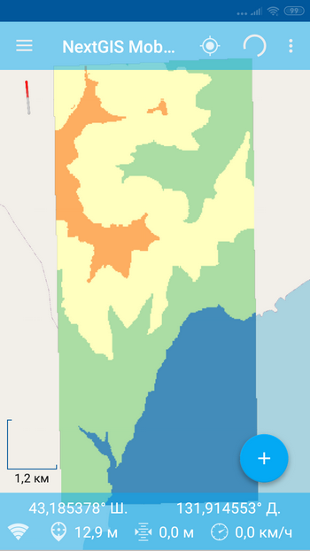
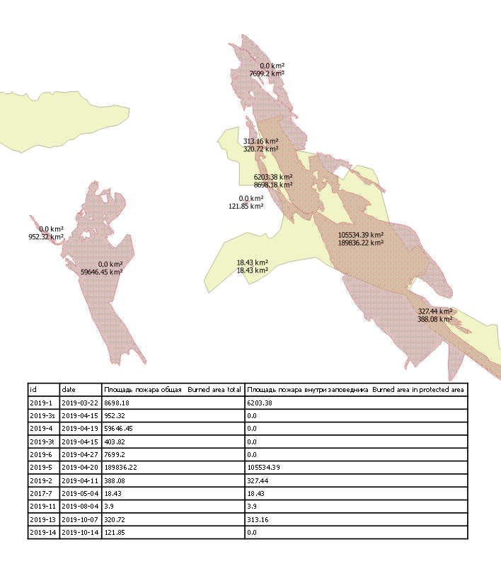
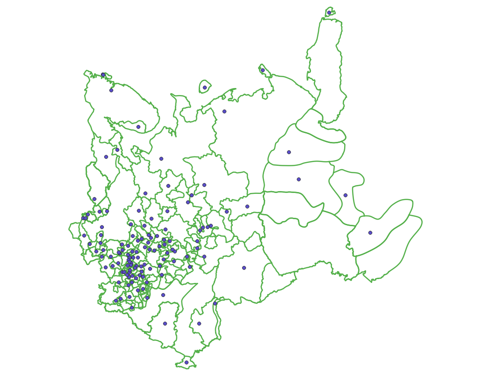
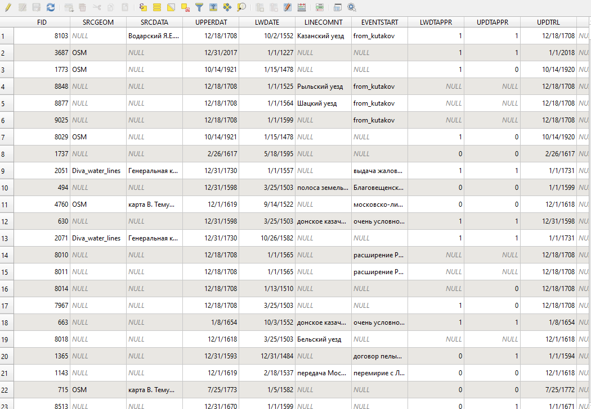
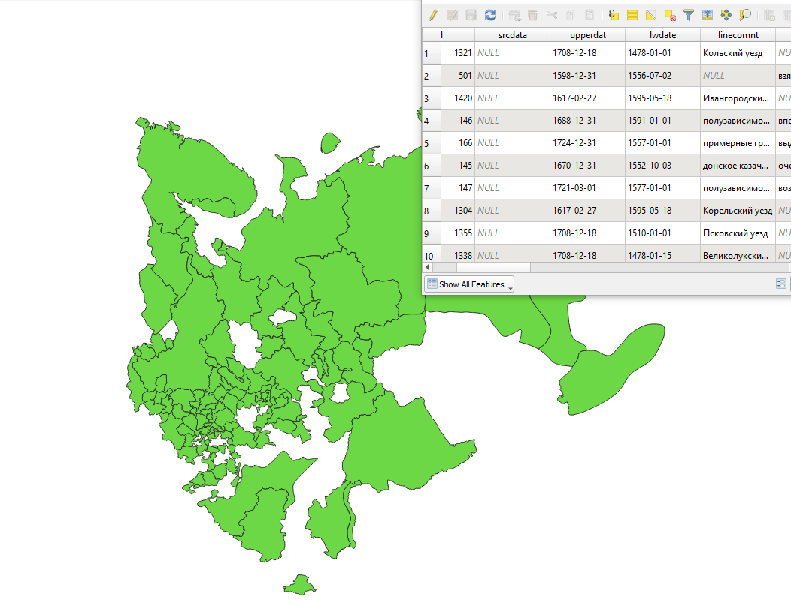
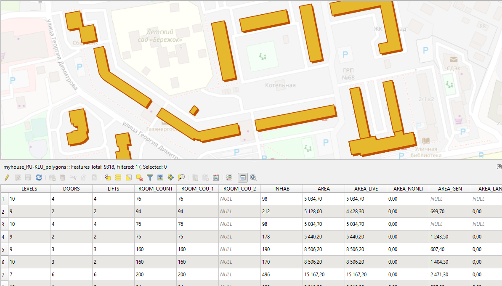

.. sectionauthor:: Maxim Dubinin <maxim.dubinin@nextgis.com>
.. NextGIS Toolbox TOC

.. _toolbox_intro:

Tools
=====

.. _toolbox_launch_conditions:

.. _toolbox_split_to_equal:

Split into equal parts
----------------------

Tool splits all objects of polygon layer into parts with equal area. Note: tool doesn't process multipolygons.

Inputs:

* Shapefile - polygon layer to be splitted. Should be in ESRI Shapefile format and packed in ZIP-archive.
* Number of parts - specify, into how many parts source Shapefile should be splitted.

Outputs:

* ZIP-archive with modified Shapefile, where initial polygons are splitted into specified number of parts with equal area, and each part is an individual polygon itself. 

Launch tool: https://toolbox.nextgis.com/operation/split_to_equal

View the results of calculations on an interactive map: https://demo.nextgis.com/resource/4552/display?panel=layers 


.. _toolbox_split_to_rect:

Split into rectangles and calculate their number
-----------------------------------------------------

Splits polygon layer into equal rectangular parts and calculates number of rectangles. Layer can consist of several polygons, number of rectangles will be calculated for each of them. 

Inputs:

*  Shapefile - polygonal layer in ESRI Shapefile format, for which the number of rectangles will be calculated. Should be packed in ZIP-archive. Attributes should contain empty string field, where the results of calculation will be recorded.
* Length of rectangle - longer side of rectangle, should be specified in meters.
* Width of rectangle - shorter side of rectangle, should be specified in meters.
* Field name - name of the string field in initial layer, where to write the number of calculated rectangles for each polygon.
* Percentage of not filled area – please, specify percentage. Percentage is calculated out of rectangle area and will be used to form a buffer around each rectangle.

Outputs:

* ZIP-archive with modified Shapefile, with a number of rectangles recorded in attribute table. 

Launch tool: https://toolbox.nextgis.com/operation/split_to_rect


.. _toolbox_raster2tiles:
 
Generate tileset from raster
---------------------------------------------------
   
Service generates raster tiles (NGM format) from input gdal-supported raster.

Inputs:

*  Palette file - TXT file  with color scheme of each raster values  located in a separate line. Order: Value Red Green Blue Opacity. For example, for a value of 23, assigning a completely opaque lilac color looks like this: 23 200 162 200 255. Opacity ranges from 0 to 255, 0 - completely transparent, 255 - completely opaque.  Use an empty text file to keep the original palette (for single-band with palette) and for RGB / RGBA rasters.
*  Raster dataset - RGB, RGBA, single-band gray or single-band with palette GDAL-compatible raster
*  Tiles name - the name that will be used for the file name and for the layer in NGM
*  Zoom levels - the levels at which the tiles will be displayed. This refers to `standard zoom levels <https://wiki.openstreetmap.org/wiki/Zoom_levels>`_, for example, as for OSM maps. Possible input values: a number indicating one level, for example, 10; a range of levels, for example, 8-14; hyphen - for auto-selection of levels

Outputs:

*  NGRC file with tileset

.. figure:: _static/raster2tiles_input.png
   :align: center
   :width: 16cm
   
   Inputs example
   

   
   Result example - NGRC file added to NextGIS Mobile

Launch tool: https://toolbox.nextgis.com/operation/raster2tiles

Download an example of source data and result :download:`here <files/raster2tiles_examples.zip>`.  


.. _toolbox_forestplots_field:

Create forestplots scheme for Garmin
------------------------------------

The tool generates forest field plots in KMZ format ready to upload to Garmin devices. Areas located closer than 10 m from the plot border are discarded. A buffer zone is added around the plot at a distance of 50 m.

Inputs:

*  Input polygon dataset. Supported formats are zipped shapefile, Mapinfo TAB or OGR-compatible file. Must contain only one feature without rings.
*  Step between points. Distance between plots in meters. Default 55 meters.

Outputs:

* KMZ file with forest field plots ready to upload to Garmin devices.
* Separate JPG file with forest plots scheme.

Download an example of source data and result: https://nextgis.ru/data/toolbox/forestplots_field/forestplots_field.zip

Launch tool: https://toolbox.nextgis.com/operation/forestplots_field

.. figure:: _static/forest-circular-plots.jpg
   :align: center
   :width: 16cm

   An example of result uploded to Garmin. 


.. _toolbox_eraser:

Erase from target
-----------------

A tool that allows you to erase areas from the target layer. Areas to be erased are taken from another layer.

Inputs:

* Vector layer from which some areas are needed to be erased

ZIP archive with ESRI Shapefile or an other file format supported by OGR.

* Vector layer containing features representing areas needed to be erased from the target layer

ZIP archive with ESRI Shapefile or other file format supported by OGR.

The result of the tool’s usage is a new vector layer.

The initial vector layers must have the same coordinate system.

Launch tool: https://toolbox.nextgis.com/operation/eraser

Download an example of initial data and calculation results: https://nextgis.ru/data/toolbox/eraser/eraser.zip

View the source data and the results of calculations on an interactive map: https://demo.nextgis.com/resource/4611/display?panel=info


.. figure:: _static/eraser.png
   :align: center
   :width: 16cm

   An example of the result of the tool’s usage


.. _toolbox_ngw_intersect:

Intersector
-----------

The tool intersects all layers of the nextgis.com web map using the specified geometry and generates a report listing the layers, with which the intersection took place. If different features intersect in a separate layer, these cases are displayed as separate events in the report.

Inputs:

*  url - address of the used Web GIS
*  webmap_id - web map ID from used Web GIS
*  wkt - geometry with which the intersection of layers of the web map is checked. Indicated in wkt format, coordinate system - EPSG: 3857

Outputs:

*  .xlsx table with a list of intersected layers

Launch tool: https://toolbox.nextgis.com/operation/ngw-intersect

Usage example:

How many types of anemones can you find on the Appalachian Trail?

*  url - https://demo.nextgis.com
*  webmap_id - 4714 (since the web map address is https://demo.nextgis.com/resource/4714/display)
*  wkt - LineString (-9378421.57282677479088306 4115819.42546373652294278, -7678593.31173497438430786 5764332.11640937067568302)	
 
.. figure:: _static/ngw_intersect_layers.png
   :align: center
   :width: 16cm
   
   Initial Data Example
   
.. figure:: _static/ngw_intersect_result.png
   :align: center
   :width: 16cm
   
   An example of the result of the tool’s usage 


.. _toolbox_clip_polys_poly:

Intersection areas inside/outside boundary
-------------------------------------------
   
Calculates area of polygons and area of polygons inside boundary. Areas calculated in hectares (ha)
Module was created for registration of wildfires in natural protected area. Internal calculations use local UTM zones, so calculations will accurate for any places on Earth.

Inputs:

*  nextgisweb url, login and password
*  nextgisweb layer id of boundary polygonal layer. Layer should have 1 feature, with polygon or multipolygon geometry
*  nextgisweb layer id of feature polygonal layer. Layer should have 2 fields for area calculations results.

Outputs:

*  Areas values will write into fields of layers in nextgisweb


.. figure:: _static/clip_polys_poly1.png
   :align: center
   :width: 16cm
   
   Example of source data
   
.. figure:: _static/clip_polys_poly2.png
   :align: center
   :width: 16cm
   
   Example of results
   

   
   Example of results and custom styling

Launch tool: https://toolbox.nextgis.com/operation/clip_polys_poly

Download an example of source data and result: https://nextgis.ru/data/toolbox/clip_polys_poly/clip_polys_poly.zip


.. _toolbox_lesis2sqlite:

Lesis (TopoL) to SQLite
-----------------------

Conversion of the Lesis database (TopoL-L GIS) to SQLite format to open in NextGIS QGIS.

Launch tool: https://toolbox.nextgis.com/operation/lesis2sqlite

Download an example of initial data and calculation results: https://nextgis.ru/data/toolbox/lesis2sqlite/lesis.zip


.. _toolbox_vectorclip:

Polygon intersection
-----------------

Clips one polygonal layer with another.

Launch tool: https://toolbox.nextgis.com/operation/vectorclip


.. _toolbox_landsat_to_radiance:

Landsat radiometric calibration
-------------------------------
   
The tool converts the Landsat raw data into radiation intensity (ToA Radiance).

Inputs:

* Landsat band initial File

Processing level L1 file from the original Landsat data archive. The name can be anything. Data can be pre-trimmed, etc.

* Band number

The band number corresponding to the downloaded file. Usually a number, for ETM + it can also be 6_VCID_1 and 6_VCID_2

* Landsat Metadata File

Text file from the original Landsat data archive. Depending on the data type, it is a * MTL.txt or * .MTL file.

Outputs:

* The radiation intensity of the corresponding band in the GeoTIFF format

Radiometric calibration is necessary for time series analysis, calculation of derivative products (for example, index images).

Supported data:

* Landsat 8 (OLI, TIRS)

* Landsat 7 (ETM+)

* Landsat 5 (TM)

* Landsat 4 (TM)

Launch tool: https://toolbox.nextgis.com/operation/landsat_to_radiance

Download an example of source data and calculation results: https://nextgis.ru/data/toolbox/landsat_to_radiance/landsat_to_radiance.zip


.. _toolbox_ndi:

Normalized difference index
---------------------------
   
The tool calculates the normalized difference index for any two input images.

Inputs:

* First component of the difference index

Any GDAL-compatible raster

* Second component of the difference index

Any GDAL-compatible raster

Outputs:

* A raster with normalized difference index in GeoTiff format

The calculation is carried out according to the formula: (First image - Second image) / (First image + Second image). The pixel values of the resulting raster are in the range from -1 to 1
Before the calculation, both images are brought into a single spatial domain. The projection and spatial resolution of the first raster is used.

Examples of common normalized difference indices:

* NDVI - for vegetation assessment (the first raster - NIR, the second - RED) For Landsat 8 data: 5 and 4 bands.
* NDWI - for the detection of water bodies (the first raster - NIR, the second - SWIR). For Landsat 8 data: 5 and 6 bands.
* NDSI - for assessing the snow cover (the first raster - GREEN, the second - SWIR). For Landsat 8 data: 3 and 6 bands.

Launch tool: https://toolbox.nextgis.com/operation/ndi

Download an example of source data and calculation results: https://nextgis.ru/data/toolbox/ndi/ndi.zip


.. _toolbox_coord_recalc:

Reprojecting coordinates
----------------------------

Tool reprojects coordinates of the objects, presented in CSV file, into a given coordinate system.

Inputs:

* CSV file - file with a list of objects and its coordinates
* ID of X coordinate - index number of the column in CSV file, where X coordinates are located (longitude).
* ID of Y coordinate - index number of the column in CSV file, where Y coordinates are located (latitude).
* ID of the first row - index number of the row, from which reprojection should be applied.
* Separator - specify separator type, which is used in source CSV (e.g., ; (semicolon) or , (comma) and so on).
* Source CRS - coordinate reference system, used in source CSV. Should be specified in proj4 format (e.g. +proj=longlat +ellps=WGS84 +datum=WGS84 + no_defs).
* Target CRS - coordinate reference system into which data will be reprojected. Should be specified in proj4 format (optional, by default "+proj=longlat +ellps=WGS84 +datum=WGS84 + no_defs" will be applied).

Output: 

Launch tool: https://toolbox.nextgis.com/operation/coord_recalc

:download:`Example <files/coord_recalc_example.csv>` of the source data.


.. _toolbox_quadro:

Set of squares generator
------------------------

This tool creates a set of square grids (polygons) and a transect of their detour for a given territory.

Inputs:

* x0 - Longitude of the anchor point
* y0 - Latitude of the anchor point
* x1 - Longitude of the reference point
* y1 - Latitude of the reference point
* size1 - Number of cells on the first axis
* size2 - Number of cells on the second axis
* side - Cell generation side (right, left)
* base_interval - The size of a cell’s side, meters

Calculation algorithm: from the anchor point in the direction of the reference point a line is drawn with a length equal to size1 * base_interval. From this line, either to the right or left of it, a second line is laid out with the length of size2 * base_interval, meters. These two lines form a grid of squares.

The result of the process is a set of layers:

* rect1 - a grid of cells the size of size1 * size2 cells, the center of the first cell is at the anchor point
* rect2 - a grid of smaller cells the size of size1 * size2 cells (i.e. 4 times larger cells, each large cell is divided into 4 parts)
* line1 - bypass lines in the direction, which if perpendicular to the line represented by the anchor point and reference point
* line2 - bypass lines in the direction, which is parallel to the line represented by the anchor point and reference point
* centers - grid cell centers rect1

Launch tool: https://toolbox.nextgis.com/operation/quadro

Download sample results: https://nextgis.ru/data/toolbox/quadro/outputs.zip

View the results on an interactive map: https://demo.nextgis.com/resource/4582/display?panel=layers

.. figure:: _static/quadro.png
   :align: center
   :width: 16cm
   
An example of the results


.. _toolbox_prepare_raster:

Prepare raster
--------------
   
A tool that performs a per-band connection of a set of single-band rasters and crops the result using a vector mask.

Input:

* Initial raster data

The initial raster data can be presented in two forms:

1. Multi-band raster in GDAL-compatible format

2. ZIP archive with a set of single-baned GDAL-compatible rasters

* Vector layer, which is used as mask

ZIP archive with ESRI Shapefile or a other file format supported by OGR.

* “No data” value

The value that is marked as “No data”. Use the - symbol to use the default value.

* The name of the resulting raster

No file extension (e.g. ndvi, water). The extension will be automatically installed in .tif

If the input is an archive with single-band rasters, the tool first combines them into a multi-band raster. The order of the bands is determined by alphabetically sorting the names of the initial rasters in the archive. 
Then the multi-band raster (assembled from the archive or submitted immediately) is cropped with a vector mask.

The initial rasters and the vector mask can be in different coordinate systems before processing, all data is brought into a single spatial domain.

Launch tool: https://toolbox.nextgis.com/operation/prepare_raster

Download an example of initial data and calculation results: https://nextgis.ru/data/toolbox/prepare_raster/prepare_raster.zip

View the source data and calculation results on the interactive map: https://demo.nextgis.com/resource/4595/display?panel=info

.. figure:: _static/prepare_raster.png
   :align: center
   :width: 16cm

   An example of the result of the tool’s usage


.. _toolbox_ogrmerge:
 
Merge vector layers
-------------------
   
.. figure:: _static/ogrmerge.png
   :align: center
   :width: 16cm

   Initial and resulting data
   
The tool merges many vector layers into one. Layers should be of same geometry type.

Inputs:

* ZIP archive with .shp, .geojson, .gpkg, .tab layers. You can combine files of different formats and coordinate reference systems together in one set. Inside archive files can also be stored in additional common folder.

Outputs:

* GeoPackage file with the result of the merge.

The tool has no limit on the number of input layers. The name of the source layer is currently not saved.

Launch tool: https://toolbox.nextgis.com/operation/ogrmerge

Download an example of initial data and calculation results: https://nextgis.ru/data/toolbox/ogrmerge/ogrmerge.zip


.. _toolbox_join_by_field:

Join layer and table by field
-----------------------------

The tool combines data from a table and a layer using a given field. The tool involves the use of two different join types: one-to-one - finds the first matching element of the table and attaches its attributes; one-to-many - connects all elements of the table for which the given field matches, the geometry of the feature is duplicated for each element.

Inputs:

* gis_url - address of the used Web GIS
* resource_id - layer ID to combine from the currently used Web GIS
* src - table name
* layer_field - the name of the field in the Web GIS layer
* csv_field - field name in the table
* join_type - type of join (1 - one-to-one, 0 - one-to-many)

Outputs:

*  layer in ESRI Shapefile format, which is in an archive (zip)

Launch tool: https://toolbox.nextgis.com/operation/join_by_field

Usage example:

.. figure:: _static/join_by_field.png
   :align: center
   :width: 16cm

Download sample results: https://nextgis.ru/data/toolbox/join_by_field/join_by_field.zip


.. _toolbox_intersect_layers:

Intersect layers
----------------

The tool intersects a polygonal layer with another vector layer (any type of geometry) and outputs the result as a set of CSV files.

Inputs:

*  Field name for CSV file. The name of the attribute column in the polygonal layer for resulting CSV files. If this field is blank, CSV file names will be generated automatically.
*  Polygonal shapefile. Polygonal layer in the ESRI Shapefile format (ZIP-archive), for the objects of which the fact of intersection (or non-intersection) with objects from another layer is defined.
*  Shapefile with intersecting layer. The vector layer with any geometries in the ESRI Shapefile format (ZIP-archive), containing objects intersecting with objects from the polygonal layer. The layer must be in the same coordinate system as the polygon layer.

Outputs:

*  Zipped CSV files, each of which describes one of the objects of the polygonal layer. If an object from a polygon layer has an intersection with an object from another layer, the CSV file will contain the coordinates of the center and the WKT description of the polygon.

Launch tool: https://toolbox.nextgis.com/operation/intersect_layers

Download an example of source data and result :download:`here <files/intersect_layer_example.zip>`.


.. _toolbox_grid:
 
Meter grid
----------
   
.. figure:: _static/grids-demo.png
   :align: center
   :width: 16cm

   Generated grid
   
The tool generates a grid within the boundaries of features of a vector layer. The grid size is set in meters. Features can be anywhere in the world.

Inputs:

*  A multipolygon layer with one or more features. It should be GeoPackage
*  Grid step in meters
*  Mode: points (points), rect (squares)
*  Algorithm for cropping the grid along the borders: all (leave all the squares in extent), touches (leave all the squares touching features), intersection (crop the squares along the borders of the features)

.. figure:: _static/grid-1000-rect-all.png
   :align: center
   :width: 16cm

   all
   
   
.. figure:: _static/grid-1000-rect-touches.png
   :align: center
   :width: 16cm

   touches
   
   
.. figure:: _static/grid-1000-rect-intersection.png
   :align: center
   :width: 16cm

   intersection
   
   
.. figure:: _static/grid-1000-point-all.png
   :align: center
   :width: 16cm

   all для точек
   
   
.. figure:: _static/grid-1000-point-intersection.png
   :align: center
   :width: 16cm

   touches и intersection для точек

   
.. figure:: _static/grid-planet.png
   :align: center
   :width: 16cm

   Generated grids for several polygons in different places of the globe
   

*  output geodata format - GeoJSON, ESRI Shape, Mapinfo TAB

Outputs:

* Geopackage


Launch tool: https://toolbox.nextgis.com/operation/grid


.. _toolbox_kmldae2footprints:

Projection (Dae, Collada) to Shapefile
--------------------------------------

The tool makes a projection of three-dimensional features on the earth's surface.

Inputs:

* Zip archive containing * .kmz and * .dae files
* *.kmz must contain the geolocation of * .dae models (coordinates of polygons in EPSG: 4326, units of measurement are metric)

Outputs:

*  A zip archive with Shapefile
*  In the resulting Shapefile for each model, the attributes “name” and “altitude” are added

You can submit several models, each of them gets a separate polygon.

Launch tool: https://toolbox.nextgis.com/operation/kmldae2footprints

Download an example of initial data and calculation results: https://nextgis.ru/data/toolbox/kmldae2footprints/kmldae2footprints.zip


.. _toolbox_change_attributes:

Change attributes in the layer group
------------------------------------

The tool changes the value of the target attribute for the selected features in the layer group in the specified Web GIS resource. Features are selected according to the set value of the selected field.

Inputs:

* Web GIS Address — The URL of your Web GIS (http(s): //***.nextgis.com)
* Login - The username of the user who has the permission to write data to the specified resource
* Password - Web GIS user password
* Resource Group Identifier - Web GIS Resource Identifier that contains layer groups
* Initial field - the name of the initial field used to search for features
* Initial value - The value of the field used to select features (identifier)
* Target field - The name of the target field, which values you want to change
* Target Value - The attribute value, which will be applied
* Start year - Starting date of the time range (optional parameter)
* End year - Ending date of the time range (optional parameter)

.. note::
    Start year and end year are optional parameters. These parameters allow you to limit the time range for the selected layers. To use these parameters, you must make sure that the time ranges are indicated in the names of the layers of the Web GIS resource. For example, in layer 1245_1246_rus_earl_v.1.0 1245 and 1246 the years are indicated. If these parameters are in use, you need to enter three or four digit values. Other parameters are **mandatory**.

Outputs:

*  A CSV file that contains data about the initial and target fields, the identifier value, the previous and new values ​​of the target field, as well as a list of hyperlinks to features that have been changed.

.. figure:: _static/result.PNG
   :align: center
   :width: 16cm

   An example of the result of the tool’s usage

Launch tool: https://toolbox.nextgis.com/operation/field_value_changer

Resource group example: https://demo.nextgis.com/resource/4793

Example of initial data:

* Web gis address = https://demo.nextgis.com
* Login = *****
* Password = *****
* Resource Group Id = 4793
* Initial field = fid
* Initial value = 1216
* Target field = fid2
* Target valuе = 1112
* Start Year = 1244
* End Year = 1300


.. _tropomi2geotiff:
 
TROPOMI to GeoTIFF
------------------
   
The tool converts TROPOMI nitrogen dioxide data to GeoTIFF format.

Inputs:

*  TROPOMI data file in NetCDF format obtained from https://s5phub.copernicus.eu/dhus/#/home. Product type: L2__NO2__, Timeliness: Offline. Example of a file’s name: S5P_OFFL_L2__NO2____20190901T091635_20190901T105804_09761_01_010302_20190907T113505.nc


Outputs:

*  GeoTIFF output image

Launch tool: https://toolbox.nextgis.com/operation/tropomi2geotiff

Download an example of initial data and calculation results: https://nextgis.ru/data/toolbox/tropomi2geotiff/tropomi2geotiff.zip

View an example result on an interactive map: https://demo.nextgis.com/resource/4698/display?panel=layers

.. figure:: _static/tropomi2geotiff.png
   :align: center
   :width: 16cm
   
The source scenes are supposed to be hosted on scihub.copernicus (https://scihub.copernicus.eu) in the future, but temporarily they are hosted on a copy of the Sentinel-5P Pre-Operations Hub web interface: https://s5phub.copernicus.eu/dhus/#/ home. Logins from scihub do not work, you need to use s5pguest / s5pguest. 


.. _toolbox_ai2geo:

Adobe Illustrator (*.ai) to geodata
-----------------------------------

The tool extracts vector data layers from an Adobe Illustrator (* .ai) file using an additional file in GeoTIFF format for georeference.

Inputs:

* An Adobe Illustrator file (with the .ai extension) that contains vector features 
* A GeoTIFF file (.geotiff or .tif extension) of PNG+PGW pair, on the basis of which the georeferencing of the extracted vector features will be performed. The same rasters should be used as a basemap in *.ai itself.

The tool works in the following way: geometries are extracted from the .ai file. For each geometry, its type (point, line or polygon) is determined, as well as the style with which it is drawn (line thickness, line color, fill color). Layers are created (according to the types of geometries) in which each feature will contain the resulting geometry and a style string in the “STYLE” field. In this case, the coordinates of the geometries are converted from local coordinates to spatial coordinates, based on the transmitted GeoTIFF file, which must contain the correct geospatial reference (it is implied, that the vector features in the .ai file were drawn “on top” of a similar image in Adobe Illustrator).

The result of the process is a ZIP archive containing a set of files in the ESRI Shapefile format according to the created layers.

Launch tool: https://toolbox.nextgis.com/operation/ai2geo

.. figure:: _static/ai2geo_before.png
   :align: center
   :width: 32cm
   
   Source vector data in .ai file

.. figure:: _static/ai2geo_after.png
   :align: center
   :width: 32cm
   
   The result of the tool’s usage: the resulting layers are loaded into QGIS and displayed on the background of the OSM basemap


.. _mt2report:
 
Create marine traffic report
----------------------------

This tool generates a table (format - CSV), which lists the ships entering given territory, the date and coordinates of their last location, as well as the number of times each ship entered a given territory for a certain period of time. It makes sense to use this tool, if you have already configured a service that updates data on ship locations in your Web GIS.

Inputs:

* name - Web GIS Name
* layer_id_border - zone resource ID
* layer_id_ships - ship data resource ID
* date - Start date

Calculation algorithm: Uploading layers of the boundary of the analysis zone and ship locations. Checking each location for intersection with the analysis zone; locations registered later than the specified starting date are also selected. Among the selected locations for each ship the last location and its coordinates, as well as the total number of locations are obtained. The information obtained for each ship is recorded in a table. 

The result of the process is a table in CSV format with information about all ships registered on a given territory later than the specified date, information about the last registered location and the number of registered locations within a given territory for a certain period of time.

Launch tool: https://toolbox.nextgis.com/operation/mt2report

View an example of initial data on an interactive map: https://demo.nextgis.com/resource/4693/display?panel=layers

.. figure:: _static/mt2report_map.png
   :align: center
   :width: 16cm
   
   Initial Data Example
   
.. figure:: _static/mt2report_table.png
   :align: center
   :width: 16cm
   
   An example of the result of the tool’s usage 


.. _toolbox_explication2poly:

Explication to a polygon
------------------------

The tool converts an explication report in correct format to a polygon. Explication report has to be an MS Excel file that contains data about direcions and distances between points. Directions should be presented in degrees and corresponds to magnetic azimuth.

.. figure:: _static/poly2explication-1.png
   :align: center
   :width: 16cm
   
   Example of a source xlx(x) file

Inputs:

* XLS(X) file - MS Excel file containing the explicaton report;
* Latitude of an anchor point. This value is specified in the coordinate system EPSG 4326. Use dot as a separator between the integer part and the fractional part;
* Longitude of an anchor point. This value is specified in the coordinate system EPSG 4326. Use dot as a separator between the integer part and the fractional part.

.. note::
    Due to inaccuracies in measuring angles and distances on the ground, the first point of the output polygon may be farther from the last one than on the ground. As a rule, the difference does not exceed 2-3 meters. 

Outputs:

*  Zipped polygonal shapefile

   Launch tool: https://toolbox.nextgis.com/operation/explication2poly
   
   Download an example of source data and result: https://nextgis.ru/data/toolbox/explication2poly/explication2poly.zip


.. _toolbox_centroid2attr:

Coordinates of center to attribute
----------------------------------
   
Calculate center point of polygons (PointOnSurface), add fields point_X, point_Y with coordinates of point guaranteed to intersect a polygon.

Inputs:

* Polygon layer

Outputs:

* ZIP with polygonal Shapefile with two fielda added: point_X, point_Y 
* QML style file

.. figure:: _static/point_on_surface.png
   :align: center
   :width: 16cm
   
   
.. figure:: _static/point_on_surface_attributes.png
   :align: center
   :width: 16cm
   
Download an example of source data and result: https://nextgis.ru/data/toolbox/centroid2attr/centroid2attr.zip

Launch tool: https://toolbox.nextgis.com/operation/centroid2attr


.. _toolbox_generalization:

Generalization of vector data
-----------------------------

Simplification of vector layer features to reduce data volume.

Inputs:

* A vector layer in ESRI Shape format, compressed(zip)
* import_snap - 
* iterations - 
* method - метод упрощения, один из: 'douglas', 'douglas_reduction', 'lang', 'reduction', 'reumann', 'boyle', 'sliding_averaging', 'distance_weighting', 'chaiken', 'hermite', 'snakes', 'displacement'.
* threshold - порог упрощения (вводится в метрах)
* look_ahead - 
* reduction - 
* slide - 
* angle_thresh - 
* alpha - 
* beta - 

The result of the process is a layer with simplified features (geometries).

Launch tool: https://toolbox.nextgis.com/operation/generalization

Download an example of source data and result: https://demo.nextgis.com/api/resource/4548/export?zipped=true&format=shp

View the result on an interactive map: https://demo.nextgis.com/resource/4108/display?panel=info

More on startup options: https://grasswiki.osgeo.org/wiki/V.generalize_tutorial


.. _toolbox_spatial_join:

Spatial Join (Join by location)
-----------------------------------------
   
Insert into layer 1 attribute from intersects feature in layer 2

Inputs:

* Vector layer 1
* Polygon layer 2
* Name of attibute in layer 2

Outputs:

* ZIP with Shapefile layer 1 with added attribute 
* QML style file

.. figure:: _static/spatial_join.png
   :align: center
   :width: 16cm
   
   Example of source data: cities and regions
   
.. figure:: _static/spatial_join_result.png
   :align: center
   :width: 16cm
   
   Example output: cities with added region name
   
Download an example of source data and result: https://nextgis.ru/data/toolbox/spatial_join/spatial_join.zip

Launch tool: https://toolbox.nextgis.com/operation/spatial_join


.. _toolbox_landsat_to_reflectance:

Landsat reflectance calculation
-------------------------------
   
The tool recalculates the ToA Radiance of Landsat data into reflectivity with the possibility of applying atmospheric corrections, using the DOS method.

Inputs:

* The file with the radiation intensity of one of the Landsat bands

The result of radiometric calibrations of the Landsat source data, for example, using the tool https://toolbox.nextgis.com/operation/landsat_to_radiance

* Band number

The band number corresponding to the downloaded file. Usually a number, for ETM + it can also be 6_VCID_1 and 6_VCID_2

* Landsat Metadata File

Text file from the original Landsat data archive. Depending on the data type, it is a * MTL.txt or * .MTL file

* Processing Result Type

0 for calculating the default albedo, 1 for applying atmospheric corrections using the DOS method

Outputs:

* Spectral albedo of the corresponding band in GeoTIFF format

Spectral albedo is the main type of information that should be used in the analysis of remote sensing data. It is best suited for time series analysis. The ability to apply atmospheric corrections also improves data quality.

Supported data:

* Landsat 8 (OLI, TIRS)

* Landsat 7 (ETM+)

* Landsat 5 (TM)

* Landsat 4 (TM)

Launch tool: https://toolbox.nextgis.com/operation/landsat_to_reflectance

Download an example of source data and calculation results: https://nextgis.ru/data/toolbox/landsat_to_reflectance/landsat_to_reflectance.zip


.. _toolbox_kptbatch_validator:

Check KPT (Cadastral register) batches 
------------------------------------
This tool validates cadastral register batches, sorts them and provides reports on files. Sorting helps to discern duplicates, declines and confirmations. If you select "Renaming", every file will have the cadastral number added to its name (*cadastral number* + '_' + *original file number*). Select "Zipping" to get an archive containing the sorted files and a CSV file of the report. If this option is disabled, the tool only returns CSV report file.

Inputs:

* ZIP file - zip archive containing KPT batch
* Rename - change file names in the archive
* Zipping - return archive with sorted files

.. note::
    Uploaded zip archive can have one of the following structures:
    1) archive has one folder containing KPT files;
    2) archive contains KPT files.
    The names of the archive and the folder within (if the first structure is used) must only contain plain latin characters. 

Outputs:

* CSV file of the report if "Zipping" is disabled;
* ZIP file containing sorted KPT files and a CSV report file if "Zipping" is enabled.

In the report the "Status" field can have one of three values: OK, Double, Declined. *OK* means that the file is verified, it has a cadastral number and the query response in it. *Double* means that the file with the same cadastral number has already been processed, so all the following files with the same number will me marked as doubles. The first file will have the OK status, all the other will be marked Double. If the "zipping" option is enabled, the archived files will be sorted the same way. *Declined* status is for the files that have a query returned negative or files that have no cadastral number in them.

In most cases, if "Zipping" is disabled, the "Renaming" option does not affect the output.

Launch tool: https://toolbox.nextgis.com/operation/kptbatch_validator


.. _toolbox_geocodetable:
 
Geocode a table
---------------
   
Add two coordinates for every address in the input table.

Inputs:

*  CSV file - input data in CSV format, first row is for field names. Encoding - UTF-8.
*  Address field name - name of the table field that contains addresses.
*  API key 

Currently two geocoding services are supported:

1. Google Geocoding API (see https://developers.google.com/maps/documentation/geocoding/usage-and-billing)
2. Yandex.Geocoder service API key (JavaScript API and HTTP Geocoder), get one here: https://developer.tech.yandex.ru/services/. All limitations apply.

Outputs:

*  Input CSV file + two additional field containinf latitude and longitude for each address.

Launch tool: https://toolbox.nextgis.com/operation/geocodetable


.. _toolbox_temporal_split:

Create temporal cache
---------------------

The tool creates several layers from one. Each new layer is a selection of features for a period of time.

Inputs:

* gis_url - address of the used Web GIS
* resource_id - ID of the polyline layer used by Web GIS
* upper_field - date the feature disappeared
* lower_field - date the feature appeared
* year1_field - the start year of the interval
* year2_field - the end year of the interval
* Date Format - date format for dates
* The output format is GeoJSON, GPKG, CSV, ESRI Shapefile (the default value is ESRI Shapefile)
* Ignore errors - leave blank to stop completion if an empty range is found. Enter 1 to ignore errors

Outputs:

*  archive of layers, each of which is also in an archive (zip)

Launch tool: https://toolbox.nextgis.com/operation/temporal_split

Usage example:

Make a temporary cache from the layer of cities appearing and disappearing at a certain time.

* Web GIS URL - https://demo.nextgis.com
* Source Resource ID - 4719
* upper_field - upperdat
* lower_field - lwdate
* year1_field - YEAR1
* year2_field - YEAR2
* Date format - 
* Output format -
* Ignore Errors - 1

Download sample results: https://nextgis.ru/data/toolbox/toolbox_temporal_split/toolbox_temporal_split.zip


.. _toolbox_raster_calculator:

Raster calculator
-----------------

.. figure:: _static/raster_calculator.png
   :align: center
   :width: 16cm
   
   
A tool that implements raster arithmetics for multi-band rasters or groups of single-band rasters.

Inputs:

* Initial raster data

The initial raster data can be presented in two forms:

1. Multi-band raster in GDAL-compatible format

2. ZIP archive with a set of single-bandl GDAL-compatible rasters

Rasters in the archive can be stored in different coordinate systems, have different extents and cell sizes. When calculated, everything will be reduced to a single spatial domain.

* Expression.

Standard expression using the operators +, -, *, /,>, <, etc. If the initial data is in a ZIP archive, then the names of the source files in the expression should be used (for example, band4.tif / band5.tif, if the files have the corresponding names). The extension is part of the name. 
For a multi-band raster, use the band number with the & prefix (for example, & 4 / & 5). Bands are numerated starting at 1.

Examples of expressions:

Forest areas with a temperature of less than 30 degrees:

forest_mask.tif * (land_temperature.tif < 30)


EVI Index:

2.5 * (&5 - &4) / (&5 + 6.0*&4 - 7.5*&2 + 1.0)


* The name of the resulting raster

No file extension (e.g. ndvi, water). The extension will be automatically set to .tif

* X resolution

The width of each individual pixel in the resulting raster in the coordinate system units of the first raster from the set (eg 30). Use the - symbol to automatically select the pixel width

* Y resolution

The height of each individual pixel in the resulting raster in the coordinate system units of the first raster from the set (eg 30). Use the - symbol to automatically select the pixel height

* The extent of the resulting raster

Format: xmin, ymin, xmax, ymax. Example: 1000, 1000, 2500, 2500. Use - to automatically determine the extent. In this case, the intersection extent of all input rasters will be calculated

* Data Type for a New Raster

Available data types: Int32, Int16, Float64, UInt16, Byte, UInt32, Float32. Use - to automatically select the data type.

The result of the process is a single-band raster in the GeoTiff format, calculated according to the specified expression.

If the user sets one of the optional parameters (resolution along one of the axes or the extent), then first all the rasters involved in the expression are brought to the specified state, when the calculations are performed. In case of an automatic selection of spatial domain parameters the following logic is used:

1. The lowest spatial resolution among all source rasters is calculated. It is taken as an output.

2. All rasters are reprojected on the coordinate system of the first raster in the list.

3. The output extent is calculated as the extent of the intersections of all the initial rasters.


Launch tool: https://toolbox.nextgis.com/operation/raster_calculator

Download an example of initial data (multi-band raster, 11 bands, a fragment of the Landsat 8 scene): https://nextgis.ru/data/toolbox/raster_calculator/LC08_B1_B11.TIF

Download an example of initial data (archive with rasters, fragments of the Landsat 8 scene, available in the name expression: band2.tif, band3.tif, band4.tif, band5.tif, band3_cropped.tif): https://nextgis.ru/data/ toolbox / raster_calculator / LC08_20180530.zip

Download examples of calculation results:

* For example with the archive (NDVI calculation). Expression: (band5.tif - band4.tif) / (band5.tif + band4.tif). File: https://nextgis.ru/data/toolbox/raster_calculator/ndvi.tif

* For example with a multi-band raster (masking a section of a river). Expression: ((& 5 - & 4) / (& 5 + & 4)) <-0.12. File: https://nextgis.ru/data/toolbox/raster_calculator/water_mask.tif


View source data and calculation results on an interactive map: https://demo.nextgis.com/resource/4566/display?panel=info


.. _toolbox_convert:
 
Convert format of vector layer
-------------------------------------------

Convert vector layer to other file format.

Coordinate refrence system (CRS) is not changing.
If output format is ESRI Shapefile, encoding of attributes cast to UTF-8.

Input:

*  Vector layer file - GeoJSON, GPKG file, ZIP archive with ESRI Shapefile or any other vector file compatible with GDAL library.
*  Name of output format

Output:

* ZIP archive with vector layers

Launch tool: https://toolbox.nextgis.com/operation/convert


.. _toolbox_lines2polygons:

Temporal polygons from lines and points
---------------------------------------

The tool creates polygons that reflect the state of the area at a particular point in time. Polygons are formed from a set of polylines, each of which is characterized by the start and end dates of its existence. Attributes for polygons are assigned from a layer of points, which also has a time reference.

In addition, grouping of polygon identifiers by a given parameter is carried out by creating a separate field with an ID common to each group (its minimum value). The geometry of the polygons does not change.

Inputs:

*  gis_url - address of the used Web GIS
*  lines_id - ID of the polyline layer from the used Web GIS
*  points_id - ID of the layer with points from the used Web GIS
*  Requested year - the year for which you want to get a time slice
*  year_field - name of the field where the requested year will be written
*  Result field - a new field where the grouping results will be entered, that is, ID
*  Field with identifiers - a field with unique values in the polyline layer; IDs for grouping are borrowed from it 
*  Grouping field - the field by which polygons are grouped

Outputs:

*  a layer with polygons (shapefile) relevant for the given year

Launch tool: https://toolbox.nextgis.com/operation/lines2polygons

Usage example:

What are the borders of Russia for the 1598th year AD?

*  gis_url - https://demo.nextgis.com
*  lines_id - 6747 (as the address of the layer with polylines https://demo.nextgis.com/resource/6747/feature/)
*  points_id - 6749 (since the address of the layer with points is https://demo.nextgis.com/resource/6749/feature/)
*  The requested year - 1598
*  year_field - Year
*  Result Field - Result
*  Field with identifiers - fid 
*  Grouping field - linecmnt
 

   
   Sample input data. Layers of polylines and dots 
   

   
   Sample input data. Polyline Layer Attributes Table  
   

   
   An example of the result of a tool    


.. _toolbox_poly2explication:

Polygon to explication (forestry)
------------------------------

Generating a report of explication of forest plots. Used to automatically obtain a table of lengths and azimuths from a polygon.

Inputs:

* Polygonal layer (forest plot) - a vector data set (plot boundaries) in the format supported by OGR. Shape-files are transferred in an archive, single-file sets - uncompressed. There should be only 1 feature on the layer
* Line layer (reference) - Vector data set (reference) in the format supported by OGR. Shape-files are transferred in an archive, single-file sets - uncompressed. There should be only 1 feature on the layer. If the reference section can not be filled out, the “Stub” can be used instead, which is a layer without features. A stub can be taken :download:`here <files/empty_layer.geojson>`.
* Type on angles to calculate. 0 - direction angles (azimuths); 1 - magnetic angles; 2 - true angles. Magnetic and true angles can be calculated only if source data (plot polygon and reference line) have correct CRS description. To calculate true angles data is reprojected to corresponding UTM zone. To calculate magnetic angles World Magnetic Model is used to calculate deviation. 
* Description of the binding method - free text
* Forestry number - integer

Outputs:

*  Excel report (xlsx)

Launch tool: https://toolbox.nextgis.com/operation/poly2explication

Download an example of initial data and calculation results: https://nextgis.ru/data/toolbox/poly2explication/poly2explication.zip

.. figure:: _static/poly2explication-1.png
   :align: center
   :width: 16cm
   
   An example of the result of the tool’s usage 
   


.. _toolbox_geometry_changer:

Change geometry for a group of layers
------------------------------------

The tool changes the geometry of features in a layer group of the Web GIS resource. The change is possible in 3 modes: Delete, Insert, Replace. In delete mode, the tool deletes the selected features. The selection is based on the specified values of a layer’s attribute field. In insert mode, the tool adds new features from the uploaded shp file, the structure of the file and the layer must match. Otherwise, the tool will not be able to add new features. 
In replacement mode, the tool replaces the geometry value for features from the uploaded shp file, the values of the specified attribute of which match with the attribute values of the Web GIS layer. The attribute name in the shp file and the Web GIS layer must match.

Inputs:

* Web GIS Address — The URL of your Web GIS (http (s): //***.nextgis.com)
* Login - The username of the user who has the permission to write data to the specified resource
* Password - Web GIS user password
* Resource Group Identifier - Web GIS Resource Identifier for a layer group
* Initial field - Name of the initial field used to search for features
* Mode - A type of mode, which changes the geometry of features. To delete features, select the Delete mode, to Add - insert, to Change - replace
* Initial value - The value of the field by which the features are selected. If you need to specify multiple values, use a comma to separate
* Start year - Starting date of the time range (optional parameter)
* End year - Ending date of the time range (optional parameter)
* SHP file - An ESRI Shapefile (zipped) that contains features. Required parameter in Add and Change modes

.. note::
    Start year and end year are optional parameters. These parameters allow you to limit the time range for the selected layers. To use these parameters, you must make sure that the time ranges are indicated in the names of the layers of the Web GIS resource. For example, in layer 1245_1246_rus_earl_v.1.0 1245 and 1246 the years are indicated. If these parameters are in use, you need to enter three or four digit values. Other parameters are **mandatory**.

Outputs:

*  A CSV file that contains data on the selected mode, the source field and its value, a list of hyperlinks to features that have been changed, in case of errors they will also be indicated in this file.

.. figure:: _static/geometry_changer.PNG
   :align: center
   :width: 16cm

   Launch tool: https://toolbox.nextgis.com/operation/geometry_changer


.. _toolbox_demInPoints:

Extract elevations from DEM
---------------------------

The extraction of elevations from DEM. Returns CSV with coordinates and altitude.

Inputs:

*  zip-compressed CSV - CSV table with coordinates of points. Delimiter should be comma. Corrdinates are floating values. File should not have spaces and should contain only latin symbols.
*  Latitude - fieldname for Latitude column. Case-sensitive.
*  Longitude - fieldname for Lonitude column. Case-sensitive.
*  Elevation dataset - choose from: gmted, gebco, alos. GMTED2010 resolution- 7.5 sec (about 250 meters), GEBCO resolution - 15 sec (about 500 meters), ALOS World 3D - 30 meters. 

Outputs:

*  zip-compressed CSV-file with coordinates and elevation values for given points.


Launch tool: https://toolbox.nextgis.com/operation/demInPoints

Download an example of initial data and calculation results: https://nextgis.ru/data/toolbox/deminpoints/deminpoints.zip


.. _toolbox_hello:

Hello, World!
-----------------

Allows to test Toolbox service. Returns greeting string for a given name. 

Input:

* Name - please, type, how you want to be greeted. 

Output:

* String with greeting "Hello, (your name)"

Launch tool: https://toolbox.nextgis.com/operation/hello


.. _toolbox_forest_declaration:

Forest declaration in XML and PDF for NextGIS Les users
---------------------------------------------------------

This tool was developed for users of NextGIS Les app. It generates forest declaration in XML and PDF formats, taking files, exported from NextGIS Les, as a basis.


Inputs:

*  Supplement 3 to the forest declaration - Zip archive with one or several png files.
*  Supplement 4 to the forest declaration - Zip archive with one or several png files.
*  Forest declaration - file in JSON format, exported from NextGIS Les app.

Outputs:

*  Forest declaration in PDF file, handy to read.
*  Zip archive with XML file of forest declaration and supplement 3 and 4 in PDF format.

Launch tool: https://toolbox.nextgis.com/operation/ForestDeclaration2

.. _toolbox_attach2resource:

Add photos to an existing NGW layer
-----------------------------------

Add a set of photos to an existing layer by identifiers (FID - feature ID).

Inputs:

*  photos.zip - a compressed set with photos. A zip file should contain a set of folders, each containing 1 or more images. Folder name should be equal to FID of a feature to add photos too. Folders with photos should not be subfolders, i.e. compressed file should contain numbered folders. See example below for reference.
*  Web GIS link - address of a destination Web GIS https://sandbox.nextgis.com
*  Login - administrator or other Web GIS user login. User must have writing access
*  Password - Password for the user above
*  layer_id - Layer resource ID to which attachments will be added. Layer ID is the number that indicates the unique number of the resource in your Web GIS. For example, your vector layer resource link is https://demo.nextgis.com/resource/6273, layer_id in this case is 6273.

Outputs:

* Import report

Launch tool: https://toolbox.nextgis.com/operation/attach2resource

An example of source data: https://nextgis.ru/data/toolbox/attach2resource/attach2resource.zip

.. _toolbox_cadnums_to_geodata:

Batch search by cadastral numbers
--------------------------------------

The tool creates a set of layers with the boundaries of cadastral objects, receiving as input a text file with a list of their numbers.
Requires access to `geoservices <https://geoservices.nextgis.com/settings/profile>`_. Auth via my.nextgis.com (NextGIS ID)

Input:

* API-key from https://geoservices.nextgis.com/settings/profile (Settings -> Profile)
* Text file (*.txt) containing numbers of items. One cadastral number per string. Max 100 numbers.

Output:

* Archive with geodata of cadastral objects

Launch tool: https://toolbox.nextgis.com/operation/cadnums_to_geodata

An example of source data and result: https://nextgis.ru/data/toolbox/cadnums_to_geodata/cadnums_to_geodata.zip


.. _toolbox_joinreforma:

Combine OSM and Reforma
-----------------------
   
Combine building data from OpenStreetMap and Reforma to produce polygon layer with building outlines and all attributes from Reforma.



   
   Example of the result data.

Inputs:

* Polygon building layer from OSM, ZIP file.
* Point building data from Reforma, CSV file.

Outputs:

A compressed file containing:

* Polygon layer with building footprints successfuly matched with OSM data, ESRI Shapefile.
* Point layer with source points not matched with OSM data, ESRI Shapefile.
* Source data, CSV file.

Download an example of source data and result: https://nextgis.ru/data/toolbox/joinreforma/joinreforma.zip

Launch tool: https://toolbox.nextgis.com/operation/joinreforma


.. _toolbox_update_vector_layer:

Update a Web GIS layer from a CSV
---------------------------------

Update an existing Web GIS layer using uploaded CSV file. Works only with point vector layers. It is possible either to add data to existing one or to replace existing features.
Data structure of CSV file should be the same as of target Web GIS layer. 

Inputs:

* Web GIS address - Your Web GIS URL, e.g. https://demo.nextgis.com.
* Login - Web GIS user login.
* Password - Web GIS user password.
* Vector layer ID - Please specify the number corresponding to the target layer, you can find it in address bar of the browser. For instance, corresponding number for resource “Matter levels” is 5150 since its address is https://demo.nextgis.com/resource/5150.
* CSV file - file with coordinates of the points. Fields with latitude and longitude should be named lat and lon, respectively. Coordinates should be in WGS84 (EPSG:4326). If the table contains dates, they must be written in `ISO <https://docs.python.org/3/library/datetime.html#datetime.datetime.isoformat>`_ format, for example, 2019-05-18T15:17:08.132263.
* CSV separator - symbol used to separate values in CSV file, for example, ; (semicolon). 
* Mode - Use Add to add features to already existing ones, and Replace to completely replace existing data. Case-insensitive.

Outputs:

* Updated vector layer in Web GIS.
* CSV report, showing ID of the updated layer, selected mode, number of uploaded features and hyperlink to updated layer in Web GIS.

Troubleshooting

* Invalid type error - incorrect resource ID. Specify vector layer resource ID, not resource group containing the layer.
* Invalid type of the layer - incorrect layer type. Only vector layers can be used.
* Invalid operation mode - incorrect mode. You can only type in Replace or Add. 
* Invalid geometry type - target layer geometry is not point.
* Invalid structure of the layer - data structures of CSV and target layer mismatch.

Launch tool: https://toolbox.nextgis.com/operation/update_vector_layer


.. _toolbox_exif2resource:

Photos with EXIF to NGW layer
-----------------------------

Convert a set of georeferenced photos with EXIF tags into NextGIS Web vector layer.

Input:

*  A set of photos as a ZIP file. No subfolders, no extra files - only photos.
*  Web GIS link, example: https://sandbox.nextgis.com
*  administrator or other Web GIS user login. User must have writing access
*  User password
*  Resource ID where layer will be created. Default is 0, layer will be created in the Main resource group.

Output:

* New vector layer where each photo is represented by point. The same photo is added as an attachment to this point.

Launch tool: https://toolbox.nextgis.com/operation/exif2resource

Download an example of source data: https://nextgis.ru/data/toolbox/exif2resource/exif2resource.zip

Result on the web map: https://demo.nextgis.com/resource/5950/display?panel=info


.. _toolbox_osm2mp:

Converter from OSM XML into MP
----------------------

Converts OSM XML data into MP (aka "polish" format). OSM XML can be obtained at data.nextgis.com 

Input: 
* .osm file

Output:
* File in "polish" format with .mp extension

Launch tool: https://toolbox.nextgis.com/operation/osm2mp


.. _toolbox_kml2geodata:
 
KML to geodata
--------------
   
Convert KML, KMZ to structured geodata (GeoJSON). This tool can work with attachments (photo) and can parse structured tables added to description of the KML feature.

Inputs:

* Input dataset in KML/KMZ format.
* NextGIS Drive ID or link (if you have access)
* Table fields. Comma-separated list of table field names to be extracted from the description.
* Check files presence. If checked, the result will contain only the files that are present in the archive.
* Ignore extended data. If checked, lc:attachment will be ignored.
* Keep Z coordinate. If checked, Z coordinate will be preserved and PointZ/LinestringZ etc geometries will be created.

Outputs:

* ZIP compressed GeoJSON with attachments if any.

Download an example of source data and result: https://nextgis.ru/data/toolbox/kml2geodata/kml2geodata.zip

Launch tool: https://toolbox.nextgis.com/operation/kml2geodata


.. figure:: _static/kml2geodata-src.png
   :align: center
   :width: 16cm
   
   Source data example. KML with attributes structured as the table in the description of a feature

.. figure:: _static/kml2geodata-res.png 
   :align: center
   :width: 16cm
   
   Result example. Data opened in QGIS after conversion with the tool


.. _toolbox_download_and_prepare_l8_s2:
 
Prepare satellite data and download the result
----------------------------------------------
   
The tool downloads source data, prepares Sentinel-2 data and provides link to download the result.

Inputs:

*  Scene identifier of Sentinel-2 (Level 1C and Level 2A). You can get ID from  https://scihub.copernicus.eu/dhus/, but only authorized users can search for data. You can download and explore instruction on registration and search performing :download:`here <files/Sentinel_scene_id_en.pdf>`
*  The vector mask, which will crop the image. The format is GeoJSON, ESRI Shape (in a zip archive) or any other OGR-compatible file
*  A list of bands. A comma separated list of numbers. The bands will be merged in the specified order, for example 2,3,4. Use - to load and merge all bands


Outputs:

*  GeoTIFF output image

Launch tool: https://toolbox.nextgis.com/operation/download_and_prepare_l8_s2

Download an example of initial data and calculation results: https://nextgis.ru/data/toolbox/download_and_prepare_l8_s2/download_and_prepare_l8_s2.zip

View the result on an interactive map: https://demo.nextgis.com/resource/4805/display?panel=layers

Examples of initial data:

*  Scene S2A_MSIL1C_20191109T072121_N0208_R006_T41VLD_20191109T084554
* Bands 4.3.2
*  File

```
{
"type": "FeatureCollection",
"name": "ekb",
"crs": { "type": "name", "properties": { "name": "urn:ogc:def:crs:OGC:1.3:CRS84" } },
"features": [
{ "type": "Feature", "properties": { }, "geometry": { "type": "Polygon", "coordinates": [ [ [ 60.46, 56.77 ], [ 60.7, 56.77 ], [ 60.7, 56.92 ], [ 60.46, 56.92 ], [ 60.46, 56.77 ] ] ] } }
]
}
```


.. _toolbox_les_remote_sensing:
 
Prepare satellite data and upload it to Web GIS
-----------------------------------------------
   
The tool allows you to get a Sentinel-2 scene by its ID, crop it by the input vector mask and upload it to Web GIS with automatically created style.

Inputs:

*  Scene identifier of Sentinel 2 (Level 1C and Level 2A). You can get ID from  https://scihub.copernicus.eu/dhus/, but only authorized users can search for data. You can download and explore instruction on registration and search performing :download:`here <files/Sentinel_scene_id_en.pdf>`
*  Vector mask to clip the scene. Possible formats - GeoJSON, ESRI Shape (in ZIP archive) or any other OGR-supported file. If you need the whole scene, just leave this field empty.
*  Output spatial resolution of the scene, in meters. Leave this field empty for original spatial resolution. If number is set, then all bands will be upscaled or downscaled to it using cubic interpolation. The example of interpolation is available `here <https://docs.nextgis.ru/_images/download_and_prepare_l8_s2.png>`_.
*  URL of Web GIS which will host processed scene.
*  Login for Web GIS which will host processed scene.
*  Password for Web GIS which will host processed scene.
*  Identifier of the parent Web GIS resource (folder) to which processed scene will be uploaded. Please specify the number corresponding to target resource, you can find it in address bar of the browser. For instance, corresponding number for resource “Examples” is 3880 since its address is  https://demo.nextgis.com/resource/3880
*  Use naming convention for Les – applicable only for NextGIS Les app users, please ignore. 

Outputs:

*  GeoTIFF of processed scene and its style uploaded to Web GIS.

Launch tool: https://toolbox.nextgis.com/operation/les_remote_sensing


.. _toolbox_dezhurcad:

Rosreestr extracts to map
----------------------------------------------------------

The tool converts extracts from `Rosreestr <https://rosreestr.gov.ru>`_ to web map with one-direction sync. During next runs script detects changes in vector features and updates or appends new features. Features are not deleted. 


Input:

*  Rosreestr extract - one xml or zip
*  Web GIS link, example: https://sandbox.nextgis.com
*  Administrator or other Web GIS user login. User must have writing access
*  User password
*  Resource group id for data. User must create group only before very first run

Output:

* Layers and web map.

Launch tool: https://toolbox.nextgis.com/operation/Dezhurcad


.. _toolbox_googlesheets2layer:

Google Sheets to Web GIS
-------------------------

Tool creates or updates point vector layer in NextGIS Web using Google Sheets.
Spreadsheet must contain 'lat' and 'lon' fields and be accessible for reading via shared link.
Coordinate reference system - WGS84.

Input:

*  Web GIS link, example: https://sandbox.nextgis.com.
*  Web GIS user login. User must have writing access.
*  Web GIS User password.
*  Vector layer ID to update. Use '0' to create new vector layer.
*  Resource group ID. Specify the group to upload layer to. Use only if creating a new layer.
*  Google Sheets ID (e.g. '1cKvjCMBZajaortAkdQqVwQ_06LuLm3bHyvybJgmAeQg') or URL. This link should be accessible for data reading.
*  Mode: ADD - to append data to existing layer or to create a new layer; REPLACE - to rewrite existing layer.

Output:

* Created/updated layer in Web GIS

`Google Sheets sample <https://docs.google.com/spreadsheets/d/1cKvjCMBZajaortAkdQqVwQ_06LuLm3bHyvybJgmAeQg/edit?usp=sharing>`_

Launch tool: https://toolbox.nextgis.com/operation/Googlesheets2layer


.. _toolbox_table2geo:

Table to vector file
-------------------------------

Convert spreadsheet file (XLSX, ODS, CSV) to vector file in several formats.
Spreadsheet must contain fields lat/x , lon/y. Only frist page of file are used.
Coordinate reference system - WGS84.

Input:

*  Spreadsheet file in ODS, XSLX, CSV formats.
*  Optional: format of output vector file. One of ESRI SHAPEFILE, GEOPACKAGE, GEOJSON, TAB, MIF, SQL, CSV  in any register. When leaving blank, a ESRI SPAPEFILE format will used.
*  Optional: csvt string - list of fields types, comma separated. Example: String,Integer,String. This is use in GDAL CSV driver as csvt file, as described on https://gdal.org/drivers/vector/csv.html.

Output:

* zip archive with vector file. You can import this file in NextGIS QGIS or NextGIS Web without unpacking


`Sample table on Google Sheets <https://docs.google.com/spreadsheets/d/1cKvjCMBZajaortAkdQqVwQ_06LuLm3bHyvybJgmAeQg/edit?usp=sharing>`_ For run of sample: open link, save document as ODS format.

Launch tool: https://toolbox.nextgis.com/operation/table2geo


.. _toolbox_polysimplifier:

Polygons topological simplifier
-------------------------------

This tool simplifies linear and polygonal geometries. Useful for simplifying administrative boundaries, vegetation, and other polygons that touch each other. This tool keeps topology, boundaries between features will not get gaps or overlaps.

Input:

* Linear or polygonal layer in GeoJSON
* Percentage of simplify - number of vertices to keep. Range 1 to 100. Use 90 for tesing. The **higher** the percentage - the **higher** the simplification.

Output:

* Simplified GeoJSON

Launch tool: https://toolbox.nextgis.com/operation/polysimplifier

Download an example of source data and result: https://nextgis.com/data/toolbox/polysimplifier/polysimplifier.zip


.. _toolbox_import_egrn:

EGRN data import
-------------

Convert official cadaster documents from EGRN into geodata package. Supports batch mode.

Supported formats: KPT (cadastral register): extract_cadastral_plan_territory_v01 and KPT_v10, KVZU (cadastral excerpt): KVZU_v07, ОКС: KVOKS_v03.


Inputs:

* Source file - XML file of the excerpt or ZIP archive containing a batch of excerpts. Subarchives are supported.
* Data format - output data format, GPKG, GeoJSON, ESRI Shapefile or MapInfo File. If left blank, GPKG will be used.
* Identifier - Name to be used in the names of output files. If empty, "converted" is used.
* Unite datasets - If a ZIP archive is converted, XML documents within it will be blocked by type (initial convert results will also be preserved). We do not recommend using it for MapInfo File format.
* Do not transform coordinates - Keeps the source coordinates without recalculating them in WGS84. Also does not check if the item is within region borders.
* Ignore objects without geometry - Skips entries in the XML documents that do not have geometry (coordinates)
* parse_reestr_extract - Sometimes excerpts have a special section ReestrExtract containing additional information, for ex. ownership. If the option is enabled, that data will be added to separate layers without geometry.

Outputs:

* ZIP archive containing converted files. 

Launch tool: https://toolbox.nextgis.com/operation/import_egrn

Download an example of source data and result: https://nextgis.ru/data/toolbox/import_egrn/import_egrn.zip


.. _toolbox_ngw_copy_layer:
 
Duplicate nextgis.com vector layer
----------------------------------
   
.. figure:: _static/ngw_copy_layer.png
   :align: center
   :width: 16cm

   Initial and resulting data
   
The tool duplicates the structure of the nextgis.com vector layer into another directory or instance. Field names, field order, field types, aliases, and descriptions are copied. Metadata in the current version are not copied.

Inputs:

*  Two pairs of URLs, usernames and passwords, id of the initial layer and id of the new folder

Outputs:

* There is no output, the result is the creation of a layer in nextgis.com

Features: Suitable for layers created by NextGIS FormBuilder. Used in the process of layer replication. Data is not copied.

Launch tool: https://toolbox.nextgis.com/operation/ngw_copy_layer

Download an example of source data and calculation results: https://nextgis.ru/data/toolbox/ngw_copy_layer/ngw_copy_layer.zip


.. _toolbox_kpt2geo:
 
Convert EGRN KPT to geodata
---------------------------
   
.. figure:: _static/kpt2geo.png
   :align: center
   :width: 16cm

   Initial and resulting data
   
The tool converts one or several Rosreestr KPT from XML format into a convenient geodata format with a GIS project.

Inputs:

*  Zip archive with zip archives of Rosreestr downloads (archive of archives with the name format Response-80-105152635.zip)
*  Output geodata format - GeoJSON, ESRI Shape, Mapinfo TAB

Outputs:

* zip archive with the QGIS project and geodata

The archive contains directories: a geodata directory in the local coordinate system (msk), a geodata directory in EPSG: 4326 (wgs) and a project for QGIS with data in EPSG: 4326 with the design.

A description of the layers is given at https://data.nextgis.com/en/cadastre/#region-layers

Launch tool: https://toolbox.nextgis.com/operation/pkk_kpt

Download an example of initial data and calculation results: https://nextgis.ru/data/toolbox/kpt2geo/kpt2geo.zip


.. _toolbox_compile_forest_declaration:

Forest declaration in XML from XLSX and PDF files
--------------------------------------------------

The tool compiles forest declaration in XML format from XLSX and PDF files. Specialized tool for forest users in Russia.


Inputs:

* XLSX files, filled according to templates
* PDF files, prepared in third party software

Outputs:

* ZIP archive with XML file of forest declaration and supplement 3 and 4 in PDF format.
* Forest declaration in PDF 

Launch tool: https://toolbox.nextgis.com/operation/compile_forest_declaration


.. _toolbox_ascii2geotiff:

ASCII raster to GeoTIFF
-------------------------------------------------

Converts ASCII raster to GeoTIFF. 

Input: 
* ASCII file containing raster description

Output:
* raster in GeoTIFF format

Launch tool:  https://toolbox.nextgis.com/operation/ascii2geotiff


.. _toolbox_import_dwg:

DWG to DXF
-------------------------------------------------

Converts DWG file into DXF that can be opened in QGIS. 

Launch tool:  
https://toolbox.nextgis.com/operation/import_dwg

.. _toolbox_maxdist:

Calculate max distance between polygon nodes
-------------------------------------------------

Adds an attribute to each polygon showing maximum distance between nodes. Distances are measured in meters along the edges. Multipolygons are exploded. 

* Input: 1 geojson or geopackage file
* Output: geojson or geopackage file with a generated field containing information about the maximum distance between nodes in each object

Launch tool: https://toolbox.nextgis.com/operation/maxdist

.. _toolbox_lines2poly:

Convert lines to polygons
-------------------------------------------------

Each line turns into a polygon. Straight and self-intersected lines are omitted.  Multilines are exploded to multiple features.

* Input: linear vector layer in geojson or geopackage format
* Output: polygon layer in geojson or geopackage format, linear layer with remaining self-intersecting lines

Launch tool: https://toolbox.nextgis.com/operation/lines2poly

.. _toolbox_flatten:

Strip ZM from a vector layer
-------------------------------------------------

Convert vector layer to same format stripping ZM measurements.  I.e. convert geometries from PolygonZ into Polygon.

* Input: 1 geojson or geopackage file
* Output: geojson or geopackage file without Z coordinates in geometry

Launch tool: https://toolbox.nextgis.com/operation/flatten

.. _toolbox_xml_decl_to_vector:

Convert forest declaration into geodata
-------------------------------------------------

Converts XML with forest declaration into vector layer.

Inputs:

* Input data – XML file or ZIP archive with several XML files
* Vector file format – option to specify the output file format: geojson, shp, gpkg or tab. If not specified, gpkg will be applied by default.
* ID of output geodata – prefix to be used in output file’s name
* Create layer with binding – option to create additional layer with binding line

Outputs:

ZIP archive with converted data


.. _toolbox_crossing_borders:

Counting crossings with polygonal layers
---------------------------------------------------

The tool counts the number of vector objects of different type in SHP format within specified polygons provided in GeoJSON format. The result is output as CSV files with identifiers derived from the polygonal file names.

Input:

* Archive with polygons in GeoJSON format, used for intersection with vector objects from SHP layers
* An archive of vector layers with different types of geometry in the shp format

Output:

* CSV-file containing the number of objects of each type from SHP files, intersected by each of the polygons from GeoJSON file


.. _toolbox_add_lesobject_layer:

Import objects into NextGIS Les from vector layers
----------------------------------------------------

This tool was developed for users of NextGIS Les app. It allows to update specific layers in Web GIS.

Inputs:

* Vector file with polygons in a format, supported by GDAL.
* Vector file with lines in a format, supported by GDAL.
* Vector file with NEP in a format, supported by GDAL.
* XLSX file with attributes for objects from vector layers.
* ID of polygonal vector layer in Web GIS.
* ID of the linear layer with binding in Web GIS.
* NEP layer ID in Web GIS.
* The whole Web GIS address, e.g. https://les.nextgis.com.
* Web GIS user login.
* Password for Web GIS user.

Outputs:

* Chosen layer will be updated with new objects.

Launch tool: https://toolbox.nextgis.com/operation/add_lesobject_layer


.. _toolbox_add_lesobject_table:

Import objects into NextGIS Les from XLSX
----------------------------------------------------
This tool was developed for users of NextGIS Les app. It allows to update specific layers in Web GIS from XLSX.

Inputs:

* XLSX file with coordinates of turning points and attributes for objects from different layers.
* CRS of the turning points from XLSX file
* ID of the Lesoseki layer in Web GIS 
* ID of the binding layer for Lesoseki in Web GIS
* ID of the NEP layer in Web GIS 
* ID of the Infrastructura layer in Web GIS 
* ID of the binding layer for Infrastructura in Web GIS
* Full Web GIS address (URL), e.g. https://les.nextgis.com
* Web GIS user login
* Password for Web GIS user

Outputs:

* Chosen layer or layers will be updated with new objects.

Launch tool: https://toolbox.nextgis.com/operation/add_lesobject_table


.. _toolbox_web_gis_structure:

Web GIS structure into spreadsheet
------------------------------------
Creates XLSX spreadsheet with a Web GIS structure (a list of resources).

Inputs:

* Full Web GIS address (URL), e.g. https://les.nextgis.com
* Web GIS user login
* Password for Web GIS user
* Resource type – specify the type of the resource for filtering data within your Web GIS. Possible options:
all – all resources from Web GIS

resource_group – resource group (directory)

postgis_layer – PostGIS layer

wmsserver_service – WMS service

baselayers – basemap

postgis_connection – PostGIS connection

webmap – web map

wfsserver_service – WFS service

vector_layer – vector layer

raster_layer – raster layer

mapserver_style – MapServer style

qgis_vector_style – QGIS vector style

raster_style – raster style

file_bucket

lookup_table – lookup table

wmsclient_layer – WMS layer

wmsclient_connection – WMS connection

formbuilder_form - form

trackers_group – trackers group

tracker - tracker

collector_project – Collector project

Output:

* XLSX spreadsheet with the list of selected resources from Web GIS.

Launch tool: https://toolbox.nextgis.com/operation/web_gis_structure


.. _toolbox_pointcloud2tileset:

Convert point cloud into tileset
------------------------------------
Converts LIDAR data into set of tiles. The result can be added to 3D scene in NextGIS Web 3D.

Inputs:

* Point cloud – LAS file
* CRS – coordinate reference system of the point cloud. Should be specified as EPSG code.

Output:

* ZIP-archive with tiles.

Launch tool: https://toolbox.nextgis.com/operation/pointcloud2tileset


.. _toolbox_grunt:

Convert data about burial of sea bottom soil
-----------------------------------------------
Tool converts data from `catalog <https://rpn.gov.ru/opendata/7703381225-grunt?sphrase_id=1181168>`_ into vector file.  

Input:

* XLSX file - Contains coordinates of burial places

Output:

* GPKG file in WGS-84

Launch tool: https://toolbox.nextgis.com/operation/grunt


.. _toolbox_egrn_kvartals_cover:

Cadastral plan of the territory
-----------------------------------------------
The tool forms list of ID of cadastral units.

Input:

* Area of interest - polygon in GeoJSON format.
* Mode - choose between kpt and kvzu.

Output:

* CSV file

Launch tool: https://toolbox.nextgis.com/operation/egrn_kvartals_cover


.. _toolbox_ngw_to_gpkg:

Vector files from Web GIS to GeoPackage
-----------------------------------------------
The tool agglomerates all vector layers from the target resource group in Web GIS into one GeoPackage file, available for download.

Input:

* Web GIS address - Full URL, e.g. https://demo.nextgis.com.
* Login - Login for Web GIS user.
* Password - Password for Web GIS user.
* ID of resource group - ID of the group, whithin which the search of all vector layers will be performed, including embedded folders (resource groups). ID could be find in address bar on the webpage of the resource group. E.g. for https://demo.nextgis.com/resource/4332 ID of the resource group is 4332. 

Output:

* GeoPackage file with all vector layers. CRS - WGS 84, attributes will be in UTF-8 encoding. 

Launch tool: https://toolbox.nextgis.com/operation/ngw_to_gpkg
