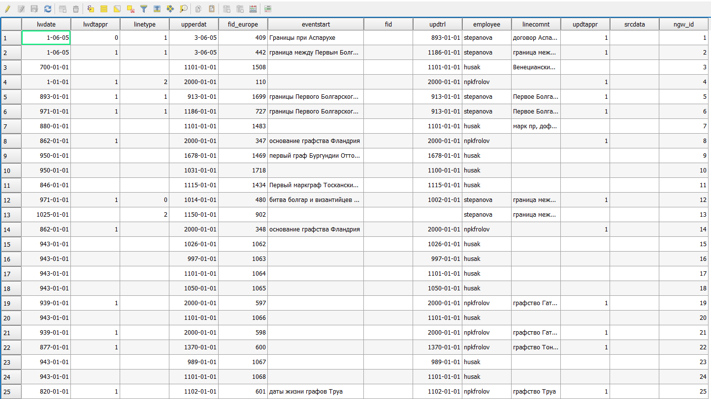
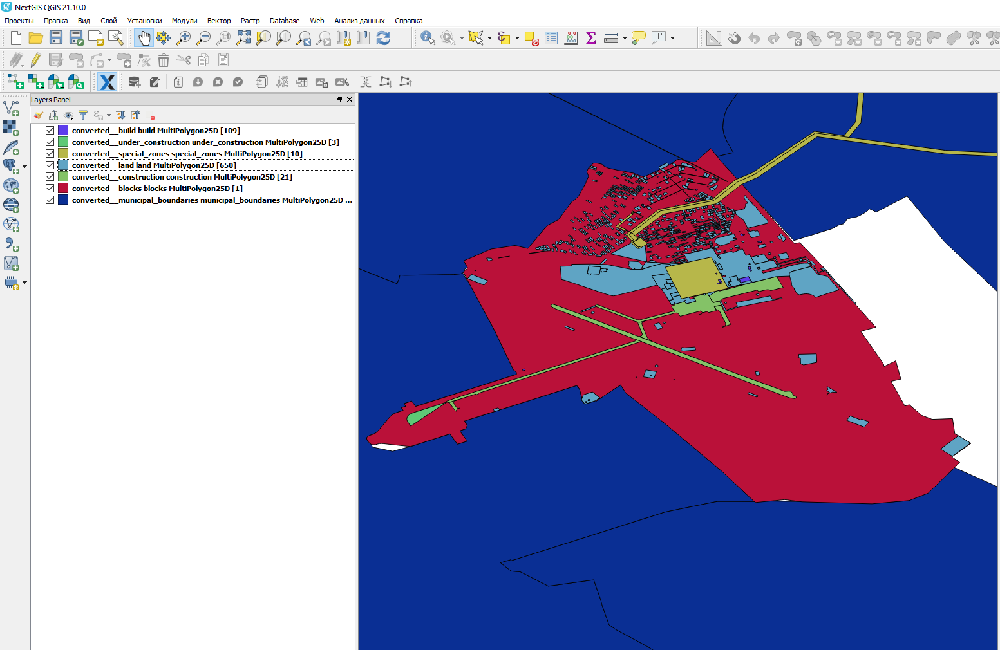

.. sectionauthor:: Maxim Dubinin <maxim.dubinin@nextgis.com>
.. NextGIS Toolbox TOC

.. _toolbox_intro:

Инструменты
===========

.. _toolbox_launch_conditions:

.. _toolbox_split_to_equal:

Разбить на равные части
-----------------------

На входе:

* Слой с полигоном (zip c Shapefile)

Результатом работы процесса является слой:

* Полигоны, с приблизительно одинаковой площадью

Запуск инструмента: https://toolbox.nextgis.com/operation/split_to_equal

Посмотреть результаты на интерактивной карте: https://demo.nextgis.com/resource/4552/display?panel=layers


.. _toolbox_split_to_rect:

Подсчёт прямоугольников при разбиении
-------------------------------------

Позволяет подсчитать количество прямоугольников, на которые можно разбить полигональный слой.

Запуск инструмента: https://toolbox.nextgis.com/operation/split_to_rect


.. _toolbox_raster2tiles:
 
Создание тайлового набора по растру
---------------------------------------------------
   
Инструмент создает тайлы в формате NGM (.ngrc) на основе gdal-совместимого набора растровых геоданных.

На входе:

*  Файл с палитрой - текстовый файл (расширение .txt), в котором описание цвета (формат RGBA) каждого значения растра занимает отдельную строку. Порядок записи: Значение Красный Зеленый Синий Прозрачность. Например, для значения 23 присвоение абсолютно непрозрачного сиреневого цвета выглядит так: 23 200 162 200 255. Прозрачность находится в пределах от 0 до 255, 0 - абсолютно прозрачный, 255 - абсолютно непрозрачный.  Используйте пустой текстовый файл, чтобы оставить исходную палитру (для одноканальных с палитрой) и для RGB/RGBA растров
*  Исходный растр - RGB, RGBA, одноканальный серый или одноканальный с палитрой GDAL-совместимый растр
*  Название тайлового набора - название набора тайлов, которое будет использовано для имени файла и для слоя в NGM
*  Масштабные уровни - уровни, на которых будут отображаться тайлы. Имеются в виду `стандартные уровни зумирования <https://wiki.openstreetmap.org/wiki/Zoom_levels>`_, например, как для карт OSM. Возможные вносимые значения: число, обозначающее один уровень, например, 10; диапазон уровней, например, 8-14; знак дефиса - для автоподбора уровней

На выходе

*  файл .ngrc с тайловым набором

.. figure:: _static/raster2tiles_input.png
   :align: center
   :width: 16cm
   
   Пример исходных данных
   
.. figure:: _static/raster2tiles_output.png
   :align: center
   :width: 8cm
   
   Пример результата работы инструмента - файл .ngrc, добавленный в NextGIS Mobile

Запуск инструмента: https://toolbox.nextgis.com/operation/raster2tiles

Скачать пример исходных данных и результатов расчёта можно :download:`здесь <files/raster2tiles_examples.zip>`.


.. _toolbox_fsc_compare:
 
Сравнение границ аренды с данными FSC
-------------------------------------
   
Инструмент предназначен для арендаторов лесных земель, которые являются держателями сертификата FSC. Алгоритм воспринимает границы аренды, загружаемые пользователем, как эталон, и сравнивает их с данными FSC об арендаторах.  В результате формируется два векторных слоя, с ошибочно присвоенной арендатору по данным FSC территорией и, наоборот, с неучтенной FSC территорией. Сформированные файлы в дальнейшем можно направить в FSC в рамках предложения по корректировке информации о границах аренды. 

На входе:

*  Векторный слой (ZIP архив с ESRI Shapefile) с полигоном или полигонами, очерчивающими границу участка.

На выходе:

* Два ZIP архива с векторными слоями: с ошибочно присвоенной по данным FSC территорией и, наоборот, с неучтенной FSC территорией. Если расхождений не наблюдается, векторный слой будет линейным, а не полигональным. 

Запуск инструмента: https://toolbox.nextgis.com/operation/fsc_compare

.. figure:: _static/ fsc_compare.png
   :align: center
   :width: 16cm
   
   Пример результата работы инструмента. В данных FSC несколько кварталов излишне указаны как принадлежащие конкретному арендатору.


.. _toolbox_split_alarm:

Экспорт ALARM в формате КЕДР
-------------------

Подготовка данных мониторинга рубок (ALARM) для передачи в систему КЕДР. Осуществляет нарезку под определенные регионы и выгрузку данных в согласованном формате.

Запуск инструмента: https://toolbox.nextgis.com/operation/split


.. _toolbox_update_attrs:

Обновление атрибутов слоя
--------------

Позволяет обновить атрибутивные данные слоя, взяв их из другого слоя.

Запуск инструмента: https://toolbox.nextgis.com/operation/update_attrs

.. _toolbox_forestplots_field:
 
Создание схемы круговых площадок для Garmin
-------------------------------------------
   
Инструмент создаёт схемы круговых площадок в формате KMZ, предназначенном для загрузки в навигаторы GARMIN. Площадки, лежащие ближе чем 10 м от границы отвода - отбрасываются. Вокруг отвода добавляется буферная зона на расстоянии 50 м.

На входе:

*  Полигональный слой, содержащий полигон отвода. ZIP-архив с ESRI Shapefile, Mapinfo TAB или отдельный файл формата, поддерживаемого OGR. Полигон должен быть один и не должен содержать дырки.
*  Расстояние между точками - расстояние в метрах между площадками. По умолчанию: 55 метров.

На выходе:

* Файл KMZ со схемой круговых площадок, пригодный для загрузки в Garmin.
* Схема круговых площадок в формате JPG отдельным файлом.

Скачать пример исходных данных и результатов расчёта: https://nextgis.ru/data/toolbox/forestplots_field/forestplots_field.zip

Запуск инструмента: https://toolbox.nextgis.com/operation/forestplots_field

.. figure:: _static/forest-circular-plots.jpg
   :align: center
   :width: 16cm
   
   Пример результата работы инструмента, загруженный в Garmin
   

.. _toolbox_eraser:

Удалить из целевого слоя
-----------------------   

   
Инструмент, позволяющий удалить из целевого слоя области объектов другого слоя.

На входе:

* Векторный слой, из которого нужно удалить области

ZIP-архив с ESRI Shapefile или отдельный файл формата поддерживаемого OGR.

* Векторный слой, содержащий объекты, области которых нужно удалить из исходного

ZIP-архив с ESRI Shapefile или отдельный файл формата поддерживаемого OGR.


Результатом работы инструмента является новый векторный слой.

Исходные векторные слои должны иметь одинаковую систему координат.

Запуск инструмента: https://toolbox.nextgis.com/operation/eraser

Скачать пример исходных данных и результатов расчёта: https://nextgis.ru/data/toolbox/eraser/eraser.zip

Посмотреть исходные данные и результаты расчётов на интерактивной карте: https://demo.nextgis.com/resource/4611/display?panel=info

.. figure:: _static/eraser.png
   :align: center
   :width: 16cm

   Пример результата работы инструмента


.. _toolbox_travel_access:

Расчет транспортной/пешеходной доступности
---------

Расчёт доступности точки при условии, что движение разрешено по произвольным траекториям, а не только по графу существующих дорог.

Запуск инструмента: https://toolbox.nextgis.com/operation/TravelAccess


.. _toolbox_irbis:

Ирбис - статистика
-------------------

Отчет на базе данных, собранных в рамках полевых учетов снежного барса.

Запуск инструмента: https://toolbox.nextgis.com/operation/irbis


.. _toolbox_ngw_intersect:

Пересекатор
--------------------
Инструмент по заданной геометрии пересекает все слои веб-карты nextgis.com и формирует отчет, где перечисляются слои, с которыми состоялось пересечение. Если в отдельном слое пересекаются разные объекты, в отчете эти случаи отображаются как самостоятельные события.

На входе:

*  url - адрес используемой Веб-ГИС
*  webmap_id - ID веб-карты из используемой Веб-ГИС
*  wkt - геометрия, с которой проверяется пересечение слоев веб-карты. Указывается в формате wkt, система координат - EPSG:3857

На выходе:

*  таблица в формате .xlsx с перечнем пересеченных слоев

Запуск инструмента: https://toolbox.nextgis.com/operation/ngw-intersect

Пример использования:

Сколько видов ветрениц можно встретить, пройдя по Appalachian Trail?

*  url - https://demo.nextgis.com
*  webmap_id - 4714 (так как адрес веб-карты https://demo.nextgis.com/resource/4714/display)
*  wkt - LineString (-9378421.57282677479088306 4115819.42546373652294278, -7678593.31173497438430786 5764332.11640937067568302)	
 
.. figure:: _static/ngw_intersect_layers.png
   :align: center
   :width: 16cm
   
   Пример исходных данных 
   
.. figure:: _static/ngw_intersect_result.png
   :align: center
   :width: 16cm
   
   Пример результата работы инструмента 
   

.. _toolbox_clip_polys_poly:
 
Площади пересечений вне/внутри границ
-------------------------------------
   
Инструмент позволяет вычислить площади полигонов вне и внутри заданной границы. Инструмент был создан для подсчёта площади степных пожаров в заповедниках, для каждого полигона (территории отдельного пожара) расчитывает его площадь, и площадь попадающую в территорию заповедника. Инструмент использует слои лежащие в nextgisweb. 
Значения площадей рассчитываются в гектарах (ha). Инструмент корректно работает с данными находящимися в любом месте земли, и не зависит от зон UTM.

На входе:

*  Адрес Веб ГИС - указывается URL Веб ГИС, которая содержит векторные слои.
*  Слой с полигонами - номер ресурса в Веб ГИС (векторный слой), для объектов которого будет рассчитана площадь. Например, 443.
*  Слой с границей - номер ресурса в Веб ГИС (векторный слой), по которому будет задана граница; слой должен содержать один полигон. Например, 445.
*  Поле для общей площади полигона - название колонки атрибутов в слое с полигонами, куда будет записана площадь каждого полигона. Название должно быть на латинице. Тип поля - String.
*  Логин для Веб ГИС
*  Пароль для Веб ГИС
*  Поле для площади полигона внутри границы - название колонки атрибутов в слое с полигонами, куда будет записана площадь полигонов, оказавшихся внутри заданной границы. Площадь полигонов, оказавшихся вне границы, будет указана как равная 0. Название атрибута должно быть на латинице. Тип поля - String.

На выходе

*  Рассчитанная площадь полигонов, внесенная в соответствующие колонки атрибутов в слое с полигонами.

.. figure:: _static/clip_polys_poly1.png
   :align: center
   :width: 16cm
   
   Пример исходных данных
   
.. figure:: _static/clip_polys_poly2.png
   :align: center
   :width: 16cm
   
   Пример результата работы инструмента

Запуск инструмента: https://toolbox.nextgis.com/operation/clip_polys_poly


Скачать пример исходных данных и результатов расчёта: https://nextgis.ru/data/toolbox/clip_polys_poly/clip_polys_poly.zip


.. figure:: _static/clip_polys_poly.png
   :align: center
   :width: 16cm
   
   Пример результата работы инструмента загруженного в QGIS, с оформлением добавленым вручную
   

.. _toolbox_lesis2sqlite:

Лесис в SQLite
--------------

Преобразование базы данных Лесис (ГИС TopoL-L) в формат SQLite для открытия в NextGIS QGIS.

На входе:

* Слой с полигонами лесных выделов (zip c Shapefile)

Результат работы:

* База SQLite, cо специальной структурой атрибутов которую можно подключать в NextGIS QGIS.

Поддерживаются данные TopoL со следующей структурой:

Пример структуры выгрузки (сокращённый) ::

        │   ├── D
        │   │   ├── Connect.mdb
        │   │   ├── Gulf.mdb
        │   │   ├── Lh1.DBF
        │   │   ├── Lh1.DBT
        │   │   ├── Lh1.MDX
        │   │   ├── Lh2.DBF
        │   │   ├── Lh2.MDX
        │   │   ├── Lh3.DBF
        │   │   ├── Lh3.MDX
        │   │   ├── Lh4.DBF
        │   │   ├── Lh4.MDX
        │   │   ├── LInfo.rtf
        │   │   └── SubRF.DBF
        │   ├── Filters
        │   ├── FONTY.TXT
        │   ├── GROUPS.DBF
        │   ├── Groups_ocifrovka.dbf
        │   ├── info_L.ini
        │   ├── kv.zta
        │   ├── Les.tps
        │   ├── Linzn.txt
        │   ├── n
        │   │   ├── AdmRan.DBF
        │   │   ├── AnalVyp.dbf
        │   │   ├── Arenda.dbf
        │   │   ├── ArhForm.DBF
        │   │   ├── arnBase.DBF
        │   │   ├── arnLesse.DBF
        │   │   ├── arnLessor.dbf
        │   │   ├── arnVidPolz.DBF
        │   │   ├── BolotnRast.dbf
        │   │   ├── bonid.DBF
        │   │   ├── Bonitet.dbf
        │   │   ├── Connect.mdb
        │   │   ├── conv_DB.ini
        │   │   ├── Cz_CLP.zvf
        │   │   ├── DBDWORK.INI
        │   │   ├── digres.tps
        │   │   ├── DIGRES.ZTA
        │   │   ├── DimVys.DBF
        │   │   ├── EdIzm.DBF
        │   │   ├── Ekspoz.dbf
        │   │   ├── ErrP.DBF
        │   │   ├── ErrP.DBT
        │   │   ├── ErrP.ini
        │   │   ├── ErzSkl.DBF
        │   │   ├── estet.tps
        │   │   ├── ESTET.ZTA
        │   ├── PARAMETR.MDB
        │   ├── Plan.tps
        │   ├── SRAFY.TXT
        │   ├── STYLY.TXT
        │   ├── TopoL.bk1
        │   ├── TopoL.bk2
        │   ├── Topolflt.exp
        │   ├── TOPOLINF.EXP
        │   ├── TopoL.INI
        │   └── TrueType.INI
        ├── tree.txt
        ├── VD
        │   ├── coordsys.xml
        │   ├── Выдел.DBF
        │   ├── Выдел.SHP
        │   └── Выдел.SHX
        ├── Vd_L
        │   ├── coordsys.xml
        │   ├── Визир.DBF
        │   ├── Визир.SHP
        │   ├── Визир.SHX
        │   ├── Выдела_гр.DBF
        │   ├── Выдела_гр.SHP
        │   ├── Выдела_гр.SHX
        │   ├── Геоход_окр.DBF
        │   ├── Геоход_окр.SHP
        │   ├── Геоход_окр.SHX
        │   ├── Геох_пов_т.DBF
        │   ├── Геох_пов_т.SHP
        │   ├── Геох_пов_т.SHX
   


Запуск инструмента: https://toolbox.nextgis.com/operation/lesis2sqlite

Скачать пример исходных данных и результатов расчёта: https://nextgis.ru/data/toolbox/lesis2sqlite/lesis.zip


.. _toolbox_vectorclip:

Пересечение полигонов
-------

Обрезает один полигональный слой другим.

Запуск инструмента: https://toolbox.nextgis.com/operation/vectorclip


.. _toolbox_landsat_to_radiance:

Радиометрическая калибровка данных Landsat
------------------------------------------
   
Инструмент осуществляет пересчёт сырых данных Landsat в интенсивность излучения (ToA Radiance).

На входе:

* Исходные файл канала Landsat

Файл из оригинального архива данных Landsat уровня обработки L1. Имя может быть любым. Данные могут быть предварительно обрезаны и т.д.

* Номер канала

Номер канала, соответствующего загруженному файлу. Обычно число, для ETM+ может быть также 6_VCID_1 и 6_VCID_2

* Файл метаданных Landsat

Текстовый файл из оригинального архива данных Landsat. В зависимости от типа данных, это файл \*MTL.txt или \*.MTL.

На выходе:

* Интенсивность излучения соответствующего канала в формате GeoTIFF

Радиометрическая калибровка необходима для анализа временных рядов, расчёта производных продуктов (например, индексных изображений).

Поддерживаются данные:

* Landsat 8 (OLI, TIRS)

* Landsat 7 (ETM+)

* Landsat 5 (TM)

* Landsat 4 (TM)

Запуск инструмента: https://toolbox.nextgis.com/operation/landsat_to_radiance

Скачать пример исходных данных и результатов расчёта: https://nextgis.ru/data/toolbox/landsat_to_radiance/landsat_to_radiance.zip


.. _toolbox_ndi:

Расчёт нормализованного разностного индекса
-------------------------------------------
   
Инструмент осуществляет расчёт нормализованного разностного индекса для двух любых входных изображений.

На входе:

* Растровое изображение - первый участник разностного индекса

Любой GDAL-совместимый растр

* Растровое изображение - второй участник разностного индекса

Любой GDAL-совместимый растр

На выходе:

* Растр с нормализованных разностным индексом в формате GeoTiff.

Расчёт осуществляется по формуле: (Первое изображение - Второе изображение) / (Первое изображение + Второе изображение). Значения пикселей результирующего растра находятся в диапазоне от -1 до 1
Перед расчётом оба изображения приводятся в единый пространственный домен. Используется проекция и пространственное разрешение первого растра.

Примеры распространенных нормализованных разностных индексов:

* NDVI - для оценки растительности (первый растр - съемка в ближнем инфракрасном диапазоне, второй - в красном диапазоне длин волн)  Для данных Landsat 8: 5 и 4 каналы.
* NDWI - для обнаружения водных объектов (первый растр - съемка в ближнем инфракрасном диапазоне, второй - в среднем инфракрасном диапазоне длин волн). Для данных Landsat 8: 5 и 6 каналы.
* NDSI - для оценки снежного покрова (первый растр - съёмка в зеленом диапазоне, второй - в среднем инфракрасном диапазоне длин волн). Для данных Landsat 8: 3 и 6 каналы.

Запуск инструмента: https://toolbox.nextgis.com/operation/ndi

Скачать пример исходных данных и результатов расчёта: https://nextgis.ru/data/toolbox/ndi/ndi.zip


.. _toolbox_coord_recalc:

Перепроецирование координат
-------

Перепроецирование набора объектов в заданную систему координат.

Запуск инструмента: https://toolbox.nextgis.com/operation/coord_recalc


.. _toolbox_quadro:

Генератор набора квадратов
--------------------------

Этот инструмент cоздает набор сеток квадратов (полигоны) и трансект их обхода для заданной территории.

На входе:

* x0 - Долгота точки привязки
* y0 - Широта точки привязки
* x1 - Долгота опорной точки
* y1 - Широта опорной точки
* size1 - Количество ячеек по первой оси
* size2 - Количество ячеек по второй оси
* side - Сторона генерации ячеек (right,left)
* base_interval - Размер стороны ячейки, метров

Алгоритм расчета: от точки привязки в направлении опорной точки прокладывается линия длиной равной size1*base_interval. От этой линии либо направо или налево от нее откладывается вторая линия длиной size2*base_interval, метров. Две эти линии формируют сетку квадратов.

Результатом работы процесса является набор слоёв:

* rect1 - сеть ячеек размером size1*size2 ячеек, центр первой ячейки - в точке привязки
* rect2 - сеть уменьшенных ячеек размером size1*size2 ячеек (т.е. в 4 раза больше ячеек, каждая крупная ячейка разделена на 4 части)
* line1 - линии обхода в направлении перпендикулярном линии представленной точкой привязки и опорной точкой
* line2 - линии обхода в направлении параллельном линии представленной точкой привязки и опорной точкой
* centers - центры ячеек сетки rect1

Запуск инструмента: https://toolbox.nextgis.com/operation/quadro

Скачать пример результатов: https://nextgis.ru/data/toolbox/quadro/outputs.zip

Посмотреть результаты на интерактивной карте: https://demo.nextgis.com/resource/4582/display?panel=layers

.. figure:: _static/quadro.png
   :align: center
   :width: 16cm
   
   Пример результата работы инструмента 


.. _toolbox_prepare_raster:

Подготовить растр
-----------------------
   
Инструмент, который осуществляет поканальную склейку набора одноканальных растров и обрезку склеенного растра по векторной маске.

На входе:

* Исходные растровые данные

Исходные растровые данные могут быть представлены в двух видах:

1. многоканальный растр в GDAL-совместимом формате

2. ZIP архив с набором одноканальных GDAL-совместимых растров.

* Векторный слой, используемый в качестве маски

ZIP-архив с ESRI Shapefile или отдельный файл формата поддерживаемого OGR.

* Значение "Нет данных"

Значение, которое будет помечено как Нет данных. Используйте символ - для использования значения по умолчанию

* Название результирующего растра

Без расширения файла (например ndvi, water). Расширение будет автоматически установлено в .tif

Если на входе архив с одноканальными растрами, инструмент сначала объединяет их в многоканальный растр. Порядок каналов определяется алфавитной сортировкой имён исходных растров в архиве.
Затем многоканальный растр (собранный из архива или поданный на вход сразу) обрезается по векторной маске.

Исходные растры и векторная маска могут быть в разных системах координат, перед началом обработки все данные приводятся в единый пространственный домен.

Запуск инструмента: https://toolbox.nextgis.com/operation/prepare_raster

Скачать пример исходных данных и результатов расчёта: https://nextgis.ru/data/toolbox/prepare_raster/prepare_raster.zip

Посмотреть исходные данные и результаты расчётов на интерактивной карте: https://demo.nextgis.com/resource/4595/display?panel=info

.. figure:: _static/prepare_raster.png
   :align: center
   :width: 16cm

   Пример результата работы инструмента


.. _toolbox_ogrmerge:
 
Объединение векторных слоёв
---------------------------
   
.. figure:: _static/ogrmerge.png
   :align: center
   :width: 16cm

   Исходные и результирующие данные
   
Инструмент осуществляет объединение множества векторных слоёв одного типа геометрии в один слой.

На входе:

* Архив в формате ZIP с файлами формата .shp, .geojson, .gpkg, .tab. Внутри архива файлы могут лежать во вложенной папке.

На выходе:

* Файл в формате GeoPackage с результатом объединения.

В инструменте нет ограничения на количество исходных слоёв. Они склеиваются по очереди. Название исходного слоя не сохраняется.

Запуск инструмента: https://toolbox.nextgis.com/operation/ogrmerge

Скачать пример исходных данных и результатов расчёта: https://nextgis.ru/data/toolbox/ogrmerge/ogrmerge.zip


.. _toolbox_join_by_field:

Объединение слоя и таблицы по полю
------------------------------------
Инструмент объединяет данные из таблицы и слоя по заданному полю. Инструмент предполагает использование двух разных режимов объединения: one-to-one - находит первый по порядку элемент таблицы и присоединяет его атрибуты; one-to-many - присоединяет все элементы таблицы, для которых совпадает заданное поле, при этом геометрия пространственного объекта дублируется для каждого элемента.

На входе:

* gis_url - адрес используемой Веб-ГИС
* resource_id - ID слоя для объединения из используемой Веб-ГИС
* src - имя таблицы
* layer_field - название поля в слое Веб-ГИС
* csv_field - название поля в таблице
* join_type - тип объединения (1 - one-to-one, 0 - one-to-many)

На выходе:

*  слой в формате ESRI Shapefile, который находится в архиве (zip)

Запуск инструмента: https://toolbox.nextgis.com/operation/join_by_field

Пример использования:

.. figure:: _static/join_by_field.png
   :align: center
   :width: 16cm

Скачать пример результатов: https://nextgis.ru/data/toolbox/join_by_field/join_by_field.zip


.. _toolbox_intersect_layers:
 
Пересечение слоёв
---------------------------------------------------
   
Инструмент осуществляет пересечение полигонального слоя с другим векторным слоем (любой тип геометрии) и выдает результат в виде набора файлов CSV.

На входе:

*  Имя поля для CSV файлов. Указывается имя колонки атрибутов в полигональном слое, из которой будут браться имена результирующих CSV-файлов. Если оставить поле пустым, имена CSV-файлов будут сгенерированы автоматически.
*  Shapefile с полигональным слоем - полигональный слой в формате ESRI Shapefile (ZIP-архив), для объектов которого устанавливается факт пересечения (или отсутствия пересечения) с объектами из другого слоя.
*  Shapefile с пересекаемым слоем - векторный слой с любыми геометриями в формате ESRI Shapefile (ZIP-архив), содержащий объекты, предполагаемо пересекающиеся с объектами из полигонального слоя. Слой должен быть в той же системе координат, что и полигональный слой.

На выходе

*  ZIP-архив с CSV-файлами, каждый из которых описывает один из объектов полигонального слоя. Если для объекта из полигонального слоя установлено пересечение с объектом из другого слоя, файл CSV будет содержать координаты центра и WKT-описание полигона. 

Запуск инструмента: https://toolbox.nextgis.com/operation/intersect_layers

Скачать пример исходных данных и результатов расчёта можно :download:`здесь <files/intersect_layer_example.zip>`.


.. _toolbox_grid:
 
Генерация сетки в метрах
-----------------------------------------------
   
.. figure:: _static/grids-demo.png
   :align: center
   :width: 16cm

   Сгенерированные сетки
   
Инструмент осуществляет генерацию сетки в границах обьектов из векторного слоя. Размер сетки задаётся в метрах. Обьекты могут быть в любом месте земли.

На входе:

*  Мультиполигональный слой с одним или несколькими объектами. Принимается формат Geopackage
*  Шаг сетки в метрах
*  Режим: points (точки), rect (квадраты).
*  Алгоритм обрезки сетки по границам. all (оставлять все квадраты в охвате обьекта), touches (оставлять все квадраты касающиеся обьекта), intersection (обрезать квадраты по границе обьекта).

.. figure:: _static/grid-1000-rect-all.png
   :align: center
   :width: 16cm

   all
   
   
.. figure:: _static/grid-1000-rect-touches.png
   :align: center
   :width: 16cm

   touches
   
   
.. figure:: _static/grid-1000-rect-intersection.png
   :align: center
   :width: 16cm

   intersection
   
   
.. figure:: _static/grid-1000-point-all.png
   :align: center
   :width: 16cm

   all для точек
   
   
.. figure:: _static/grid-1000-point-intersection.png
   :align: center
   :width: 16cm

   touches и intersection для точек

   
.. figure:: _static/grid-planet.png
   :align: center
   :width: 16cm

   Сгенерированные сетки для нескольких полигонов в разных местах глобуса
   

*  выходной формат геоданных - GeoJSON, ESRI Shape, Mapinfo TAB

На выходе:

* Geopackage


Запуск инструмента: https://toolbox.nextgis.com/operation/grid


.. _toolbox_kmldae2footprints:

Проекция Dae (Collada) в Shapefile
----------------------------------
Инструмент делает проекцию трехмерных объектов на земную плоскость.

На входе:

* zip-архив, содержащий файлы *.kmz  и *.dae.
* *.kmz должны содержать геопривязку моделей *.dae (координаты полигонов в EPSG:4326, единицы измерения - метрические)

На выходе:

*  zip-архив с Shapefile
*  В результирующем Shapefile для каждой модели указываются атрибуты «name» и «altitude»

На вход можно подать несколько моделей, на выходе по каждой из них получить отдельный полигон.

Запуск инструмента: https://toolbox.nextgis.com/operation/kmldae2footprints

Скачать пример исходных данных и результатов расчёта: https://nextgis.ru/data/toolbox/kmldae2footprints/kmldae2footprints.zip


.. _toolbox_change_attributes:

Изменение атрибутов в группе слоев
------------------------------------
Инструмент изменяет значение целевого атрибута для выбранных объектов в группе слоев в заданном ресурсе Веб ГИС. Выбор объектов происходит по заданному значению выбранного поля.

На входе:

* Адрес Веб гис - url-адрес вашей Веб ГИС (http(s)://***.nextgis.com)
* Логин - Имя пользователя, имеющего права на запись данных в указанный ресурс
* Пароль - Пароль пользователя в Веб ГИС
* Идентификатор группы ресурса - Идентификатор ресурса Веб ГИС, в котором содержится группа слоев
* Исходное поле - Имя исходного поля, по которому производится поиск объектов
* Исходное значение - Значение поля, по которому осуществляется выбор объектов (идентификатор)
* Целевое поле - Имя целевого поля, значения которого необходимо изменить
* Целевое значение - Значение атрибута, которое будет применено
* Год начала - Начальная дата временного диапазона (опциональный параметр)
* Год окончания - Дата окончания временного диапазона (опциональный параметр)

.. note::
    Год начала и год окончания - необязательные параметры. Данные параметры позволяют ограничить временной диапазон для выбранных слоев. Для использования этих параметров необходимо убедиться, что в названиях слоев ресурса Веб ГИС указаны временные диапазоны. Например, в слое 1245_1246_rus_earl_v.1.0 1245 и 1246 указывают на время. Если данные параметры используются, то необходимо ввести трех- или четырехзначные значения.  Остальные поля являются **обязательными**.

На выходе:

*  CSV файл, в котором представлены данные об исходном и целевом полях, значении идентификатора, предыдущее и новое значения целевого поля, а также перечень гиперссылок на объекты, которые были изменены.

.. figure:: _static/result.PNG
   :align: center
   :width: 16cm

   Пример результата работы инструмента

Запуск инструмента: https://toolbox.nextgis.com/operation/field_value_changer

Пример группы ресурсов: https://demo.nextgis.com/resource/4793

Пример исходных данных:

* Адрес Веб гис = https://demo.nextgis.com
* Логин = *****
* Пароль = *****
* Идентификатор группы ресурса = 4793
* Исходное поле = fid
* Исходное значение = 1216
* Целевое поле = fid2
* Целевое значение = 1112
* Год начала = 1244
* Год окончания = 1300


.. _tropomi2geotiff:
 
TROPOMI в GeoTIFF
-----------------
   
Инструмент конвертирует данные TROPOMI по диоксиду азота в формат GeoTIFF

На входе:

*  Файл данных TROPOMI в формате NetCDF полученный с https://s5phub.copernicus.eu/dhus/#/home. Product type: L2__NO2__, Timeliness: Offline. Пример имени файла: S5P_OFFL_L2__NO2____20190901T091635_20190901T105804_09761_01_010302_20190907T113505.nc


На выходе

*  GeoTIFF готового снимка

Запуск инструмента: https://toolbox.nextgis.com/operation/tropomi2geotiff

Скачать пример исходных данных и результатов расчёта: http://nextgis.ru/data/toolbox/tropomi2geotiff/tropomi2geotiff.zip

Посмотреть пример результата на интерактивной карте: https://demo.nextgis.com/resource/4698/display?panel=layers

.. figure:: _static/tropomi2geotiff.png
   :align: center
   :width: 16cm
   
Исходные сцены должны быть на scihub.copernicus (https://scihub.copernicus.eu), но временно лежат на копии веб-интерфейса Sentinel-5P Pre-Operations Hub: https://s5phub.copernicus.eu/dhus/#/home . Логины от scihub не действуют, нужно использовать s5pguest/s5pguest. 
   


.. _toolbox_ai2geo:

Геоданные из файлов Adobe Illustrator
-------------------------------------

Инструмент извлекает слои векторных данных из файла Adobe Illustrator (*.ai), используя дополнительный файл в формате GeoTIFF для геопривязки.

На входе:

* Файл Adobe Illustrator (с расширением .ai), в котором содержатся векторные объекты. 
* Файл GeoTIFF (с расширением .geotiff или .tif) или пара файлов PNG+PGW (world-файл), на основе которых будет производиться геопривязка извлекаемых векторных объектов. Эти же файлы должны использоваться в файле *.ai в качестве подложки.

Инструмент работает следующим образом: из файла .ai извлекаются геометрии. Для каждой геометрии определяется её тип (точка, линия или полигон), а так же стиль которым она нарисована (толщина линии, цвет линии, цвет заливки). Создаются слои (согласно типам геометрий), в которых каждый объект будет содержать полученную геометрию и строку стиля в поле "STYLE". При этом координаты геометрий преобразуются из локальных координат в пространственные координаты, основываясь на переданном файле GeoTIFF, который должен содержать корректную геопространственную привязку (подразумевается, что векторные объекты в .ai файле при его создании были нарисованы "поверх" аналогичного изображения в Adobe Illustrator).

Результатом работы процесса является ZIP-архив, содержащий набор файлов в формате ESRI Shapefile согласно созданным слоям.

Запуск инструмента: https://toolbox.nextgis.com/operation/ai2geo


.. figure:: _static/ai2geo_before.png
   :align: center
   :width: 32cm
   
   Исходные векторные данные в .ai файле.


.. figure:: _static/ai2geo_after.png
   :align: center
   :width: 32cm
   
   Результат работы инструмента: полученные слои загружены в QGIS и отображаются на фоне подложки OSM.


.. _mt2report:
 
Отчет о судах в зоне
--------------------
Этот инструмент генерирует таблицу (формат - Excel), в которой перечислены суда, заплывающие на заданную территорию, название и тип судна, дата и координаты их последнего места пребывания, а также количество заходов судов на заданную территорию за определенный промежуток времени. Этот инструмент имеет смысл если у вас уже настроен сервис обновляющий данных о локациях судов в вашей Веб ГИС.

На входе:

* Адрес Веб гис - url-адрес вашей Веб ГИС (http(s)://***.nextgis.com)
* Логин - Имя пользователя, имеющего права на запись данных в указанный ресурс
* Пароль - Пароль пользователя в Веб ГИС
* layer_id_border - ID ресурса зоны
* layer_id_ships - ID ресурса данных о судах
* date - Начальная дата

Алгоритм расчета: Загрузка слоев границы зоны анализа и локаций судов. Проверка каждой локации на вхождение в зону анализа, также отбираются локации зарегистрированные позже заданной стартовой даты. Среди отобранных локаций по каждому судну получается последняя локация и ее координаты, а также общее количество локаций. Полученная иформация для каждого судна записывается в таблицу. 

Результатом работы процесса является таблица в формате Excel с информацией о всех судах, зарегистрированных на заданной территории позднее заданной даты, информация о последней зарегистрированной локации и количестве зарегистрированных локаций в пределах заданной территории за определенный промежуток времени.

Запуск инструмента: https://toolbox.nextgis.com/operation/mt2report

Посмотреть пример исходных данных на интерактивной карте:
https://demo.nextgis.com/resource/4693/display?panel=layers

.. figure:: _static/mt2report_map.png
   :align: center
   :width: 16cm
   
   Пример исходных данных 
   
.. figure:: _static/mt2report_table.png
   :align: center
   :width: 16cm
   
   Пример результата работы инструмента

.. _toolbox_explication2poly:

Экспликация в полигон отвода
------------------------------------
Инструмент конвертирует отчет об экспликации в заданном формате в полигон отвода. Отчет об экспликации представляет файл в формате excel, который содержит данные о направлениях и расстояниях между точками. Направления указаны в градусах и соответствуют магнитному азимуту.

.. figure:: _static/poly2explication-1.png
   :align: center
   :width: 16cm

   Пример исходного excel файла
   
На входе:

* XLS(X) файл - excel файл, содержащий отчет об экспликации
* Широта точки привязки. Указывается в системе координат EPSG 4326, в качестве разделителя целой и дробной части используется точка
* Долгота точки привязки. Указывается в системе координат EPSG 4326, в качестве разделителя целой и дробной части используется точка

.. note::
    Из-за погрешностей измерения углов и расстояний на местности первая точка выходного полигона может быть более удалена от последней, чем на местности. Как правило, различие не превышает 2-3 метров.

На выходе:

*  Zip-архив с shp-файлом, содержащим полученный полигон

Запуск инструмента: https://toolbox.nextgis.com/operation/explication2poly

Скачать пример исходных данных и результатов расчёта: https://nextgis.ru/data/toolbox/explication2poly/explication2poly.zip


.. _toolbox_centroid2attr:

Координаты центра в атрибуты
----------------------------
   
Расчитывает центр полигонов (PointOnSurface), добавляет поля point_X, point_Y с координатами точки, гарантировано пересекающейся с полигоном.

На входе:

* Полигональный слой

На выходе:

* Файл ZIP со слоем полигонов, и двумя новыми полями point_X, point_Y 
* Файл стиля

.. figure:: _static/point_on_surface.png
   :align: center
   :width: 16cm

   Пример исходных данных - точки и полигоны регионов.
   
.. figure:: _static/point_on_surface_attributes.png
   :align: center
   :width: 16cm
   
Скачать пример исходных данных и результатов расчёта: https://nextgis.ru/data/toolbox/centroid2attr/centroid2attr.zip

Запуск инструмента: https://toolbox.nextgis.com/operation/centroid2attr


.. _toolbox_generalization:

Упрощение векторного слоя (генерализация)
-----------------------------------------

Инструмент позволяет упростить, сгладить или сместить геометрии векторного слоя. 

На входе:

* Векторный слой – слой в формате ESRI Shape, запакованный в ZIP-архив. 
* import snap – значение (в единицах системы координат), при котором узлы геометрий начинают сливаться друг с другом. Используется при импорте данных до начала самой генерализации.  Опциональный параметр, можно оставить поле пустым.  Значение по умолчанию = -1 и соответствует отсутствию слияния узлов. 
* iterations – целое число, обозначающее количество итераций (повторов) процедуры упрощения, сглаживания или смещения. Опциональный параметр, можно оставить поле пустым.  Значение по умолчанию = 1. 
* method – в этом поле необходимо указать один из  методов упрощения, сглаживания или смещения.

**Методы упрощения:**

douglas – Douglas-Peucker, наиболее популярный алгоритм упрощения геометрии. Начальная и конечная точка линии соединяются прямой, а для всех остальных узлов оценивается расстояние до этой прямой и сравнивается с заданным порогом (threshold). Если расстояние от узла до прямой превышает порог, такой узел сохраняется (и прямая становится линией с дополнительным узлом), а для оставшихся узлов вновь оценивается расстояние до обновленной линии и т.д.  Параметр алгоритма – threshold.

douglas_reduction – Douglas-Peucker Reduction Algorithm, по своей сути - тот же алгоритм  douglas, но с дополнительным параметром – reduction. Параметры алгоритма – threshold, reduction.

lang – Lang, другой стандартный алгоритм упрощения. Упрощаются по очереди отдельные участки линии, т.н. search region. Их размер задается параметром look_ahead. В пределах search region прямой линией соединяется первый и последний узел, для остальных узлов оценивается расстояние до прямой. Если расстояние больше заданного порога, такой узел сохраняется. Параметры алгоритма - look_ahead, threshold.

reduction - Vertex Reduction, самый простой алгоритм, удаляет из линии узлы, которые находятся друг к другу ближе, чем заданное пороговое значение. Параметр алгоритма – threshold.

reumann -  Reumann-Witkam, данный алгоритм сохраняет характерные особенности линии. Первый и второй узел соединяются прямой линией. От третьего узла опускается перпендикуляр к созданной прямой, и его длина сравнивается с заданным порогом. Если она превышает порог, то тогда третий узел сохраняется, а четвертый узел оценивается уже по отношению к новой прямой, между узлом 2 и 3, и т.д. Параметр алгоритма – threshold.

**Методы сглаживания:**

boyle - Boyle's Forward-Looking Algorithm, позиция каждой точки зависит от позиций предыдущих точек, и также некоторых последующих точек, заданных параметром look_ahead. Алгоритм оставляет количество точек неизменным. Параметр алгоритма – look_ahead.

sliding_averaging - McMaster's Sliding Averaging Algorithm, позиция каждой точки – это среднее некоторых точек вокруг, заданных параметром look_ahead. Параметр slide используется для линейной интерполяции между старой и новой позицией точки. При slide = 0 берется исходная позиция. Алгоритм оставляет количество точек неизменным. Параметры алгоритма – slide, look_ahead (только нечетное число).

distance_weighting - McMaster's Distance-Weighting Algorithm, работает со взвешенным средним последовательных точек, заданных параметром look_ahead; при этом вес является обратной величиной от расстояния между исходной и уже сглаженной точкой. Алгоритм оставляет количество точек неизменным. Параметры алгоритма - look_ahead (только нечетное число), slide.

chaiken - Chaiken's Algorithm, создает линию, касающуюся и как бы вписываемую в исходную геометрию таким образом, что точки новой линии как минимум удалены друг от друга на расстояние порогового значения. Итоговая линия также всегда касается или пересекает центр каждого сегмента между двумя последовательными точками начальной линии. Результат очень приближен к исходной геометрии. Алгоритм увеличивает количество точек. Параметр алгоритма – threshold.

hermite - Hermite Interpolation, этот алгоритм рассматривает точки исходной линии как контрольные точки кубического сплайна Эрмита и строит приближенную к нему линию с точками, удаленными друг от друга на расстояние порогового значения. Алгоритм увеличивает количество точек. Единственный алгоритм, у которого линия всегда проходит через исходные точки. Параметры алгоритма – threshold, angle_thresh.

snakes – Snakes, метод минимизирует "энергию" линии. Сохраняет общий облик, но сглаживает острые углы. Параметры alpha и beta задают степень резкости и выгибания вычисляемой линии. Алгоритм работает очень хорошо со значениями alpha и beta в интервале от 0 до 5.  Алгоритм оставляет количество точек неизменным. Является самым медленным и ресурсозатратным методом. Параметры алгоритма – alpha, beta.

**Метод смещения:**

displacement – смещение используется, когда линии находятся слишком близко друг к другу или накладываются. Алгоритм увеличивает расстояние между такими объектами. Считается, что объекты взаимодействуют, если находятся друг к другу ближе, чем заданное пороговое значение. Алгоритм частично базируется на методе Snakes. Параметры alpha и beta характеризуют жесткость линий. При более крупных значениях alpha и beta (>=1) лучше сохраняется исходная геометрия линий, но это может быть в ущерб расстоянию между соседствующими линиями. Если значения alpha и beta слишком малы (<=0.001), тогда линии смещаются значительно, но геометрия и топология линий может быть нарушена. По всей видимости, оптимальные значения alpha и beta можно получить только в ходе экспериментов. Параметр iterations обозначает количество итераций (повторов) запуска алгоритма. Количество итераций между 10 и 100 подходят для большинства задач. Алгоритм является достаточно ресурсозатратным. Параметры алгоритма – alpha, beta, threshold, iterations.

* threshold – число от 0 до 1 000 000 000, задает пороговое значение (указывается в единицах системы координат). Обязательный параметр. Если метод не обращается к данному параметру, укажите любое число.
* look_ahead – целое число, задает количество точек, используемых в некоторых методах. Опциональный параметр, можно оставить поле пустым.  Значение по умолчанию = 7. 
* reduction – число от 0 до 100. При алгоритме упрощения характеризует процент точек, которые сохраняются относительно исходного количества точек. Опциональный параметр, можно оставить поле пустым.  Значение по умолчанию = 50.
* slide – число от 0 до 1, характеризует сдвиг полученной точки относительно исходной. Опциональный параметр, можно оставить поле пустым.  Значение по умолчанию = 0.5.
* angle_thresh – число от 0 до 180. Задает минимальный угол между двумя последовательными сегментами линии. Опциональный параметр, можно оставить поле пустым.  Значение по умолчанию = 3.
* alpha – число, параметр для метода Snakes. Опциональный параметр, можно оставить поле пустым.  Значение по умолчанию = 1.
* beta – число, параметр для метода Snakes. Опциональный параметр, можно оставить поле пустым.  Значение по умолчанию = 1.

Результатом работы инструмента является слой с измененными объектами (геометриями).

Запуск инструмента: https://toolbox.nextgis.com/operation/generalization

Подробнее о параметрах запуска: https://grasswiki.osgeo.org/wiki/V.generalize_tutorial


.. _toolbox_spatial_join:

Пространственное объединение
----------------------------
   
Добавляет к слою 1 атрибут с заданным названием из слоя 2, если объекты накладываются. Алгоритм так же известен как "Присоединить атрибуты по месторасположению", Spatial Join

На входе:

* Слой 1, любой тип геометрии
* Слой 2, полигоны
* Название атрибута из слоя 2

На выходе:

* Файл ZIP со слоем 1 и новым полем 
* Файл стиля

.. figure:: _static/spatial_join.png
   :align: center
   :width: 16cm
   
   Пример исходных данных - точки населённых пунктов и полигоны регионов.

.. figure:: _static/spatial_join_result.png
   :align: center
   :width: 16cm
   
   Выход - точки с добавленым атрибутом названия региона.
      
   
Скачать пример исходных данных и результатов расчёта: https://nextgis.ru/data/toolbox/spatial_join/spatial_join.zip

Запуск инструмента: https://toolbox.nextgis.com/operation/spatial_join


.. _toolbox_landsat_to_reflectance:

Расчёт спектрального альбедо объектов по данным Landsat
-------------------------------------------------------
   
Инструмент осуществляет пересчёт интенсивности излучения (ToA Radiance) данных Landsat в отражательную способность с возможностью применения атмосферной коррекции по методу DOS

На входе:

* Файл с интенсивностью излучения одного из каналов Landsat

Результат радиометрической калибовки исходных данных Landsat, например с помощью инструмента https://toolbox.nextgis.com/operation/landsat_to_radiance

* Номер канала

Номер канала, соответствующего загруженному файлу. Обычно число, для ETM+ может быть также 6_VCID_1 и 6_VCID_2

* Файл метаданных Landsat

Текстовый файл из оригинального архива данных Landsat. В зависимости от типа данных, это файл \*MTL.txt или \*.MTL.

* Тип результата обработки

0 для расчёта альбедо по умолчанию, 1 для применения атмосферной коррекции по методу DOS

На выходе:

* Спектральное альбедо соответствующего канала в формате GeoTIFF

Спектральное альбедо - основной тип информации, который следует использовать при анализе данных дистанционного зондирования. Он лучше всего подходит для анализа временных рядов. Возможность применения атмосферной коррекции также улучшает качество данных.

Поддерживаются данные:

* Landsat 8 (OLI, TIRS)

* Landsat 7 (ETM+)

* Landsat 5 (TM)

* Landsat 4 (TM)

Запуск инструмента: https://toolbox.nextgis.com/operation/landsat_to_reflectance

Скачать пример исходных данных и результатов расчёта: https://nextgis.ru/data/toolbox/landsat_to_reflectance/landsat_to_reflectance.zip


.. _toolbox_kptbatch_validator:

Проверить набор КПТ (Кадастровый план территории)
------------------------------------
Инструмент проверяет набор КПТ, сортирует и предоставляет отчет о файлах. Сортировка позволяет отобрать дубликаты, отказы и подтвержденные запросы. При выборе режима "Переименовать" каждый файл будет переименован в соответствии с кадастровым номером (кадастровый номер + '_' + первоначальное название файла). Режим "Создать архив" вернет на выходе архив с отсортированными файлами и отчетом в виде csv-файла. При выключенном режиме "Создать архив" инструмент возвращает только отчет в виде csv-файла.

На входе:

* ZIP-файл - zip-архив, содержащий набор КПТ
* Переименовать - Изменить названия файлов в архиве
* Создать архив - Вернуть по окончании работы инструмента архив с отсортированными файлами

.. note::
    Загружаемый zip-архив может содержать следующие структуры:
    1) в архиве расположена одна папка, внутри которой содержатся файлы КПТ;
    2) в архиве расположены файлы КПТ.
    Названия загружаемого архива и папки внутри архива (при первом типе структуры) должны быть написаны только с использованием букв латинского алфавита. 

На выходе:

*  CSV-файл с отчетом в случае, когда режим "Создать архив" выключен;
*  ZIP-файл c отсортированными файлами КПТ и отчетом в виде csv-файла в случае, когда режим "Создать архив" включен.

В отчете в поле "Статус" могут быть три типа значений: ОК, Дубль, Отказ. Статус "ОК" означает, что файл в порядке, он имеет кадастровый номер и в файле присутствует ответ на запрос. "Дубль" - файл с таким кадастровым номером уже появлялся при проверке, поэтому все последующие файлы с этим номером будут записываться как дубли (то есть первый по порядку файл с этим кадастровым номером получает статус "ОК", а все последующие - "Дубль", точно так же сортируются файлы при выбранном режиме "Создать отчет"). Статус "Отказ" получают те файлы, в запросе кадастровых номеров которых был получен отказ, или файлы без указания кадастрового номера.

В большинстве случаев режим "Переименовать" не имеет значения, если режим "Создать архив" выключен.

Запуск инструмента: https://toolbox.nextgis.com/operation/kptbatch_validator


.. _toolbox_geocodetable:
 
Геокодировать таблицу
---------------------
   
Инструмент добавляет два столбца с координатами в таблицу CSV, содержащую столбец с адресом.

На входе:

*  Файл CSV - исходные данные в формате CSV, первая строка - названия полей (столбцов). Кодировка - UTF-8.
*  Имя поля адреса - название поля (столбца) таблицы, где содержатся адреса.
*  API ключ - ключ сервиса Яндекс.Геокодер (JavaScript API и HTTP Геокодер), подключается тут: https://developer.tech.yandex.ru/services/. Для использования инструмента необходимо иметь лицензию на Яндекс Геокодер, позволяющую сохранять результаты геокодирования.

На выходе

*  Исходный файл CSV с дополнительными двумя столбцами содержащими координаты соответствующие адресам

Запуск инструмента: https://toolbox.nextgis.com/operation/geocodetable


.. _toolbox_temporal_split:

Нарезка слоя данных на временной кэш
------------------------------------
Инструмент из одного слоя создает несколько. Каждый новый слой представляет собой выборку объектов за период времени.

На входе:

* gis_url - адрес используемой Веб-ГИС
* resource_id - ID слоя с полилиниями из используемой Веб-ГИС
* upper_field - дата исчезновения объекта
* lower_field - дата появления объекта
* year1_field - начальный год интервала
* year2_field - конечный год интервала
* Формат даты - формат даты для дат
* Выходной формат - GeoJSON, GPKG, CSV, ESRI Shapefile (значение по умолчанию ESRI Shapefile).
* Игнорировать ошибки - оставьте пустым чтобы останавливать выполнение если найден пустой диапазон. Введите 1, чтобы игнорировать ошибки.

На выходе:

*  архив слоёв, каждый из которых также находится в архиве (zip)

Запуск инструмента: https://toolbox.nextgis.com/operation/temporal_split

Пример использования:

Сделать временной кэш из слоя городов появляющихся и исчезающих в определенное время.

* Web GIS URL - https://demo.nextgis.com
* ID ресурса исходных данных - 4719
* upper_field - upperdat
* lower_field - lwdate
* year1_field - YEAR1
* year2_field - YEAR2
* Формат даты - 
* Выходной формат - 
* Игнорировать ошибки - 1

Скачать пример результатов: https://nextgis.ru/data/toolbox/toolbox_temporal_split/toolbox_temporal_split.zip


.. _toolbox_raster_calculator:

Калькулятор растров
-----------------------

.. figure:: _static/raster_calculator.png
   :align: center
   :width: 16cm
   
   
Инструмент, реализующий растровую арифметику для многоканальных растров или групп одноканальных растров.

На входе:

* Исходные растровые данные.

Исходные растровые данные могут быть представлены в двух видах:

1. многоканальный растр в GDAL-совместимом формате

2. ZIP архив с набором одноканальных GDAL-совместимых растров.

Растры в архиве могут храниться в разных системах координат, иметь разные охваты и размеры ячеек. При расчёте всё будет приведено в единый пространственный домен.

* Выражение.

Стандартное выражение с использованием операторов +, -, \*, /, >, < и т.п. Если исходные данные - ZIP архив, то следует использовать имена исходных файлов в выражении (например band4.tif / band5.tif, если файлы имеют соответствуюшие имена). Расширение является частью имени.
Для мультиканального растра следует использовать номер канала с префиксом & (например &4 / &5). Каналы нумеруются начиная с 1.

Примеры выражений:

Участки леса с температурой меньше 30 градусов:

forest_mask.tif * (land_temperature.tif < 30)


Индекс EVI:

2.5 * (&5 - &4) / (&5 + 6.0*&4 - 7.5*&2 + 1.0)


* Название результирующего растра

Без расширения файла (например ndvi, water). Расширение будет автоматически установлено в .tif

* Разрешение по X

Ширина каждого отдельного пикселя в результирующем растре в метрике системы координат первого растра из набора (напр. 30). Используйте символ - для автоматического подбора ширины пикселя

* Разрешение по Y

Высота каждого отдельного пикселя в результирующем растре в метрике системы координат первого растра из набора (напр. 30). Используйте символ - для автоматического подбора высоты пикселя

* Охват результирующего растра

Формат: xmin, ymin, xmax, ymax. Пример: 1000, 1000, 2500, 2500. Используйте - для автоматического определения охвата. В таком случае будет рассчитан охват пересечений всех входных растров

* Тип данных для нового растра

Доступные типы данных: Int32, Int16, Float64, UInt16, Byte, UInt32, Float32. Используйте - для автоматического подбора типа данных

Результатом работы процесса является одноканальный растр в формате GeoTiff, расчитанный в соответствии с заданным выражением.

Если пользователь задаёт один из опциональных параметров (разрешение по одной из осей или охват), то сначала все участвующие в выражении растры приводятся к заданному состоянию, затем производится расчёт. В случае автоматического подбора параметров пространственного домена используется следующая логика:

1. Вычисляется наименьшее пространственное разрешение среди всех исходных растров. Оно принимается за выходное.

2. Все растры перепроецируются в систему координат первого растра в списке.

3. Выходной охват вычисляется как охват пересечений всех исходных растров.


Запуск инструмента: https://toolbox.nextgis.com/operation/raster_calculator

Скачать пример исходных данных (многоканальный растр, 11 каналов, фрагмент сцены Landsat 8): https://nextgis.ru/data/toolbox/raster_calculator/LC08_B1_B11.TIF

Скачать пример исходных данных (архив с растрами, фрагменты сцены Landsat 8, доступные в выражении названия: band2.tif, band3.tif, band4.tif, band5.tif, band3_cropped.tif): https://nextgis.ru/data/toolbox/raster_calculator/LC08_20180530.zip

Скачать примеры результатов расчёта:

* Для примера с архивом (расчёт NDVI). Выражение: (band5.tif - band4.tif) / (band5.tif + band4.tif). Файл: https://nextgis.ru/data/toolbox/raster_calculator/ndvi.tif

* Для примера с многоканальным растром (маскирование участка реки). Выражение: ((&5 - &4) / (&5 + &4)) < -0.12. Файл: https://nextgis.ru/data/toolbox/raster_calculator/water_mask.tif


Посмотреть исходные данные и результаты расчётов на интерактивной карте: https://demo.nextgis.com/resource/4566/display?panel=info


.. _toolbox_convert:

Конвертация векторных слоёв
-----------------------------

Конвертация векторных слоёв между разными форматами файлов.


На входе:

*  Векторный слой. Одиночный файл GeoJSON, GPKG или ZIP-архив с одним векторным слоём любого формата поддерживаемого библиотекой GDAL, например архив с ESRI Shapefile.
*  Название выходного формата.

На выходе:

* ZIP архив с векторным слоем. 

Система координат не изменяется. 
Если конвертация в ESRI Shapefile, то атрибуты конвертируются в UTF-8. У остальных форматов кодировка не изменяется, подразумевается что их создатели уже создают их в UTF-8.

Запуск инструмента: https://toolbox.nextgis.com/operation/convert


   
.. _toolbox_lines2polygons:

Полигоны из линий и точек по времени
--------------------
Инструмент создает полигоны, отражающие состояние местности на конкретный момент времени. Полигоны формируются из набора контуров (полилиний), каждый из которых характеризуется датой начала и окончания своего существования. Атрибуты полигонам присваиваются из слоя точек, которые также имеют временную привязку.

Кроме того, осуществляется группировка идентификаторов полигонов по заданному параметру через создание отдельного поля с ID, общим для каждой группы (минимальное его значение). Геометрия полигонов при этом не меняется.

На входе:

*  gis_url - адрес используемой Веб-ГИС
*  lines_id - ID слоя с полилиниями из используемой Веб-ГИС
*  points_id - ID слоя с точками из используемой Веб-ГИС
*  Запрашиваемый год - год, на который нужно получить временной срез
*  year_field - название поля, куда будет записываться запрашиваемый год
*  Поле результата - новое поле, куда будут заноситься результаты группировки, то есть ID.
*  Поле с идентификаторами - поле с уникальными значениями в слое полилиний, из него заимствуются ID для группировки 
*  Поле группировки - поле, по которому осуществляется группировка полигонов

На выходе:

*  слой с полигонами (shapefile), актуальными для заданного года

Запуск инструмента: https://toolbox.nextgis.com/operation/lines2polygons

Пример использования:

Каковы границы европейских государств на 1000-й год н. э.?

*  gis_url - https://demo.nextgis.com
*  lines_id - 4702 (так как адрес слоя с полилиниями https://demo.nextgis.com/resource/4702/feature/)
*  points_id - 4700 (так как адрес слоя с точками https://demo.nextgis.com/resource/4700/feature/)
*  Запрашиваемый год - 1000
*  year_field - Year
*  Поле результата - Result
*  Поле с идентификаторами - fid_europe 
*  Поле группировки - linecomnt
 
.. figure:: _static/lines2polygons_lines_points_map.png
   :align: center
   :width: 16cm
   
   Пример исходных данных. Слои полилиний и точек 
   

   
   Пример исходных данных. Таблица атрибутов слоя полилиний  
   
.. figure:: _static/lines2polygons_polygons_map_table.png
   :align: center
   :width: 16cm
   
   Пример результата работы инструмента    


.. _toolbox_poly2explication:

Полигон в экспликацию отвода
----------------------------
Формирование отчета с экспликацией отвода лесосеки или другого объекта. Используется для автоматического получения из полигона таблицы с азимутами и расстояниями между поворотными точками полигона.

На входе:

* Полигональный слой (лесосека) - векторный набор данных в формате, поддерживаемом OGR. Shape-файлы передаются только в ZIP-архиве, однофайловые наборы - в исходном виде. В слое должен быть только 1 объект.
* Линейный слой (линия привязки) - Векторный набор данных в формате, поддерживаемом OGR. Shape-файлы передаются в архиве, однофайловые наборы - в исходном виде. В слое должен быть только 1 объект. Если раздел привязка не заполняется, то вместо файла можно использовать т.н. "заглушку" - слой без объектов. Готовую заглушку можно взять :download:`здесь <files/empty_layer.geojson>`.
* Тип углов, требуемых для экспликации. 0 - расчёт дирекционных углов; 1 - расчёт магнитных азимутов; 2 - расчёт истинных азимутов. Магнитные и истинные азимуты могут быть рассчитаны только если исходные наборы данных (лесосека и линия привязки) имеют корректные метаданные о системе координат. Для расчёта истинных азимутов осуществляется принудительный пересчёт данных в систему координат UTM соответствующей зоны. Для расчёта магнитных азимутов используется общеземная модель поля магнитного склонения World Magnetic Model. 
* Описание способа привязки - текст в свободной форме
* Номер лесосеки - целое число
* Против часовой стрелки - при проставленном флажке ход вдоль границ отвода (полигона) осуществляется против часовой стрелки. По умолчанию ход идет по часовой стрелке.

На выходе:

*  отчёт в формате Excel (xlsx)

Запуск инструмента: https://toolbox.nextgis.com/operation/poly2explication

Скачать пример исходных данных и результатов расчёта: https://nextgis.ru/data/toolbox/poly2explication/poly2explication.zip

.. figure:: _static/poly2explication-1.png
   :align: center
   :width: 16cm
   
   Пример результата работы инструмента 
   

.. _toolbox_geometry_changer:

Изменение геометрии в группе слоев
------------------------------------
Инструмент изменяет геометрию объектов в группе слоев ресурса Веб ГИС. Изменение возможно в 3 режимах: Удаление, Вставка, Замена.
В режиме удаления инструмент удаляет выбранные объекты. Выбор производится на основе заданных значений атрибутивного поля слоя.
в режиме вставки инструмент добавляет новые объекты из загружаемого shp-файла, при этом структура файла и слоя должна совпадать. В противном случае, инструмент не сможет добавить новые объекты.
В режиме замены инструмент заменяет значение геометрии для объектов из загружаемого shp-файла, значения заданного атрибута которых совпадают со значениями атрибута слоя Веб ГИС. Название атрибута в shp-файле и слое Веб ГИС должны совпадать.

На входе:

* Адрес Веб гис - url-адрес вашей Веб ГИС (http(s)://***.nextgis.com)
* Логин - Имя пользователя, имеющего права на запись данных в указанный ресурс
* Пароль - Пароль пользователя в Веб ГИС
* Идентификатор группы ресурса - Идентификатор ресурса Веб ГИС, в котором содержится группа слоев
* Исходное поле - Имя исходного поля, по которому производится поиск объектов
* Режим - Тип режима изменения геометрии объектов. Для удаления объектов выберите режим Delete, для добавления - Add, для замены - Change
* Исходное значение - Значение поля, по которому осуществляется выбор объектов. Если необходимо указать несколько значений, используйте запятую в качестве разделителя. Параметр необходим в режимах Delete и Change
* Год начала - Начальная дата временного диапазона (опциональный параметр)
* Год окончания - Дата окончания временного диапазона (опциональный параметр)
* SHP-файл - Файл в формате ESRI Shapefile (в виде ZIP-фрхива), который содержит объекты. Параметр обязательный в режимах Add и Change

.. note::
    Год начала и год окончания - необязательные параметры. Данные параметры позволяют ограничить временной диапазон для выбранных слоев. Для использования этих параметров необходимо убедиться, что в названиях слоев ресурса Веб ГИС указаны временные диапазоны. Например, в слое 1245_1246_rus_earl_v.1.0 1245 и 1246 указывают на время. Если данные параметры используются, то необходимо ввести трех- или четырехзначные значения.  Остальные поля являются **обязательными**.

На выходе:

*  CSV файл, в котором представлены данные о выбранном режиме, исходном поле и его значение, перечень гиперссылок на объекты, которые были изменены, в случае возникновения ошибок, они будут также указаны в данном файле.

.. figure:: _static/geometry_changer.PNG
   :align: center
   :width: 16cm

   Пример результата работы инструмента

Запуск инструмента: https://toolbox.nextgis.com/operation/geometry_changer


.. _toolbox_demInPoints:
 
Извлечь высоты
--------------
   
Инструмент извлекает значение высот в заданных точках из цифровой модели рельефа (DEM). Возвращает CSV-файл с координатами и высотами для заданных точек.

На входе:

*  ZIP-архив с CSV-файлом - CSV-файл с координатами точек, упакованный в ZIP-архив. Разделитель для CSV-файла - запятая. Координаты представлены в градусах, разделитель целой и дробной части - точка. Названия колонок не должны содержать пробелов. Названия колонок с широтой и долготой должны быть только на латинице.
*  Имя колонки с широтой - указывается заголовок, которым подписана колонка с широтой в CSV-файле. Регистр учитывается.
*  Название цифровой модели рельефа - необходимо выбрать один из трех вариантов: gmted, gebco, alos. Разрешение у GMTED2010 - 7.5 угловых секунд (приблизительно 250 метров), у GEBCO - 15 угловых секунд (приблизительно 500 метров), у ALOS World 3D - 30 метров. 
*  Имя колонки с долготой - указывается заголовок, которым подписана колонка с долготой в CSV-файле. Регистр учитывается.

На выходе:

*  Архивированный CSV-файл с координатами и высотами для заданных точек.

Запуск инструмента: https://toolbox.nextgis.com/operation/demInPoints

Скачать пример исходных данных и результатов расчёта: https://nextgis.ru/data/toolbox/deminpoints/deminpoints.zip


.. _toolbox_hello:

Привет, Мир! 
------------

Операция для проведения теста. Возвращает строку приветствия для заданного имени.

Запуск инструмента: https://toolbox.nextgis.com/operation/hello


.. _toolbox_forest_declaration:

Лесная декларация в XML
-----------------------

Инструмент разработан для пользователей веб-приложения NextGIS Лес. Генерирует лесную декларацию в формате XML на основе файлов, подготовленных в NextGIS Лес. 

За один запуск инструмента генерируется одна лесная декларация.

На входе:

*  Приложение 3 к лесной декларации - zip-архив, подготовленный и экспортированный из NextGIS Лес.
*  Приложение 4 к лесной декларации - zip-архив, подготовленный и экспортированный из NextGIS Лес.
*  Лесная декларация - файл с расширением JSON, подготовленный и экспортированный из NextGIS Лес.

На выходе:

* Zip-архив, готовый для подписания усиленной квалифицированной электронной подписью и дальнейшей подачи на портале Госуслуг. Содержит XML файл с лесной декларацией и Приложение 3 и Приложения 4 к лесной декларации в формате pdf. 

Запуск инструмента: https://toolbox.nextgis.com/operation/ForestDeclaration2

.. _toolbox_attach2resource:

Добавить фото к существующему слою NGW
--------------------------------------

Добавляет набор фото существующему слою по идентификаторам (FID - feature ID).

На входе:

*  Исходный набор данных - архив с фото. Архив должен включать набор папок, в каждой папке может быть 1 или больше фотографий. Папки должны быть названы по номеру объекта к которому приклепляются фотографии. Папки не должны быть вложены в другие папки, т.е. в архиве должны сразу идти папки с номерами. См. пример ниже.
*  Web GIS link - Ссылка вида https://sandbox.nextgis.com
*  Login - имя пользователя Веб ГИС с соответствующими правами на запись
*  Password - пароль пользователя
*  layer_id - ID ресурса слоя к которому будут добавлены фото. Layer ID это число показывающее уникальный номер ресурса в вашей Веб ГИС. Например, если ссылка на ваш векторный слой выглядит так: https://demo.nextgis.com/resource/6273, то layer_id = 6273.

На выходе:

* Отчет об импорте

Запуск инструмента: https://toolbox.nextgis.com/operation/attach2resource

Пример исходных данных: https://nextgis.ru/data/toolbox/attach2resource/attach2resource.zip

.. _toolbox_cadnums_to_geodata:

Пакетный поиск по кадастровым номерам
--------------------------------------

Инструмент создаёт набор слоёв с границами кадастровых объектов, получая на вход текстовый файл со списком их номеров.
Для работы необходим доступ к `geoservices <https://geoservices.nextgis.com/settings/profile>`_. Авторизация через аккаунт на my.nextgis.com (NextGIS ID)

На входе:

* API-ключ из https://geoservices.nextgis.com/settings/profile (Settings -> Profile)
* Текстовый файл (*.txt) с номерами объектов. Одна строка - один кадастровый номер

На выходе:

* Архив с геоданными кадастровых объектов

Запуск инструмента: https://toolbox.nextgis.com/operation/cadnums_to_geodata

Пример исходных данных и результат: https://nextgis.ru/data/toolbox/cadnums_to_geodata/cadnums_to_geodata.zip


.. _toolbox_joinreforma:

Объединение OSM и РеформыЖКХ
----------------------------
   
Объединение данных OpenStreetMap и выгрузки РеформыЖКХ для получения полигонального слоя зданий со всеми атрибутами из РеформыЖКХ.

.. figure:: _static/joinreforma.png
   :align: center
   :width: 16cm
   
   Данные РеформыЖКХ объединённые с OpenStreetMap.
   
На входе:

* Полигональный слой зданий из OSM, архив ZIP
* Точечный слой зданий из РеформыЖКХ, файл CSV

На выходе:

Архив содержащий:

* Слой полигонов к которым были найдены соответствующие точки из РеформыЖКХ.
* Слой остальные точки, к которым не были найдены полигоны в OpenStreetMap.
* Исходные данные, файл CSV

Скачать пример исходных данных и результатов расчёта: https://nextgis.ru/data/toolbox/joinreforma/joinreforma.zip

Запуск инструмента: https://toolbox.nextgis.com/operation/JoinReforma


.. _toolbox_update_vector_layer:

Обновление слоя Веб ГИС из CSV-файла
------------------------------------

Инструмент обновляет содержание точечного слоя Веб ГИС. Обновление возможно в 2 режимах: Добавление и Замена. 
В режиме добавления инструмент добавляет объекты из загруженного csv-файла к существующим данным слоя в Веб ГИС.
В режиме замены инструмент удаляет все объекты слоя Веб ГИС, затем добавляет новые объекты из загруженного csv-файла.
Важно отметить, что структура данных в csv-файле и в слое Веб ГИС должна совпадать. Координаты объектов из загружаемого csv-файла должны быть в системе координат WGS84 (EPSG 4326). Поля для обозначения широты и долготы объектов в csv-файле должны быть названы lat и lon соответственно. Если в строке csv-файла указана только одна координата или не указаны вообще, то в таком случае строка будет пропущена и не добавлена в слой Веб ГИС. Если координаты указаны неверно, то инструмент выведет ошибку и укажет, какая строка в csv-файле содержит ошибочные координаты. Если в таблице содержатся даты, то они должны быть записаны в `ISO <https://docs.python.org/3/library/datetime.html#datetime.datetime.isoformat>`_ формате. Пример - 2019-05-18T15:17:08.132263.

На входе:

* Адрес Веб гис - url-адрес вашей Веб ГИС (http(s)://***.nextgis.com)
* Логин - Имя пользователя, имеющего права на запись данных в указанный ресурс
* Пароль - Пароль пользователя в Веб ГИС
* Идентификатор слоя в Веб ГИС - Идентификатор ресурса слоя Веб ГИС
* Выберите файл CSV - Поле загрузки csv-файла
* Номер начальной строки - Порядковый номер строки, с которой необходимо начать работу. Заданный номер должен соответствовать порядковому номеру строки, в которой содержатся названия полей, а со следующей строки должны начинаться описания объектов (опциональный параметр)
* Разделитель строки в файле CSV - Тип разделителя для загружаемого csv-файла (опциональный параметр)
* Режим - Тип режима обновления данных слоя. Для добавления объектов выберите режим Add, для замены - Replace

.. note::
    Номер начальной строки и Разделитель строки в файле CSV - необязательные параметры. При пустых полях по умолчанию используются следующие значения: 1 и ; соответственно. Номер начальной строки 1 означает, что строки в загружаемом csv-файле пропущены не будут. Остальные поля являются **обязательными**.

На выходе:

* CSV файл, в котором представлены идентификатор обновляемого слоя в Веб ГИС, данные о выбранном режиме, количестве загруженных объектов и гиперссылка на обновленный слой в Веб ГИС.

Если инструмент не может обработать загруженный csv-файл и обновить слой в Веб ГИС, пользователь может столкнуться со следующими проблемами:

* Ошибка Invalid type указывает на неверный идентификатор слоя. Для корректной работы инструмента необходимо указывать идентификатор слоя, а не папки, в которой этот слой может быть размещен.
* Ошибка Invalid type of the layer указывает на неверный тип слоя. В данном инструменте могут быть использованы только векторные слои.
* Ошибка Invalid operation mode появляется в случае, когда пользователем был неверно введен режим работы инструмента. Возможны только два варианта работы - Replace и Add. В обоих случаях регистр не важен.
* Ошибка Invalid geometry type - геометрия слоя содержит объекты, отличные от точки. Инструмент позволяет обновлять только точечные слои.
* Ошибка Invalid structure of the layer указывает на различие в структурах загруженного csv-файла и слоя Веб ГИС.

Запуск инструмента: https://toolbox.nextgis.com/operation/update_vector_layer

.. _toolbox_exif2resource:

Фото с EXIF в слой NGW
----------------------

Превращает набор фото у которых в EXIF записаны координаты в векторный слой NextGIS Web.

На входе:

*  Набор фото запакованных в ZIP. Без подпапок, без лишних файлов - только сами фото.
*  Адрес Веб ГИС, например: https://sandbox.nextgis.com
*  Логин пользователя Веб ГИС с правами записи.
*  Пароль пользователя Веб ГИС
*  ID ресурса (папки), где будет создан слой. По умолчанию: 0, слой будет создан в основной группе ресурсов (корне) Веб ГИС.

На выходе:

* Новый векторный слой, где каждой фото соответствует точка и к этой точке приложено само фото в виде приложения.

Запуск инструмента: https://toolbox.nextgis.com/operation/exif2resource

Пример исходных данных: https://nextgis.ru/data/toolbox/exif2resource/exif2resource.zip

Пример результата работы инструмента на веб-карте: https://demo.nextgis.ru/resource/5929/display?panel=info


.. _toolbox_osm2mp:

Конвертер из OSM XML в MP
---------------------------

Конвертирование OSM XML в формат MP (т.е. "польский" формат). OSM XML можно взять на data.nextgis.com.

Запуск инструмента: https://toolbox.nextgis.com/operation/osm2mp


.. _toolbox_kml2geodata:
 
KML в геоданные
---------------
   
Конвертирование KML, KMZ в структурированные геоданные (GeoJSON). Инструмент умеет работать с приложениями (фото) и умеет разбирать таблицы структурированных данных записаных в описание (description) объекта.

На входе:

* Входной набор данных в формате KML/KMZ.
* Идентификатор или ссылка на исходные данные в NextGIS Drive (только для тех, у кого есть доступ)
* Поля таблицы. Перечень названий полей таблицы атрибутивных данных (для разбора описания).
* Проверять наличие файлов. Если отмечено, то в результат попадут только файлы, присутствующие в архиве.
* Игнорировать расширенные данные. Если отмечено, то будет игнорироваться содержимое lc:attachment
* Сохранить координату Z. Если отмечено, будет сохранена координата Z и созданы геометрии типа PointZ/LinestringZ и т.д.

На выходе:

* Файл ZIP со слоем GeoJSON и приложениями, если они есть.

Скачать пример исходных данных и результатов расчёта: https://nextgis.ru/data/toolbox/kml2geodata/kml2geodata.zip

Запуск инструмента: https://toolbox.nextgis.com/operation/kml2geodata

.. figure:: _static/kml2geodata-src.png
   :align: center
   :width: 16cm
   
   Пример исходных данных. KML c атрибутами записанными в описание объекта в Google Earth

.. figure:: _static/kml2geodata-res.png 
   :align: center
   :width: 16cm
   
   Пример результата работы инструмента. Загруженные в QGIS геоданные

.. _toolbox_download_and_prepare_l8_s2:
 
Подготовка спутниковых данных и скачивание результата
-----------------------------------------------------
   
Инструмент загружает исходные данные, подготавливает снимки Sentinel-2, дает скачать результат.

На входе:

*  Идентификатор сцены Sentinel-2 (Level 1C и Level 2A), тип данных определяется автоматически по идентификатору. Получить идентификатор можно на https://scihub.copernicus.eu/dhus/#/home, поиск снимков доступен только зарегистрированным пользователям. Пожалуйста, скачайте и ознакомьтесь с :download:`инструкцией <files/Sentinel_scene_id_ru.pdf>` по регистрации и поиску.
*  Векторная маска, по которой будет обрезан снимок. Формат - GeoJSON, ESRI Shape (в zip-архиве) или любой другой OGR-совместимый файл. Если обрезка снимка не требуется, то  вместо маски можно использовать т.н. «заглушку» - слой без объектов. Готовую заглушку можно взять по :download:`ссылке <files/empty_layer.geojson>`.
*  Перечень каналов. Список номеров, разделенных запятой. Каналы будут склеены в указанном порядке, например, для натуральных цветов - 4,3,2. Используйте знак дефиса для загрузки и склейки всех каналов
*  Выходное разрешение снимка, указывается в метрах. Оставьте пустым или введите знак дефиса для использования оригинального пространственного разрешения. Если ввести число, то все каналы снимка будут искусственно интерполированы к указанному разрешению. Используется кубическая интерполяция.


На выходе

*  GeoTIFF готового снимка

Запуск инструмента: https://toolbox.nextgis.com/operation/download_and_prepare_l8_s2

Скачать пример исходных данных и результатов расчёта: https://nextgis.ru/data/toolbox/download_and_prepare_l8_s2/download_and_prepare_l8_s2.zip

Посмотреть результат на интерактивной карте: https://demo.nextgis.com/resource/4805/display?panel=layers

.. figure:: _static/download_and_prepare_l8_s2.png
   :align: center
   :width: 16cm

   Изменение пространственного разрешения снимка Sentinel-2 с 10 до 2 метров 
   
Пример исходных данных:

*  Сцена S2A_MSIL1C_20191109T072121_N0208_R006_T41VLD_20191109T084554
* Каналы 4,3,2
*  файл

```
{
"type": "FeatureCollection",
"name": "ekb",
"crs": { "type": "name", "properties": { "name": "urn:ogc:def:crs:OGC:1.3:CRS84" } },
"features": [
{ "type": "Feature", "properties": { }, "geometry": { "type": "Polygon", "coordinates": [ [ [ 60.46, 56.77 ], [ 60.7, 56.77 ], [ 60.7, 56.92 ], [ 60.46, 56.92 ], [ 60.46, 56.77 ] ] ] } }
]
}
```
 


.. _toolbox_les_remote_sensing:
 
Подготовка спутниковых данных и их загрузка в Веб ГИС
-----------------------------------------------------
   
Инструмент позволяет получить сцену Sentinel-2 по её идентификатору, обрезать её по входной векторной маске и загрузить в Веб ГИС с автоматически созданным стилем.

На входе:

*  Идентификатор сцены Sentinel-2 (Level 1C и Level 2A), тип данных определяется автоматически по идентификатору.  Получить идентификатор можно на https://scihub.copernicus.eu/dhus/#/home, поиск снимков доступен только зарегистрированным пользователям. Пожалуйста, скачайте и ознакомьтесь с :download:`инструкцией <files/Sentinel_scene_id_ru.pdf>` по регистрации и поиску.
*  Векторная маска, по которой будет обрезан снимок. Формат - GeoJSON, ESRI Shape (в zip-архиве) или любой другой OGR-совместимый файл. Если обрезка снимка не требуется, то оставьте поле пустым.
*  Выходное разрешение снимка, указывается в метрах. Оставьте поле пустым для использования оригинального пространственного разрешения. Если ввести число, снимок будет искусственно интерполирован к указанному разрешению. Используется кубическая интерполяция. Пример интерполяции доступен `здесь <https://docs.nextgis.ru/_images/download_and_prepare_l8_s2.png>`_.
*  Адрес Веб ГИС, куда требуется загрузить обработанный снимок.
*  Логин для Веб ГИС, куда требуется загрузить обработанный снимок.
*  Пароль для Веб ГИС, куда требуется загрузить обработанный снимок.
*  Идентификатор ресурса (папки) Веб ГИС, куда будет загружен обработанный снимок. Необходимо указать соответствующее ресурсу число, его можно узнать в адресной строке браузера. Например, ресурсу Examples соответствует число 3880, так как адрес этого ресурса - https://demo.nextgis.com/resource/3880
*  Если напротив пункта Именование для NextGIS Лес поставлен флажок, снимку автоматически будет присвоено имя, необходимое для корректного формирования отчетов в веб-приложении NextGIS Лес. Если флажок не поставлен, имя снимка будет состоять из уникального кода + оригинального идентификатора сцены.

На выходе

*  GeoTIFF обработанного снимка и стиль к нему, загруженные в Веб ГИС.

Запуск инструмента: https://toolbox.nextgis.com/operation/les_remote_sensing


.. _toolbox_dezhurcad:

Дежурная кадастровая карта
--------------------------

Инструмент создаёт или обновляет веб-карту из имеющихся у пользователя кадастровых выписок Росреестра в формате xml. При следующих запусках инструмент проверяет, есть ли эти обьекты на веб-карте, добавляет новые, и изменяет данные в изменившихся (происходит синхронизация без удаления объектов) 


На входе:

*  Кадастровые выписки - один файл xml или zip-архив с несколькими файлами xml
*  Адрес Веб ГИС, куда требуется загрузить данные.
*  Логин для Веб ГИС, куда требуется загрузить данные.
*  Пароль для Веб ГИС, куда требуется загрузить данные.
*  Идентификатор ресурса (папки) Веб ГИС, куда будет загружены данные и создана веб-карта. При первом запуске рекомендуется создать вручную отдельную папку в вашей веб-гис. При повторном запуске указывайте этот же идентификатор. Необходимо указать соответствующее ресурсу число, его можно узнать в адресной строке браузера. Например, ресурсу Examples соответствует число 3880, так как адрес этого ресурса - https://demo.nextgis.com/resource/3880

На выходе:

* Слои и веб-карта в веб-гис

Техническое описание процесса работы инструмента.

* Инструмент конвертирует кадастровые выписки в геоданные с геопривязкой в WGS84, той же библиотекой что в инструменте "Конвертация данных ЕГРН"
* Данные нормализуются - все атрибуты конвертируются в строковый тип, для упрощения алгоритма синхронизации.
* В веб-гис ищутся слои по метаданным, если их нет, то слои загружаются. Как правило, большинство из них не содержат объектов. 
* В веб-гис задаются псевдонимы атрибутов, атрибут из которого берётся название для идентификации, загружаются стили, и названия слоёв.
* В веб-гис создаётся веб-карта, если её ещё нет.
* Для каждого слоя запускается синхронизация. Она однонаправленная, без удалений объектов. Если объектов в выписке в слое ещё нет, то он создастся, если объект изменён по геометрии или атрибутам - он изменится. Связь объектов ищется по их номерам.  Пользователь может передавать скрипту по-одному файлу, может сразу все. После загрузки данных, если пользователь будет передавать только свежие файлы, не все вместе, то скрипт будет работать быстрее.
* Обновляется охват карты по всем объектам.


Запуск инструмента: https://toolbox.nextgis.com/operation/Dezhurcad


.. _toolbox_googlesheets2layer:

Таблица Google Sheets в Веб ГИС
-------------------------------

Создает и обновляет точечный векторный слой в NextGIS Web на базе таблицы Google Sheets.
Документ должен содержать поля 'lat' и 'lon' и должен быть доступен для чтения по ссылке.
Система координат - WGS84.

На входе:

*  Адрес Веб ГИС, например: https://sandbox.nextgis.com.
*  Логин пользователя Веб ГИС с правами на запись.
*  Пароль пользователя Веб ГИС.
*  ID векторного слоя Веб ГИС для обновления. Используйте "0" для создания нового слоя.
*  ID ресурса (папки), где будет создан слой. Используйте только в случае создания нового слоя, не обновления имеющегося.
*  Идентификатор документа Google Sheets (например '1cKvjCMBZajaortAkdQqVwQ_06LuLm3bHyvybJgmAeQg') или URL целиком. Документ должен быть доступен для чтения по ссылке.
*  Режим - ADD или REPLACE - добавить слой или заменить уже имеющийся.

На выходе:

* Созданный/обновленный слой в Веб ГИС

`Пример таблицы <https://docs.google.com/spreadsheets/d/1cKvjCMBZajaortAkdQqVwQ_06LuLm3bHyvybJgmAeQg/edit?usp=sharing>`_

Запуск инструмента: https://toolbox.nextgis.com/operation/Googlesheets2layer


.. _toolbox_polysimplifier:

Упрощение полигонов
-------------------

Инструмент упрощает геометрии полигональных и линейных объектов. Подойдет для упрощения границ административно-территориального деления, растительности и других соприкасающихся друг с другом полигонов. Топология сохраняется, то есть между объектами не появится разрывов и наложений.

На входе:

* Линейный или полигональный слой в GeoJSON
* Процент упрощения- количество оставляемых вершин. Диапазон от 1 до 100. Для тестирования используйте 90. Чем **выше** процент - тем **больше** упрощение.

На выходе:

* GeoJSON с упрощенной геометрией

Запуск инструмента: https://toolbox.nextgis.com/operation/polysimplifier

Пример исходных данных и результат: https://nextgis.ru/data/toolbox/polysimplifier/polysimplifier.zip


.. _toolbox_import_egrn:

Конвертация данных ЕГРН
-----------------------



   Результирующие данные


Конвертация выписок ЕГРН в геоданные. Поддерживаемые форматы данных ЕГРН: https://docs.nextgis.ru/docs_ngqgis/source/NGQ_Rosreestr_Tools.html#ngq-rr-import


На входе:

*  Исходный набор данных - XML-документ с выпиской или ZIP-архив с набором выписок. Поддерживаются вложенные архивы.
*  Формат выходных данных - GPKG, GeoJSON, ESRI Shapefile или MapInfo File. Если оставить пустым, используется GPKG.
*  Идентификатор выходных данных - Название для использовании в именах выходных файлов. Если оставить пустым, используется converted
*  Объединять наборы данных - Если конвертируется ZIP архив, то обнаруженные внутри него XML-документы будут объединены по типам (исходные результаты конвертации также сохранятся). Не рекомендуется использовать с форматом MapInfo File.
*  Не трансформировать координаты - Оставить исходные координаты без их трансформации в WGS84. Также пропускается проверка на попадание объекта в границы региона
*  Пропускать объекты без геометрии - Игнорировать записи в XML-документах, для которых отсутствуют геометрии (координаты)
*  parse_reestr_extract - Иногда к выпискам присоединен отдельный раздел ReestrExtract, в котором содержится дополнительная информация. Например, о правах собственности на объекты. Если опция включена, эти данные будут добавлены в отдельные слои без геометрий.

На выходе:

* ZIP архив с результатами конвертации. 

Запуск инструмента: https://toolbox.nextgis.com/operation/import_egrn

Пример исходных данных и результата работы инструмента: https://nextgis.ru/data/toolbox/import_egrn/import_egrn.zip

Для конвертации и других операций с кадастровыми данными вы также можете использовать конвертер Rosreestr Tools https://docs.nextgis.ru/docs_ngqgis/source/NGQ_Rosreestr_Tools.html

.. _toolbox_dem:

Пакет данных по рельефу
-----------------------
  
Генерация пакета данных по рельефу.

На входе:

* Шаг горизонталей. Целочисленное значение.
* База данных. Выбор из ALOS, GMTED, GEBCO.
* Граница обрезки. Архивированный в zip или не архивированный файл в формате GeoJSON (EPSG:4326).

Результатом работы процесса является набор слоёв:

* Изолинии рельефа с заданным шагом
* Цифровая модель рельефа (разрешение 30 м если территория до 60 гр. с.ш., 250 м если после)
* Свето-теневая отмывка рельефа (разрешение как у ЦМР)

Запуск инструмента: https://toolbox.nextgis.com/operation/dem

Скачать пример результатов: https://demo.nextgis.com/api/resource/4548/export?zipped=true&format=shp

Посмотреть результаты на интерактивной карте: https://demo.nextgis.com/resource/4108/display?panel=info

.. figure:: _static/isolines_sample.png
   :align: center
   :width: 16cm
   
   Пример рендеринга 


.. _toolbox_ngw_copy_layer:
 
Дублировать структуру векторного слоя nextgis.com
-------------------------------------------------
   
.. figure:: _static/ngw_copy_layer.png
   :align: center
   :width: 16cm

   Исходные и результирующие данные
   
Инструмент осуществляет дублирование структуры векторного слоя nextgis.com в другой каталог или инстанс. Копируются названия полей, порядок полей, типы полей, псевдонимы и описания. Метаданные в текущей версии не копируются.

На входе:

*  Две пары URL, логинов и паролей, id исходного слоя и id новой папки

На выходе:

* Выходных данных нет, результатом является создание слоя в nextgis.com

Особенности: 
Пригоден для слоёв создаваемых NextGIS FormBuilder. Используется при процессе репликации слоёв. Данные не копируются.

Запуск инструмента: https://toolbox.nextgis.com/operation/ngw_copy_layer

Скачать пример исходных данных и результатов расчёта: https://nextgis.ru/data/toolbox/ngw_copy_layer/ngw_copy_layer.zip


.. _toolbox_last_img:
 
Запрос метаданных изображений Google Earth Engine
-------------------------------------------------
   
Инструмент запрашивает метаданные изображений указанной пользователем коллекции изображений Google Earth Engine (изображения анализируются внутри фиксированной области), начиная с заданной даты.

На входе:

*  Векторный слой с полигном, задающий область интереса (в формате GeoJSON).
*  Название коллекции в формате GEE (например, LANDSAT/LC08/C01/T1_SR).
*  Начальная дата: изображения коллекции, созданные ранее этой даты, игнорируются. Метаданные возвращаются по изображениям, созданным позднее даты. Формат даты: YYYY-MM-DD.
*  Архив (zip) файла доступа к GEE, обычно может быть найден в домашнем каталоге пользователя (.config/earthengine/credentials).


На выходе

*  метаданные по запрошенным изображениям;
*  выходной формат данных - JSON (запакованный в zip).


Запуск инструмента: https://toolbox.nextgis.com/operation/last_img


.. _toolbox_osmclip_bbox:

Обрезать PBF по прямоугольнику
------------------------------------
Инструмент выкачивает PBF (формат openstreetmap - https://wiki.openstreetmap.org/wiki/RU:PBF_Format) из сети и обрезает его по границе Bounding Box (bbox). 

На входе:

*  URL-адрес, где находится pbf-файл. Пример - https://download.geofabrik.de/europe/malta-latest.osm.pbf (Мальта, 4 Мб)
*  параметры ограничевающей рамки Bounding Box в формате CSV. Пример - 14.5013,35.887,14.5066,35.899 (координаты левого нижнего и правого верхнего угла рамки). Строку bbox можно взять здесь - https://boundingbox.klokantech.com/. 
 
На выходе:

*  pbf-файл, обрезанный по контуру Bounding Box

Запуск инструмента: https://toolbox.nextgis.com/operation/osmclip_bbox


.. _toolbox_gee_classifier:
 
Классификация спутниковых данных на базе Google Earth Engine
------------------------------------------------------------
   
Инструмент предлагает удобный интерфейс для создания задачи в вашем Google Earth Engine по классификации спутниковых данных. Результат - растр классификации территории и отчёт о ее качестве.

На входе:

*  Файл аутентификации Google – запакованный в ZIP-архив файл credentials.
*  Область интереса - файл формата GeoJSON, полигональный, система координат WGS 84. Классификация будет осуществляться в пределах указанного полигона.
*  Обучающие полигоны - файл формата GeoJSON, полигональный, система координат WGS 84. Полигоны должны располагаться в пределах области интереса и в своих атрибутах нести информацию о классе, который они определяют. Обучающие полигоны создаются методом ручного дешифрирования выделяемых пользователем объектов, например, водной поверхности, асфальтового покрытия, залесенной территории и т.д.
*  Поле, содержащее индекс типа - имя атрибута в обучающих полигонах, где хранится номер класса. Номера должны начинаться с 0: 0,1,2,3... Например, водным объектом можно присвоить значение 0, залесенной территории – 1 и т.д.
*  Валидационные полигоны - файл формата GeoJSON, полигональный, система координат WGS 84. Аналогичны обучающим полигонам, но не должны с ними совпадать.
*  Поле, содержащее индекс типа - имя атрибута в валидационных полигонах, где хранится номер класса. Номера должны начинаться с 0: 0,1,2,3...
*  Коллекция спутниковых данных – выберите одну из доступных коллекций: modis; sentinel2; landsat8; landsat7; landsat5; landsat4. Используйте знак дефиса для значения по умолчанию (landsat8).
*  Начальная дата – дата, с которой будут отбираться снимки для заданной территории. Формат ГГГГ-ММ-ДД, например 2019-08-01. 
*  Конечная дата - дата, до которой будут отбираться снимки для заданной территории. Формат ГГГГ-ММ-ДД, например 2019-08-30.
*  Категории каналов - список категорий каналов, разделенных запятой. Доступные категории: optical, nir, swir, ndvi. Используйте знак дефиса для значения по умолчанию (optical, nir, ndvi). Эти категории будут использованы для классификации.
*  Метрики агрегации по времени - список требуемых метрик, разделённых запятой. Доступные метрики: median, mean, min, max, stdev, q25, q75. Используйте знак дефиса для значения по умолчанию (median). Классификация проводится по агрегированным снимкам. 
*  Алгоритм классификации - доступные опции: RF, CART, SVM, NB. Используйте знак дефиса для значения по умолчанию (CART). RF – Random Forest, CART – Classification And Regression Tree, SVM – Support Vector Machine, NB – Naïve Bayes.
*  Гиперпараметры алгоритма - список гиперпараметров алгоритма, разделённых запятой. Количество параметров должно соответствовать алгоритму. Параметры считываются в соответствии с приведенной ниже последовательностью. Используйте знак дефиса для значений по умолчанию.
Для Random Forest:

#.	количество деревьев (number of trees). По умолчанию 10.
#.	количество переменных для каждого разделения (variables per split). По умолчанию будет использован квадратный корень из количества переменных.
#.	минимальный размер выборки для конечного узла (min leaf population). По умолчанию 1.
#.	доля данных, используемых для построения каждого дерева (bag fraction). По умолчанию 0.5.
#.	максимальное количество узлов для каждого дерева (max nodes). По умолчанию количество не ограничивается.
#.	любое число для возможности воспроизведения классификации (seed). По умолчанию 0.

Для Classification And Regression Tree:

#.	максимальное количество узлов для каждого дерева (max nodes). По умолчанию количество не ограничивается.
#.	минимальный размер выборки для конечного узла (min leaf population). По умолчанию 1.

Для Support Vector Machine:

#.	тип ядра (kernel type). Возможные значения: linear, poly, rbf, sigmoid, precomputed. По умолчанию rbf (radial basis function kernel).
#.	диапазон (gamma). По умолчанию 0.5.
#.	цена (cost). По умолчанию 10.

Naïve Bayes не требует гиперпараметров.

На выходе:

*  Растр классификации территории и отчёт о ее характеристиках, сохраненные на Google Drive пользователя.


**Как получить файл аутентификации (credentials) для Google Earth Engine:**

*  Сначала необходимо зарегистрироваться на `Google Earth Engine <https://earthengine.google.com>`_. Одобрение регистрации может занять некоторое время. Если регистрация прошла успешно, на вашу почту в домене google.com придет письмо “Welcome to Google Earth Engine!”
*  Получение файла аутентификации осуществляется через API-запрос на Python к серверу Google. Для этого на компьютер пользователя необходимо установить `Miniconda <https://docs.conda.io/en/latest/miniconda.html>`_.
*  После установки запустите файл Anaconda Prompt (miniconda3). В появившейся командной строке активируйте пакет conda следующей командой (необходимо указать путь к файлу, соответствующий вашему компьютеру): 

.. code-block:: python

   %UserProfile%\miniconda3\condabin\activate

И затем проверить активацию вызовом команды    

.. code-block:: python

   conda --help

*  Создайте виртуальную среду для Earth Engine API:

.. code-block:: python

   conda create --name ee

после запуска этой команды вас попросят подтвердить создание среды, нажмите [y]

*  Активируйте созданную среду: 

.. code-block:: python

   conda activate ee

*  Убедитесь, что теперь командная строка начинается с (ee). Установите API:

.. code-block:: python

   conda install -c conda-forge earthengine-api

вас попросят подтвердить установку API и зависимых объектов. 

*  Для аутентификации запустите команду

.. code-block:: python

   earthengine authenticate

и следуйте появившимся инструкциям. Будет сгенерирован URL, по которому можно получить код авторизации. Скопируйте код в командную строку и запустите как команду. После этого файл credentials будет создан в директории %UserProfile%/.config/earthengine.


Запуск инструмента: https://toolbox.nextgis.com/operation/gee_classifier

