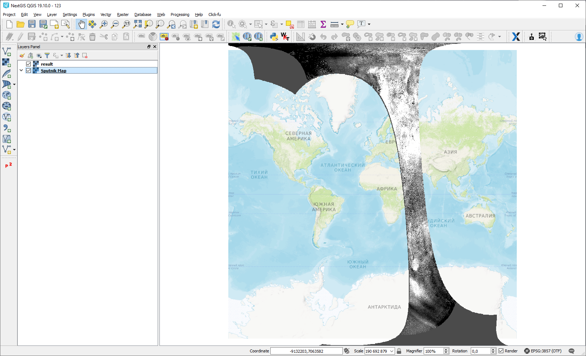

.. todo:: Does not work, removed from tools.rst

TROPOMI to GeoTIFF
==================

The tool converts TROPOMI nitrogen dioxide data to GeoTIFF format.

Inputs:

*  TROPOMI data file in NetCDF format obtained from https://s5phub.copernicus.eu/dhus/#/home. 
   Product type: L2__NO2__, Timeliness: Offline. 
   Example of a file’s name: S5P_OFFL_L2__NO2____20190901T091635_20190901T105804_09761_01_010302_20190907T113505.nc

This dataset is available at https://browser.dataspace.copernicus.eu or ``s3://meeo-s5p/OFFL/L2__NO2___/`` (access via AWS CLI).

Outputs:

*  GeoTIFF output image

Launch the tool: https://toolbox.nextgis.com/t/tropomi2geotiff

Interactive map with the result of the tool run:

**Try it out using our sample:**

Download `input dataset <https://nextgis.com/data/toolbox/tropomi2geotiff/tropomi2geotiff_inputs.zip>`_ to test the instrument. Step-by-step instructions included.

Get the `output <https://nextgis.com/data/toolbox/tropomi2geotiff/tropomi2geotiff_outputs.zip>`_ to additionally check the results.
