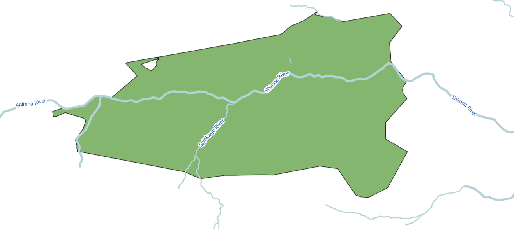
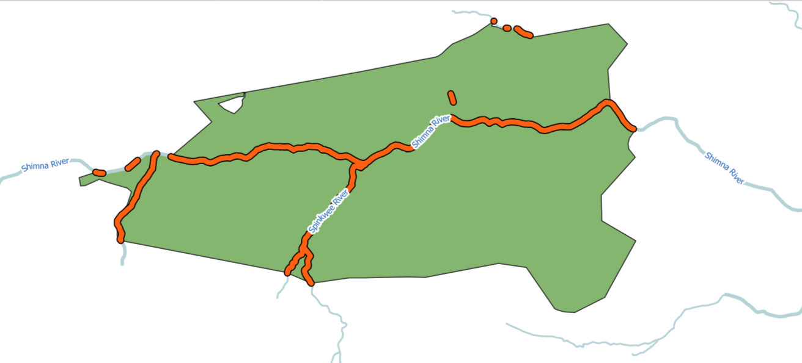

Polygon intersection
====================

Finds overlapping areas between features of 2 polygon layers.

Inputs:

* Polygon layer 1
* Polygon layer 2

Files should be in GDAL-supported format, e.g. GeoPackage, GeoJSON, MapInfo TAB, ESRI Shapefile (the last two - in ZIP-archive).

You can use this tool to clip line geometry. Upload the line layer to the field 1 and the clipping boundary to the field 2. 

Outputs:

* GeoPackage file with polygon layer containing only the overlapping areas.

Launch the tool: https://toolbox.nextgis.com/t/vectorclip

   Example input

   Example output

**Try the tool in action**

1. Click on the **Demo** button above the tool form. The fields are filled in with demo values.
2. Click on the **Run** button.

.. admonition:: Related tools

   * `Intersector <https://toolbox.nextgis.com/t/ngw_intersect?from-related-tools=1>`_
   * `Intersect layers <https://toolbox.nextgis.com/t/intersect_layers?from-related-tools=1>`_
   * `Erase overlapping areas from layer <https://toolbox.nextgis.com/t/eraser?from-related-tools=1>`_