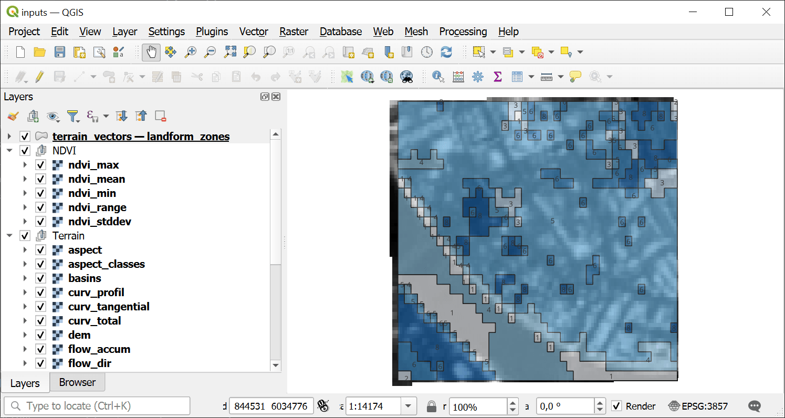
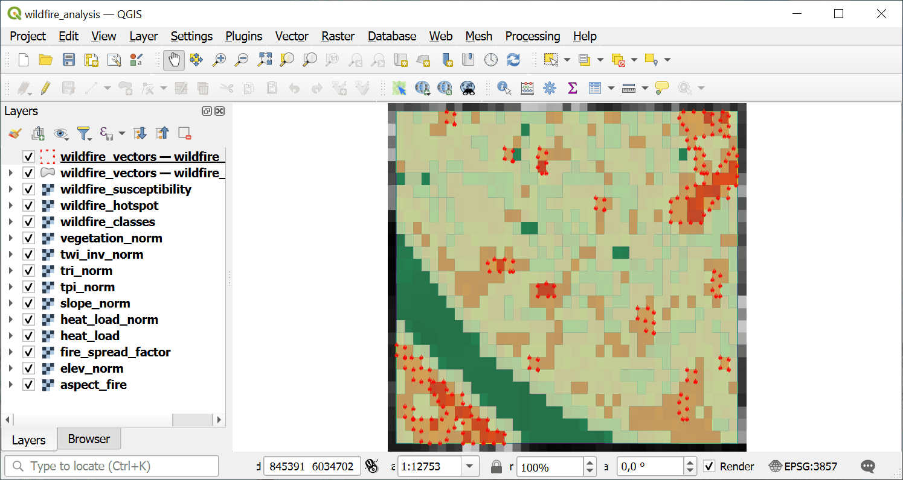

Wildfire Susceptibility Analysis (Topographic)
==============================================

Topographic wildfire susceptibility analysis using slope, Heat Load Index (Bohner & Antonic 2009), TPI, TRI, inverse TWI, and elevation. Includes Rothermel fire spread factor. Note: vegetation, climate, and anthropogenic factors not included.

Inputs:

* Terrain Analysis Package (ZIP). ZIP file from terrain_analysis containing DEM, slope, aspect, TWI, TPI, TRI, and manifest.json
* Weight: Slope. Weight for the slope indicator (default: 0.25)
* Weight: Heat Load Index. Weight for the Heat Load Index indicator (default: 0.25)
* Weight: TPI. Weight for the Topographic Position Index (default: 0.15)
* Weight: TRI. Weight for the Terrain Ruggedness Index (default: 0.10)
* Weight: TWI (inverted). Weight for the inverted TWI indicator (default: 0.15)
* Weight: Elevation. Weight for the elevation indicator (default: 0.10)
* Hotspot Threshold. WTI value above which areas are classified as hotspots (default: 70)
* Spectral Indices Package (ZIP). Optional ZIP from spectral_indices with vegetation index aggregates. When provided, a vegetation indicator is added to the weighted overlay.
* Weight: Vegetation Index. Weight for the vegetation index indicator (default: 0.10). Only used when spectral_zip is provided. Other weights are scaled down proportionally.

Outputs:

* Wildfire Analysis Package (ZIP). ZIP archive with wildfire susceptibility rasters, vectors, statistics, and manifest
* Summary. Human-readable summary of the wildfire analysis results
* Manifest JSON. JSON manifest string describing all outputs

Launch the tool: https://toolbox.nextgis.com/t/wildfire_analysis

Example:

   Example input

   Example output

**Try the tool in action**

1. Click on the **Demo** button above the tool form. The fields are filled in with demo values.
2. Click on the **Run** button.
