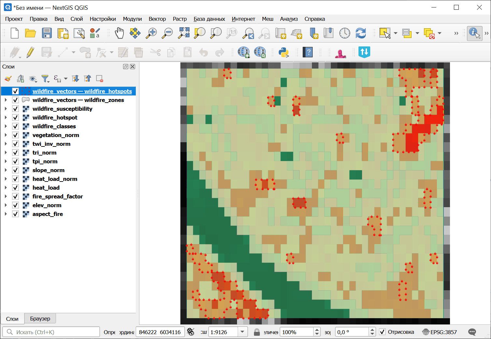

Анализ подверженности лесным пожарам (топографический)
======================================================

Топографический анализ подверженности лесным пожарам с использованием уклона, индекса тепловой нагрузки (Bohner & Antonic 2009), TPI, TRI, обратного TWI и высоты. Включает фактор распространения огня по Ротермелу. Примечание: растительность, климат и антропогенные факторы не учитываются.

На входе:

* Пакет анализа рельефа (ZIP).  ZIP-файл, полученный из инструмента `Комплексный анализ рельефа <https://toolbox.nextgis.com/t/terrain_analysis>`_, содержит ЦМР, уклон, аккумуляцию стока, кривизну, STI, SPI и manifest.json;
* Вес: Уклон. Вес индикатора уклона (по умолчанию: 0.25);
* Вес: Индекс тепловой нагрузки. Вес индикатора индекса тепловой нагрузки (по умолчанию: 0.25);
* Вес: TPI. Вес индекса топографической позиции (по умолчанию: 0.15);
* Вес: TRI. Вес индекса пересеченности рельефа (по умолчанию: 0.10);
* Вес: TWI (инвертированный). Вес инвертированного индикатора TWI (по умолчанию: 0.15);
* Вес: Высота. Вес индикатора высоты (по умолчанию: 0.10);
* Порог горячих точек. Значение WTI, выше которого области классифицируются как горячие точки (по умолчанию: 70);
* Пакет спектральных индексов (ZIP). Необязательный ZIP с агрегатами вегетационного индекса, полученный инструментом `Вычисление спектральных индексов <https://toolbox.nextgis.com/t/spectral_indices>`_. При указании в взвешенное наложение добавляется вегетационный индикатор;
* Вес: Вегетационный индекс. Вес индикатора вегетационного индекса (по умолчанию: 0.10). Используется только при наличии spectral_zip. Остальные веса пропорционально уменьшаются.

На выходе:

* Пакет анализа лесных пожаров (ZIP). ZIP-архив с растрами подверженности лесным пожарам, векторами, статистикой и манифестом
* Сводка. Текстовая сводка результатов анализа лесных пожаров
* Манифест JSON. JSON-манифест, описывающий все результаты

Запуск инструмента: https://toolbox.nextgis.com/t/wildfire_analysis

Пример работы инструмента:

.. figure:: _static/erosion_analysis_input_ru.png
   :name: wildfire_analysis_input_pic
   :align: center
   :width: 20cm

   Пример исходных данных

   Пример результата работы инструмента

**Попробуйте инструмент в действии:**

1. Нажмите кнопку **Демо** над формой инструмента. Поля будут автоматически заполнены демонстрационными значениями.
2. Нажмите кнопку **Запустить**.

.. seealso::

   * `Анализ подверженности затоплению <https://toolbox.nextgis.com/t/flood_analysis?from-related-tools=1>`_
   * `Анализ подверженности оползням <https://toolbox.nextgis.com/t/landslide_analysis?from-related-tools=1>`_
   * `Анализ подверженности эрозии <https://toolbox.nextgis.com/t/erosion_analysis?from-related-tools=1>`_
