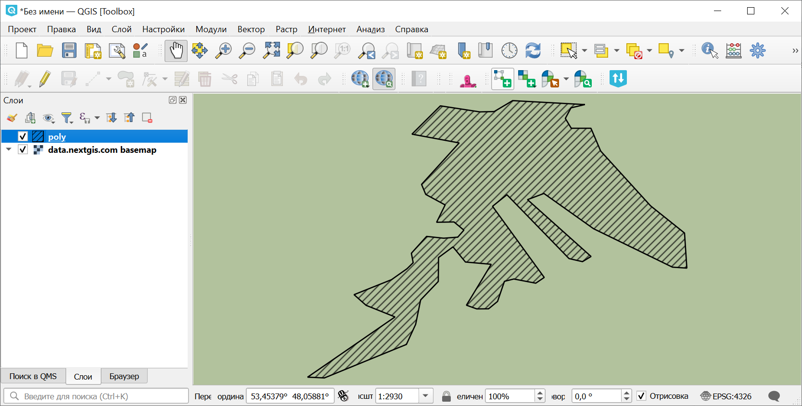

Конвертация XML: Акт лесопатологического обследования
=====================================================

Конвертация XML-документа Акт лесопатологического обследования.

На входе:

* Исходный файл - Единичный файл XML или ZIP с любым количеством XML произвольной вложенности;
* Выходной формат - впишите один из вариантов: ``GPKG, GEOJSON, SHP, TAB``.

На выходе:

* ZIP-архив с файлом в выбранном формате.

Запуск инструмента: https://toolbox.nextgis.com/t/xml_lpo_to_vector

Пример работы инструмента:

   Пример полученного полигона

**Попробуйте инструмент в действии, скачав наш пример:**

`Набор исходных данных <https://nextgis.ru/data/toolbox/xml_lpo_to_vector/xml_lpo_to_vector_inputs_ru.zip>`_ для проверки работы инструмента. Внутри архива пошаговая инструкция.

`Пример результата <https://nextgis.ru/data/toolbox/xml_lpo_to_vector/xml_lpo_to_vector_outputs_ru.zip>`_ работы инструмента.

.. seealso::

   Попробуйте также другие инструменты конвертации XML:

   `Лесная декларация <https://toolbox.nextgis.com/t/xml_decl_to_vector>`_

   `Проект лесовосстановления <https://toolbox.nextgis.com/t/xml_plv_to_vector>`_

   `Таксационное описание лесосеки <https://toolbox.nextgis.com/t/xml_tol_to_vector>`_

   `Конвертация выписок ГЛР <https://toolbox.nextgis.com/t/import_glr>`_