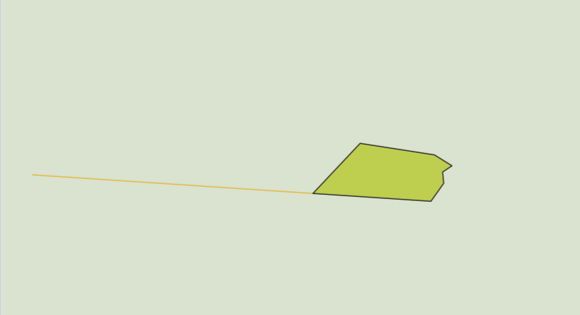

Convert XML: forestReforestation
=================================

Convert XML: forestReforestation to geodata.

Inputs:

* Source file. Single XML file or ZIP with any XML.
* Output format. One of output formats: GPKG, GEOJSON, SHP, TAB.

Outputs:

* ZIP archive with polygon and line files in the chosen format.

Launch the tool: https://toolbox.nextgis.com/t/xml_plv_to_vector

   Example output layers

**Try the tool in action**

1. Click on the **Demo** button above the tool form. The fields are filled in with demo values.
2. Click on the **Run** button.
