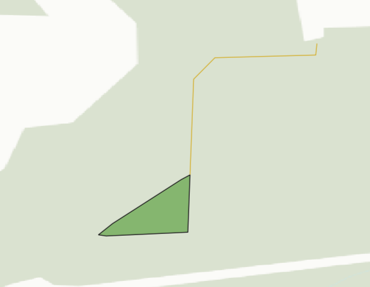

Конвертация XML: Таксационное описание лесосеки
===============================================

Конвертация XML-документа "Таксационное описание лесосеки" в геоданные. Поддерживаются версии докумена 3.0.2 и выше.

На входе:

* Исходный файл - Единичный файл XML или ZIP с любым количеством XML произвольной вложенности.
* Выходной формат - Один из выходных форматов: GPKG, GEOJSON, SHP, TAB. Если не указать формат, по умолчанию будет выбран GeoPackage.

На выходе:

* ZIP-архив с файлами линий и полигонов в выбранном формате.

Запуск инструмента: https://toolbox.nextgis.com/t/xml_tol_to_vector

   Пример конвертированных геоданных

**Попробуйте инструмент в действии, скачав наш пример:**

`Набор исходных данных <https://nextgis.ru/data/toolbox/xml_tol_to_vector/xml_tol_to_vector_inputs_ru.zip>`_ для проверки работы инструмента. Внутри архива пошаговая инструкция.

`Пример результата <https://nextgis.ru/data/toolbox/xml_tol_to_vector/xml_tol_to_vector_outputs_ru.zip>`_ работы инструмента.
