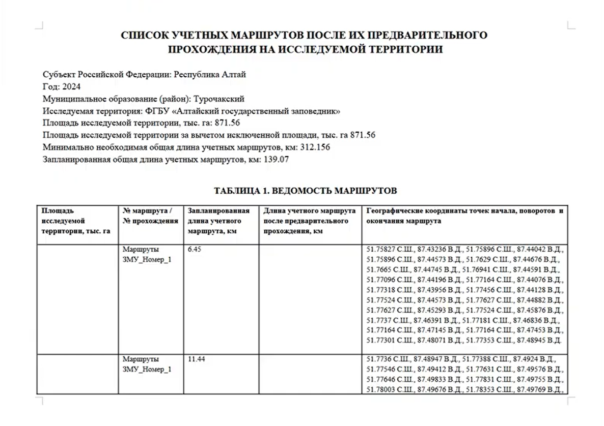

ЗМУ: анализ и отчётность 
=============================
  
Анализ данных о распространении и численности объектов животного мира, получаемых в ходе проведения зимнего маршрутного учета (ЗМУ), и формирование отчетов в соответствии с требованиями "Методики учета численности охотничьих ресурсов методом зимнего маршрутного учета", утвержденной Приказом №49 ФГБУ "ФНИЦ Охота" от 22 ноября 2023 года. Все данные берутся из NextGIS Web.

.. note:: Если хотите подключить маршрутный учёт, напишите нам на eco@nextgis.ru

На входе:

* Адрес веб-ГИС ``Обязательное поле``
* Логин веб-ГИС
* Пароль веб-ГИС
* ID группы ресурсов "Данные ЗМУ" ``Обязательное поле`` - Идентификатор группы ресурсов с развёрнутой системой ЗМУ (по умолчанию "Данные ЗМУ")
* Ширина учётной полосы, используемая при составлении ведомости расчёта численности птиц на исследуемой территории, в километрах. Параметр обязателен при учёте видов птиц в процессе ЗМУ.
* Добавление веб-карты - При выборе формирует в веб-ГИС пользователя веб-карту с маршрутами, и добавляет ссылку на неё в ведомость

На выходе:

* Отчёт в формате .DOCX
* Опционально: веб-карта с маршрутами в Веб ГИС

В отчёт входит:

* Список учетных маршрутов после их предварительного прохождения на исследуемой территории
* Ведомость зимнего маршрутного учёта
* Ведомость расчёта численности зверей на исследуемой территории

   Файл отчёта

Запуск инструмента: https://toolbox.nextgis.com/t/zmu_data_analysis

Посмотрите, как работает инструмент, в видео:

.. raw:: html

   <iframe width="720" height="405" src="https://rutube.ru/play/embed/bf25be714ad825a86bb100ef6a11f53b/" frameBorder="0" allow="clipboard-write; autoplay" webkitAllowFullScreen mozallowfullscreen allowFullScreen></iframe>

Смотреть на `youtube <https://youtu.be/zQF_dutJQMY>`_, `rutube <https://rutube.ru/video/bf25be714ad825a86bb100ef6a11f53b/>`_.

**Попробуйте инструмент в действии, скачав наш пример:**

`Набор исходных данных <https://nextgis.ru/data/toolbox/zmu_data_analysis/zmu_data_analysis_inputs_ru.zip>`_ для проверки работы инструмента. Внутри архива пошаговая инструкция.

`Пример результата <https://nextgis.ru/data/toolbox/zmu_data_analysis/zmu_data_analysis_outputs_ru.zip>`_ работы инструмента.

