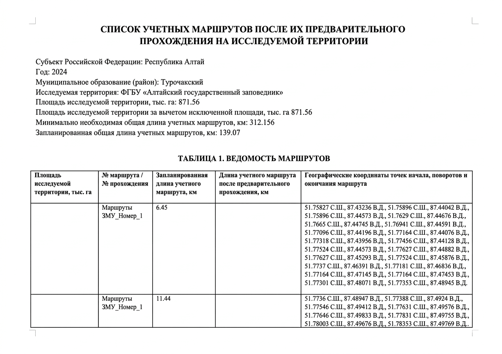

ЗМУ: анализ и отчётность 
=============================
  
Анализ данных о распространении и численности объектов животного мира, получаемых в ходе проведения зимнего маршрутного учета (ЗМУ), и формирование отчетов в соответствии с требованиями "Методики учета численности охотничьих ресурсов методом зимнего маршрутного учета", утвержденной Приказом №49 ФГБУ "ФНИЦ Охота" от 22 ноября 2023 года. Все данные берутся из NextGIS Web.

.. note:: Если хотите подключить маршрутный учёт, напишите нам на eco@nextgis.ru

На входе:

* Адрес Веб ГИС ``Обязательное поле``
* Логин Веб ГИС
* Пароль Веб ГИС
* ID группы ресурсов "Данные ЗМУ" ``Обязательное поле`` - :abbr:`Идентификатор (Цифры в конце ссылки на ресурс, например для ресурса https://demo-ru.nextgis.com/resource/9284 ID=9284)` группы ресурсов с развёрнутой системой ЗМУ (по умолчанию группа называется "Данные ЗМУ") 
* Начальная дата - Начальная дата для данных ЗМУ, используемых для формирования ведомости, в формате ГГГГ-ММ-ДД. Если оставить поле пустым, ведомость будет сформирована за всё время до конечной даты
* Конечная дата - Конечная дата для данных ЗМУ, используемых для формирования ведомости, в формате ГГГГ-ММ-ДД. Если оставить поле пустым, ведомость будет сформирована за промежуток времени от начальной даты до сегодняшнего дня
* Добавление веб-карты - При выборе формирует в Веб ГИС пользователя веб-карту с маршрутами, и добавляет ссылку на неё в ведомость
* Добавить точки маршрутов - При выборе заполняет в выходном документе географические координаты точек начала, поворотов и окончания маршрутов в таблице списка учётных маршрутов
* Ширина учётной полосы, используемая при составлении ведомости расчёта численности птиц на исследуемой территории, в километрах. **Параметр обязателен при учёте видов птиц в процессе ЗМУ.**

На выходе:

* Отчёт в формате .DOCX
* Опционально: веб-карта с маршрутами в Веб ГИС

В отчёт входит:

* Список учетных маршрутов после их предварительного прохождения на исследуемой территории
* Ведомость зимнего маршрутного учёта
* Ведомость расчёта численности зверей на исследуемой территории

   Файл отчёта

Запуск инструмента: https://toolbox.nextgis.com/t/zmu_data_analysis

Посмотрите, как работает инструмент, в видео:

.. raw:: html

   <iframe width="720" height="405" src="https://rutube.ru/play/embed/bf25be714ad825a86bb100ef6a11f53b/" frameBorder="0" allow="clipboard-write; autoplay" webkitAllowFullScreen mozallowfullscreen allowFullScreen></iframe>

Смотреть на `youtube <https://youtu.be/zQF_dutJQMY>`_, `rutube <https://rutube.ru/video/bf25be714ad825a86bb100ef6a11f53b/>`_.

**Попробуйте инструмент в действии**

1. Нажмите кнопку **Демо** над формой инструмента. Поля будут автоматически заполнены демонстрационными значениями.
2. Нажмите кнопку **Запустить**.

.. seealso::

   * `ЗМУ: развёртывание <https://toolbox.nextgis.com/t/zmu_deploy?from-related-tools=1>`_
   * `Генератор набора квадратов <https://toolbox.nextgis.com/t/quadro?from-related-tools=1>`_
   * `Статистика по точкам и трекам в полигонах из NGW <https://toolbox.nextgis.com/t/points_on_tracks_stats?from-related-tools=1>`_
