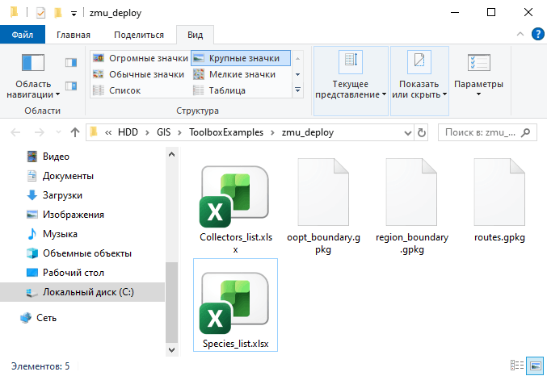
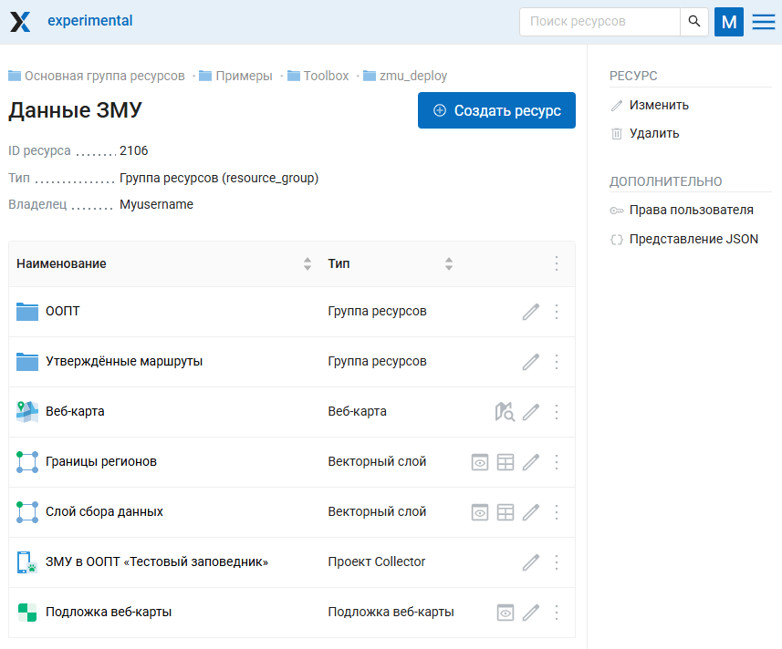

ЗМУ: развёртывание
==================

Развёртывание группы ресурсов «Данные ЗМУ» из локальных файлов.

На входе:

* Адрес Веб ГИС, логин и пароль - ссылка на Веб ГИС на платформе NextGIS Web вида https://demo.nextgis.com и логин/пароль, если необходимо;
* Название ООПТ;
* Идентификатор родительской группы ресурсов. Идентификатор группы ресурсов, в которую будет помещена группа ресурсов «Данные ЗМУ»;
* Файл границ ООПТ. Один полигональный слой;
* Название региона - выберите из списка название региона, где расположен ООПТ.
* Файл границ региона. Один полигональный слой. Если формат подразумевает несколько файлов для одного слоя (например, SHP), все файлы должны быть заархивированы в ZIP;
* Файл утверждённых маршрутов. Один линейный слой. Если формат подразумевает несколько файлов для одного слоя (например, SHP), все файлы должны быть заархивированы в ZIP. В таблице объектов должна быть колонка «route_name» с уникальным именем маршрута.
* Файл классификации ландшафтов (не обязательно). Один полигональный слой. Если формат подразумевает несколько файлов (например, SHP), все файлы должны быть заархивированы в ZIP. В таблице объектов слоя должна быть колонка «type» с тремя вариантами значений: «Лес», «Поле», «Болото».
* Файл со списком учётчиков в формате XLSX. Файл должен иметь следующую структуру: одна колонка с заголовком «ФИО».
* Файл со списком видов в формате XLSX. Файл должен иметь следующую структуру: две колонки с заголовками «name_ru» и «name_en» с русскими и английскими названиями видов соответственно.

На выходе:

* Группа ресурсов «Данные ЗМУ», ссылка: https://experimental.nextgis.com/resource/2106, внутри:

   * Проект Collector с заданным названием заповедника
   * Веб-карта для отображения результатов
   * Векторный слой ООПТ (в отдельной подгруппе)
   * Векторный слой Утверждённые маршруты (в отдельной подгруппе)
   * Векторный слой Границы регионов
   * Векторный слой Слой сбора данных
   * Подложка веб-карты

.. note:: Сохраняйте эту структуру ресурсов, если планируете пользоваться инструментом `ЗМУ: анализ и отчётность <https://toolbox.nextgis.com/t/zmu_data_analysis?from-related-tools=1>`_

Запуск инструмента: https://toolbox.nextgis.com/t/zmu_deploy

Пример работы инструмента:

   Папка с исходными файлами

   Пример результата работы инструмента

"**Попробуйте инструмент в действии, скачав наш пример:**

`Набор исходных данных <https://nextgis.ru/data/toolbox/zmu_deploy/zmu_deploy_inputs_ru.zip>`_ для проверки работы инструмента. Внутри архива пошаговая инструкция.

.. seealso::

   * `ЗМУ: анализ и отчётность <https://toolbox.nextgis.com/t/zmu_data_analysis?from-related-tools=1>`_
   * `ЗМУ: обновление <https://toolbox.nextgis.com/t/zmu_update?from-related-tools=1>`_
   * `Генератор набора квадратов <https://toolbox.nextgis.com/t/quadro?from-related-tools=1>`_
   * `Статистика по точкам и трекам в полигонах из NGW <https://toolbox.nextgis.com/t/points_on_tracks_stats?from-related-tools=1>`_