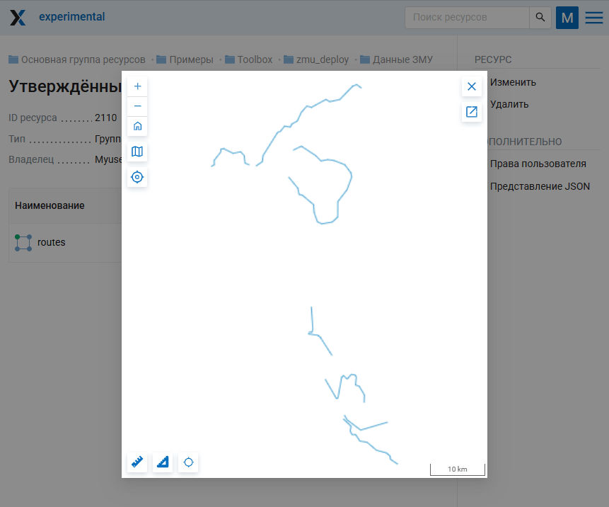
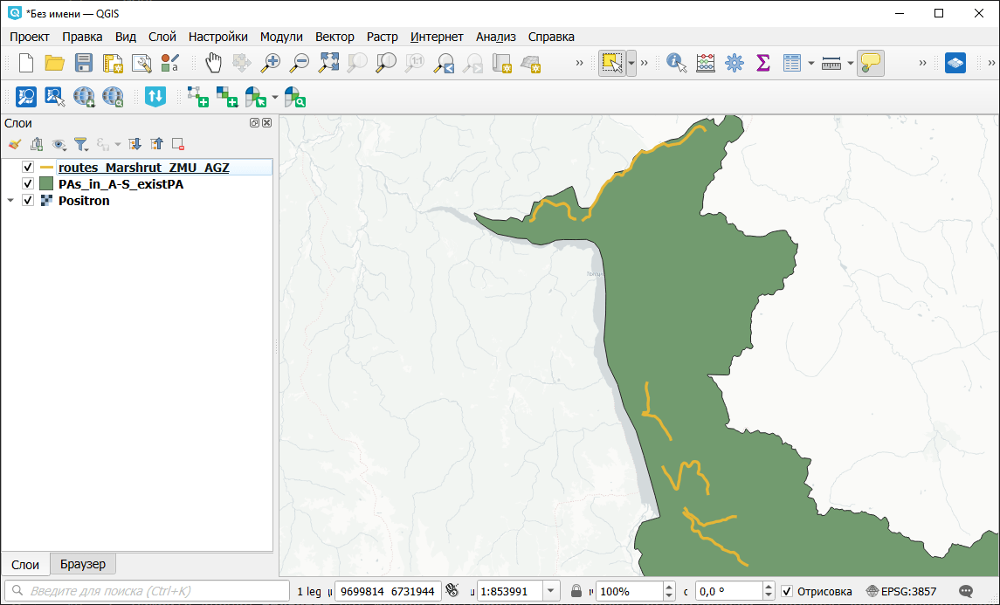
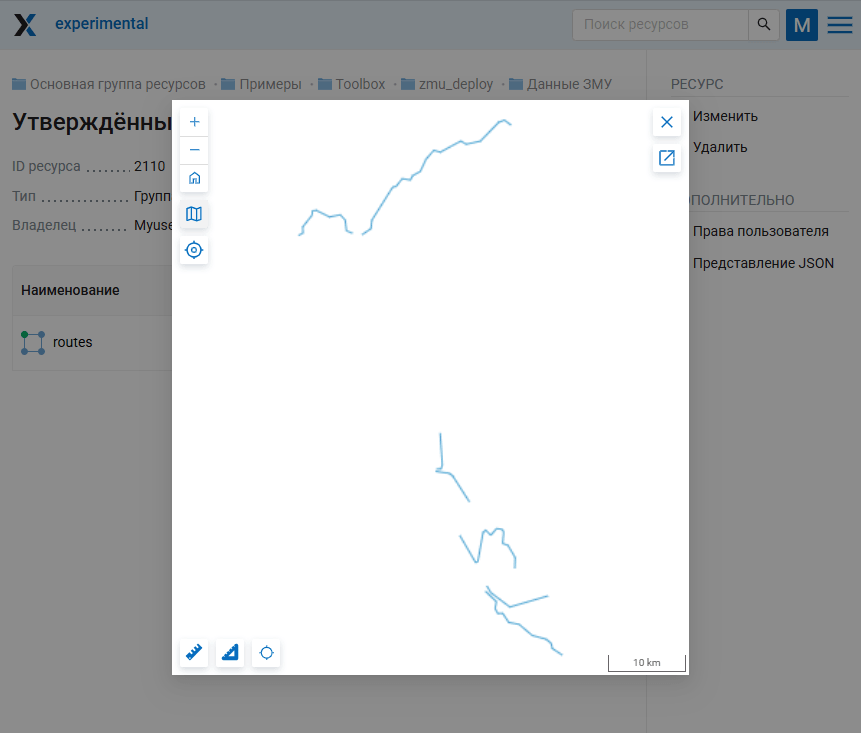

ЗМУ: обновление
===============

Обновление группы ресурсов «Данные ЗМУ» из локальных файлов.

.. note:: Развернуть группу "Данные ЗМУ" нужной структуры можно при помощи инструмента `ЗМУ: развёртывание <https://toolbox.nextgis.com/t/zmu_deploy?from-related-tools=1>`_

На входе:

* Адрес Веб ГИС, логин и пароль. Ссылка на Веб ГИС на платформе NextGIS Web вида https://demo.nextgis.com и логин/пароль, если необходимо;
* Идентификатор группы ресурсов - цифры в конце ссылки на группу ресурсов «Данные ЗМУ»;
* Один или несколько из следующих файлов:

   * Файл границ ООПТ - один полигональный векторный слой;
   * Файл границ региона - один полигональный векторный слой. Если формат подразумевает несколько файлов (например, SHP), все файлы должны быть заархивированы в ZIP;
   * Файл утверждённых маршрутов - один линейный векторный слой. Если формат подразумевает несколько файлов (например, SHP), все файлы должны быть заархивированы в ZIP. В таблице объектов должна быть колонка «route_name» с уникальным именем маршрута;
   * Файл классификации ландшафтов - один полигональный векторный слой. Если формат подразумевает несколько файлов (например, SHP), все файлы должны быть заархивированы в ZIP. В таблице объектов слоя должна быть колонка «type» с тремя вариантами значений: «Лес», «Поле», «Болото».

На выходе:

* Обновлённые соответствующие слои в Веб ГИС.

Запуск инструмента: https://toolbox.nextgis.com/t/zmu_update

Пример работы инструмента:

   Слой с маршрутами в Веб ГИС

   Обновлённые маршруты в NextGIS QGIS: один маршрут удалён

   Обновлённый слой маршрутов в Веб ГИС

**Попробуйте инструмент в действии:**

Вам понадобится группа "Данные ЗМУ", развёрнутая при помощи инструмента "ЗМУ: развёртывание" (`Набор данных для развёртывания <https://nextgis.ru/data/toolbox/zmu_deploy/zmu_deploy_inputs_ru.zip>`_). `Набор данных для обновления <https://nextgis.ru/data/toolbox/zmu_update/zmu_deploy_update_ru.zip>`_ Внутри архивов пошаговые инструкции.

.. seealso::

   * `ЗМУ: развёртывание <https://toolbox.nextgis.com/t/zmu_deploy?from-related-tools=1>`_
   * `ЗМУ: анализ и отчётность <https://toolbox.nextgis.com/t/zmu_data_analysis?from-related-tools=1>`_